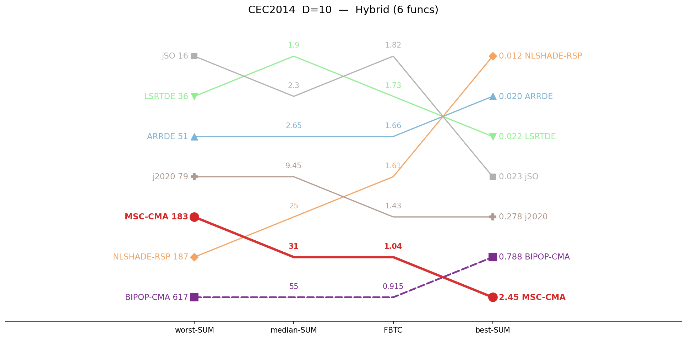
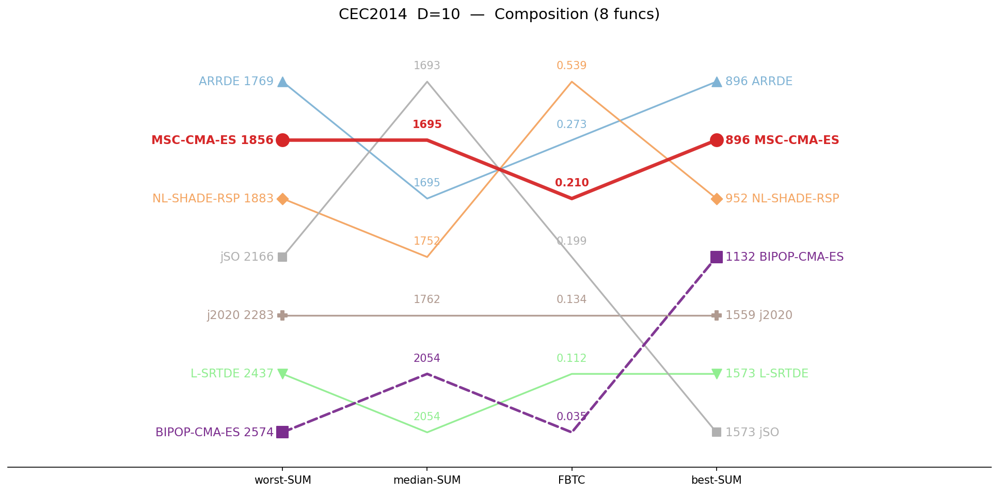
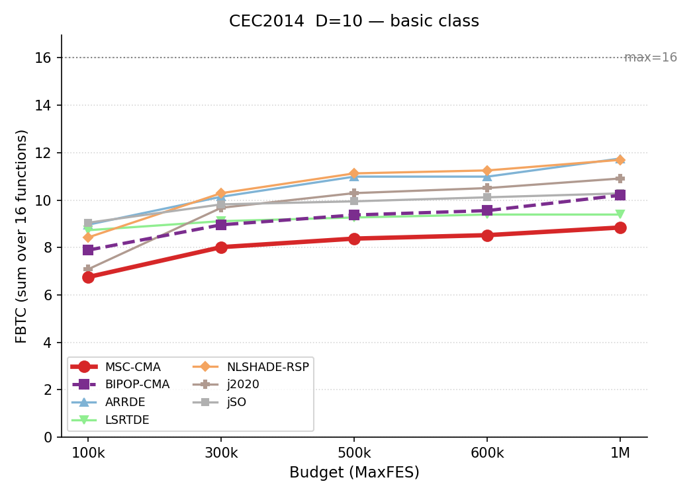
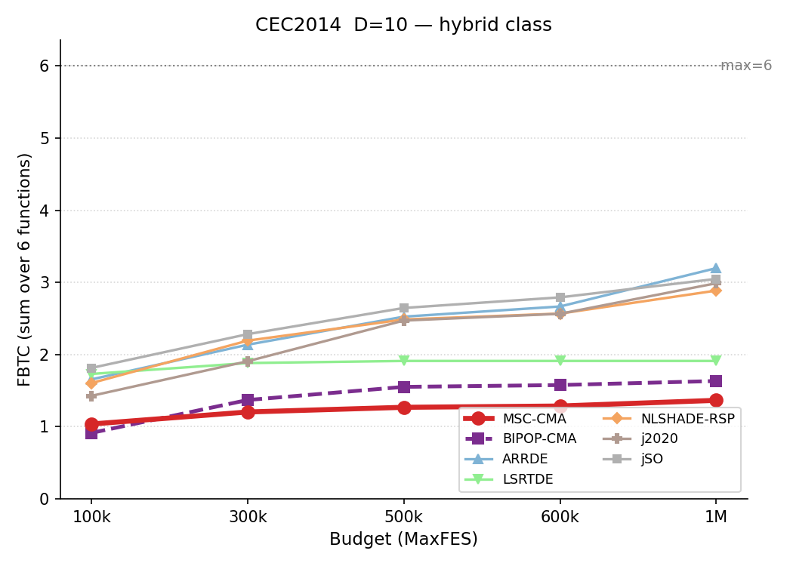
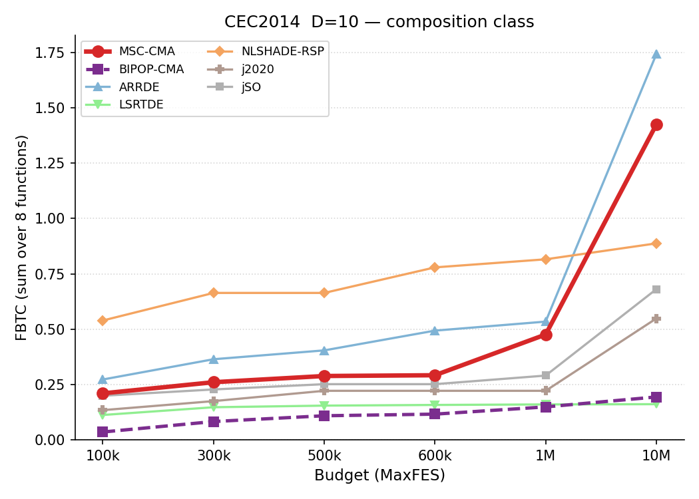
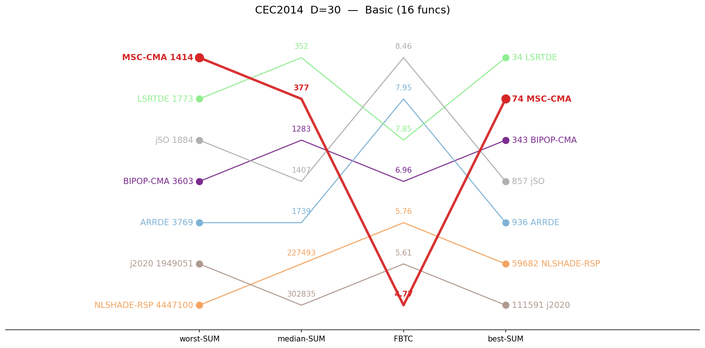
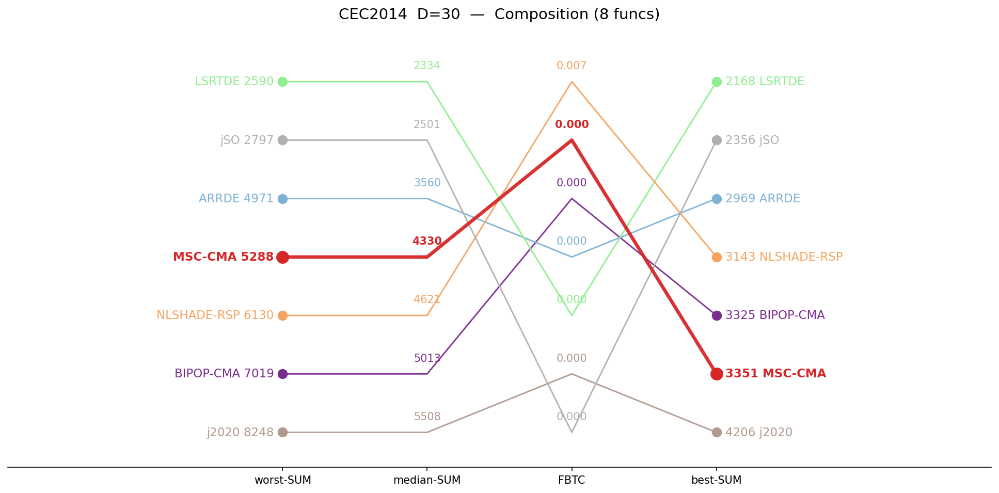
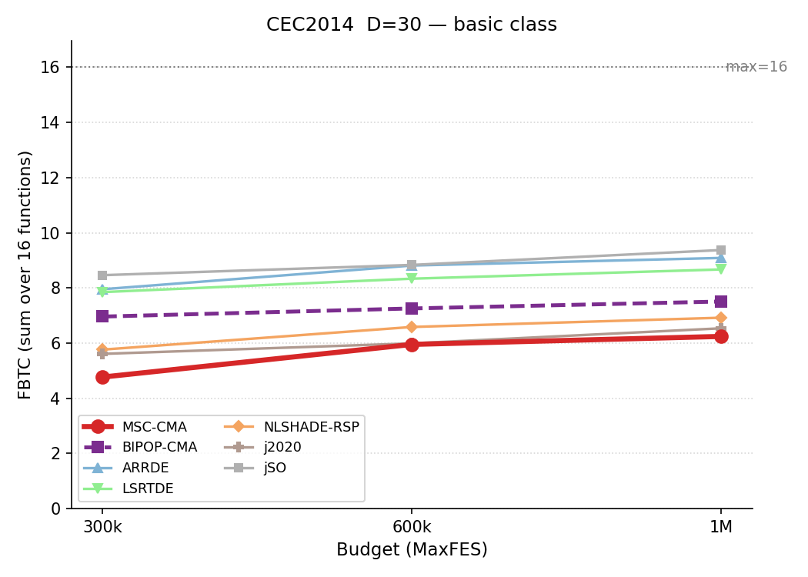
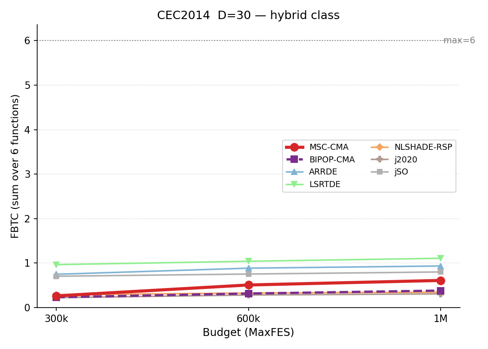
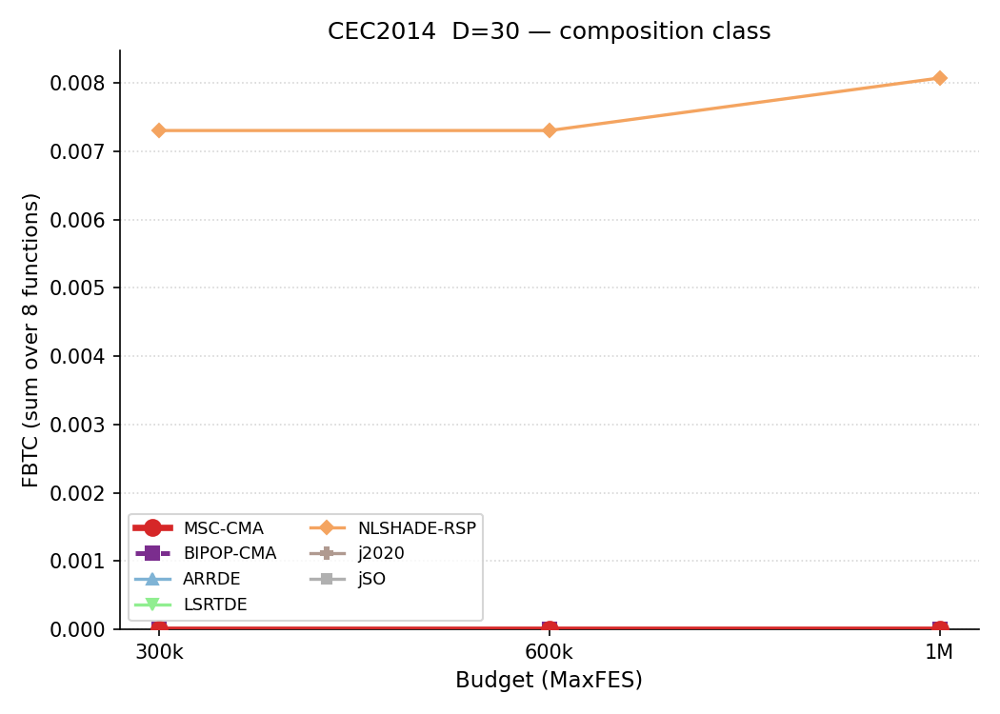

# CEC2014 — cross-dimension summary

Aggregated sums by function category, across dimensions. **Bold** = best in row. For simplicity the suite is presented per dimension.

Official budgets — 10D: 100,000, 30D: 300,000.

## Ranking — D=10

Parallel-coordinate rank on four aggregate metrics (worst-SUM, median-SUM, coverage, best-SUM). Best value at the top of each axis; MSC-CMA in red.

<table>
<tr>
<td></td>
<td></td>
<td></td>
</tr>
<tr>
<td align="center">Basic</td>
<td align="center">Hybrid</td>
<td align="center">Composition</td>
</tr>
</table>

## Budget scaling — D=10

FBTC by budget, monotone envelope; higher is better.

<table>
<tr>
<td></td>
<td></td>
<td></td>
</tr>
<tr>
<td align="center">Basic</td>
<td align="center">Hybrid</td>
<td align="center">Composition</td>
</tr>
</table>

## Ranking — D=30

Parallel-coordinate rank on four aggregate metrics (worst-SUM, median-SUM, coverage, best-SUM). Best value at the top of each axis; MSC-CMA in red.

<table>
<tr>
<td></td>
<td></td>
<td></td>
</tr>
<tr>
<td align="center">Basic</td>
<td align="center">Hybrid</td>
<td align="center">Composition</td>
</tr>
</table>

## Budget scaling — D=30

FBTC by budget, monotone envelope; higher is better.

<table>
<tr>
<td></td>
<td></td>
<td></td>
</tr>
<tr>
<td align="center">Basic</td>
<td align="center">Hybrid</td>
<td align="center">Composition</td>
</tr>
</table>

## Median error (lower is better)

| Category | Dim | MSC-CMA | BIPOP-CMA |  | ARRDE | LSRTDE | NLSHADE | j2020 | jSO |
|:--|:--:|--:|--:|:-:|--:|--:|--:|--:|--:|
| Basic | 10 | **69** | 118 |    | 146 | 69.8 | 145 | 91.6 | 77.4 |
| Basic | 30 | 377 | 1283 |    | 1739 | **352** | 227493 | 302835 | 1407 |
| Hybrid | 10 | 31.2 | 55.2 |    | 2.65 | **1.9** | 24.7 | 9.45 | 2.3 |
| Hybrid | 30 | 1795 | 1813 |    | 114 | **43.9** | 13858 | 3369 | 110 |
| Composition | 10 | 1695 | 2054 |    | 1695 | 2054 | 1752 | 1762 | **1693** |
| Composition | 30 | 4330 | 5013 |    | 3560 | **2334** | 4621 | 5508 | 2501 |

## Best error (lower is better)

| Category | Dim | MSC-CMA | BIPOP-CMA |  | ARRDE | LSRTDE | NLSHADE | j2020 | jSO |
|:--|:--:|--:|--:|:-:|--:|--:|--:|--:|--:|
| Basic | 10 | 27.8 | 5.67 |    | 4.37 | **0.539** | 8.82 | 11.4 | 4.22 |
| Basic | 30 | 74.2 | 343 |    | 936 | **34.2** | 59682 | 111591 | 857 |
| Hybrid | 10 | 2.45 | 0.788 |    | 0.0202 | 0.0215 | **0.0125** | 0.278 | 0.0226 |
| Hybrid | 30 | 1168 | 321 |    | 43.7 | **26** | 1254 | 1635 | 62.9 |
| Composition | 10 | 896 | 1132 |    | **896** | 1573 | 952 | 1559 | 1573 |
| Composition | 30 | 3351 | 3325 |    | 2969 | **2168** | 3143 | 4206 | 2356 |

## Worst error (lower is better)

| Category | Dim | MSC-CMA | BIPOP-CMA |  | ARRDE | LSRTDE | NLSHADE | j2020 | jSO |
|:--|:--:|--:|--:|:-:|--:|--:|--:|--:|--:|
| Basic | 10 | 430 | 582 |    | 380 | **209** | 559 | 462 | 287 |
| Basic | 30 | **1414** | 3603 |    | 3769 | 1773 | 4447100 | 1949051 | 1884 |
| Hybrid | 10 | 183 | 617 |    | 50.9 | 35.8 | 187 | 78.6 | **16** |
| Hybrid | 30 | 3188 | 3660 |    | 608 | **194** | 148061 | 8668 | 289 |
| Composition | 10 | 1856 | 2574 |    | **1769** | 2437 | 1883 | 2283 | 2166 |
| Composition | 30 | 5288 | 7019 |    | 4971 | **2590** | 6130 | 8248 | 2797 |

## FBTC — Fixed-Budget Target Coverage (higher is better)

| Category | Dim | MSC-CMA | BIPOP-CMA |  | ARRDE | LSRTDE | NLSHADE | j2020 | jSO |
|:--|:--:|--:|--:|:-:|--:|--:|--:|--:|--:|
| Basic | 10 | 6.754 | 7.890 |    | 8.963 | 8.730 | 8.427 | 7.084 | **9.045** |
| Basic | 30 | 4.768 | 6.962 |    | 7.952 | 7.848 | 5.763 | 5.609 | **8.462** |
| Hybrid | 10 | 1.038 | 0.915 |    | 1.656 | 1.732 | 1.606 | 1.428 | **1.815** |
| Hybrid | 30 | 0.264 | 0.234 |    | 0.749 | **0.967** | 0.288 | 0.223 | 0.705 |
| Composition | 10 | 0.210 | 0.035 |    | 0.273 | 0.112 | **0.539** | 0.134 | 0.199 |
| Composition | 30 | 0.000 | 0.000 |    | 0.000 | 0.000 | **0.007** | 0.000 | 0.000 |

*FBTC = Fixed-Budget Target Coverage (per-function sum across 51 log-uniform targets in [10²…10⁻⁸]); fixed-budget analogue of the COCO/BBOB ECDF. Higher is better.*

## Environment
Python 3.13.5 (anaconda3 env `intelpython`) · NumPy 2.3.1 · SciPy 1.15.3 · pycma 4.4.2 · minionpy 1.5.0.
Hardware: Intel Xeon Platinum 8160 @ 2.10 GHz, 192 threads, 251 GiB RAM.

*Generated 2026-07-09 by analysis/suite_report.py.*
