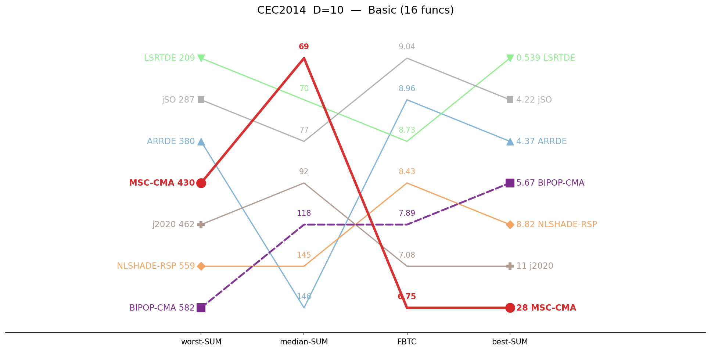
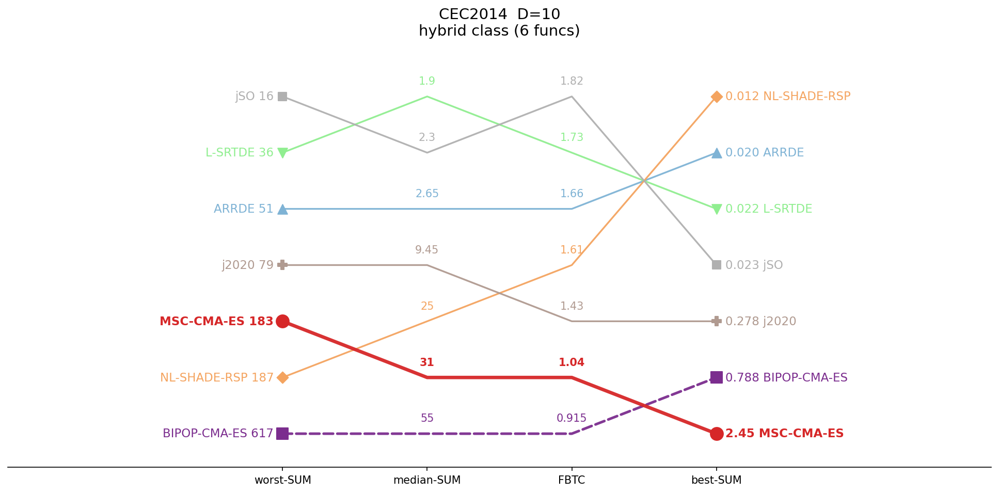
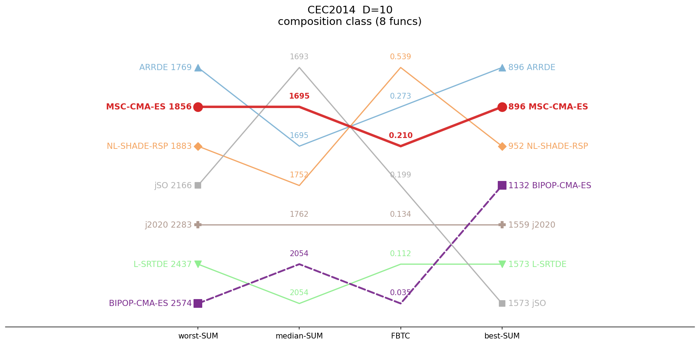
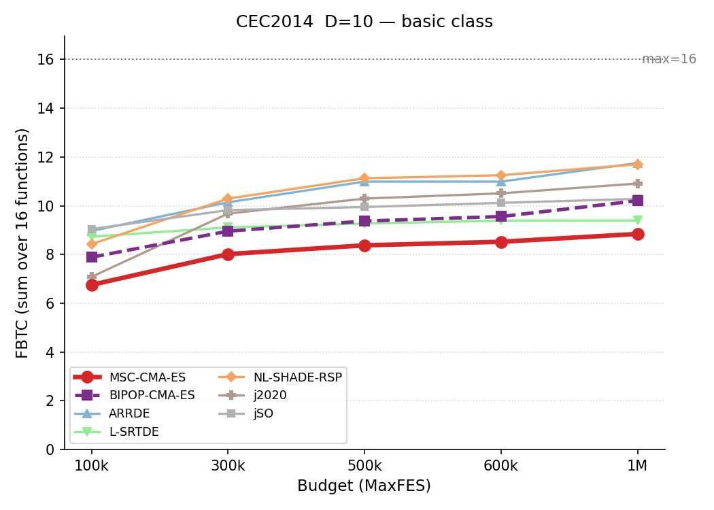
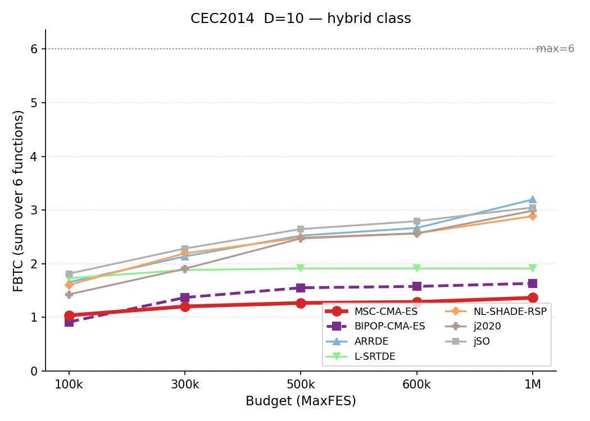
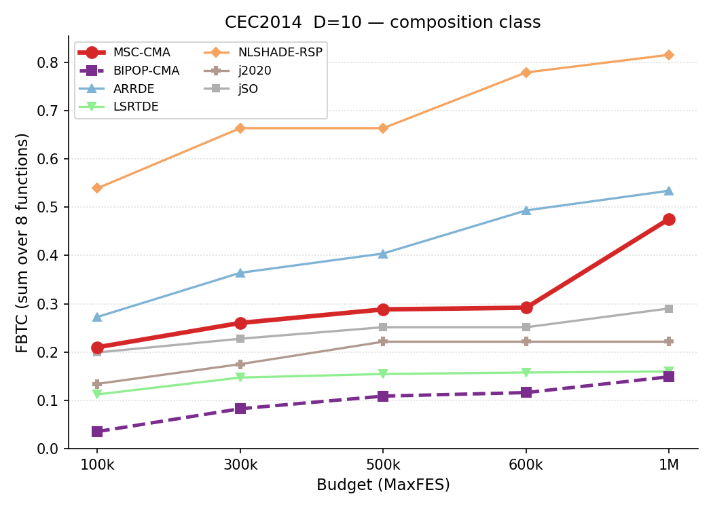
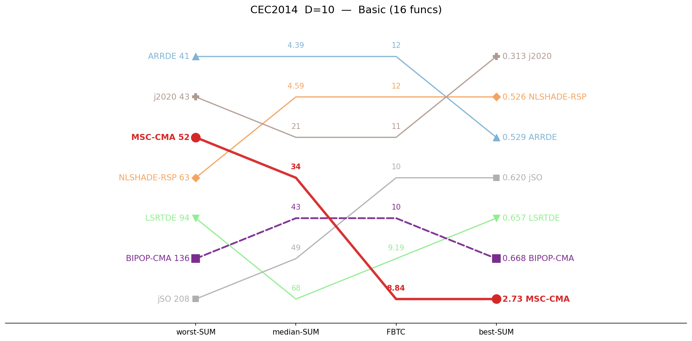
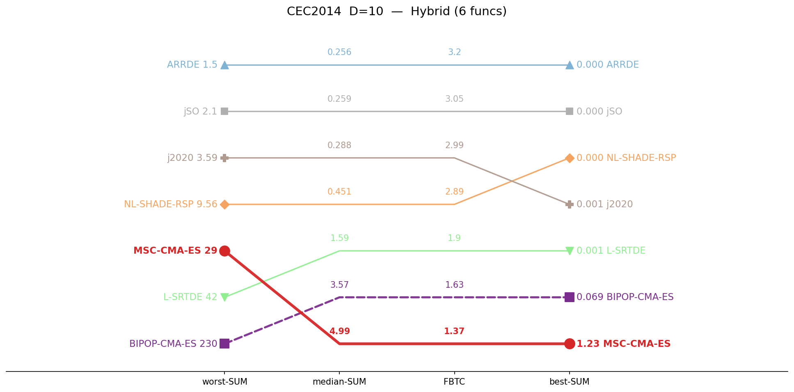
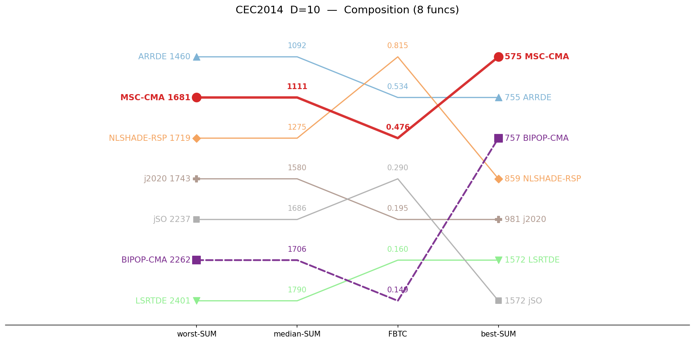
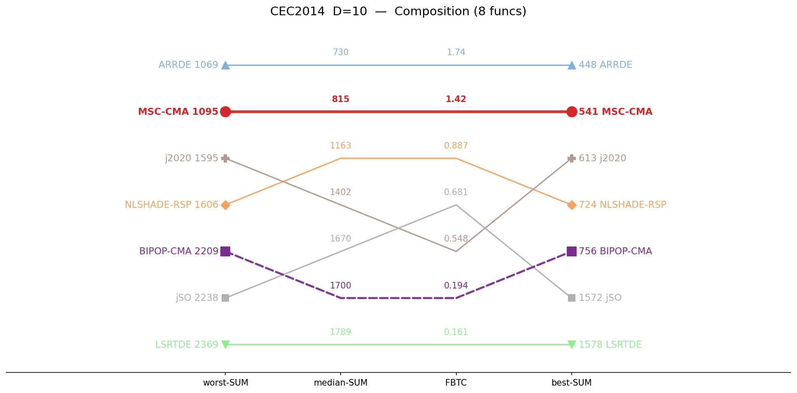

# CEC2014 / D=10 — by-category summary

## Ranking across metrics (budget 100K)

Parallel-coordinate rank of all 7 algorithms on four aggregate metrics (worst-SUM, median-SUM, FBTC, best-SUM), per function class. Each line is one algorithm; for every axis the best value is at the top. MSC-CMA in red.

<table>
<tr>
<td></td>
<td></td>
<td></td>
</tr>
<tr>
<td align="center">unimodal and simple multimodal</td>
<td align="center">Hybrid</td>
<td align="center">Composition</td>
</tr>
</table>

## Budget scaling

FBTC by budget, monotone envelope (running maximum over budgets). Higher is better. The budget axis is per class: a budget is shown only where all 7 algorithms cover the whole class. MSC-CMA in red.

<table>
<tr>
<td></td>
<td></td>
<td></td>
</tr>
<tr>
<td align="center">unimodal and simple multimodal</td>
<td align="center">Hybrid</td>
<td align="center">Composition</td>
</tr>
</table>

## Ranking across metrics (budget 1M)

Same parallel-coordinate rank, recomputed at 1,000,000 evaluations. Only classes with full 7-algorithm coverage at 1M are shown. MSC-CMA in red.

<table>
<tr>
<td></td>
<td></td>
<td></td>
</tr>
<tr>
<td align="center">unimodal and simple multimodal</td>
<td align="center">Hybrid</td>
<td align="center">Composition</td>
</tr>
</table>

## Ranking across metrics (budget 10M)

Same parallel-coordinate rank, recomputed at 10,000,000 evaluations. Only classes with full 7-algorithm coverage at 10M are shown. MSC-CMA in red.

<table>
<tr>
<td></td>
<td></td>
<td></td>
</tr>
<tr>
<td></td>
<td></td>
<td align="center">Composition</td>
</tr>
</table>

## Summary table

Sums of per-function metrics, grouped by function class. Budget: 100,000 evaluations. **Bold** = best in row.

| Category | Metric | MSC-CMA-ES | BIPOP-CMA-ES |  | ARRDE | L-SRTDE | NL-SHADE-RSP | j2020 | jSO |
|:--|:--|--:|--:|:-:|--:|--:|--:|--:|--:|
| **unimodal and simple multimodal** (n=16) | mean | 98.9 | 133 |    | 132 | **52.7** | 138 | 118 | 83.6 |
|  | median | **69** | 118 |    | 146 | 69.8 | 145 | 91.6 | 77.4 |
|  | best | 27.8 | 5.67 |    | 4.37 | **0.539** | 8.82 | 11.4 | 4.22 |
|  | worst | 430 | 582 |    | 380 | **209** | 559 | 462 | 287 |
|  | std | 93.9 | 129 |    | 102 | **54** | 123 | 86.8 | 76.2 |
|  | FBTC | 6.754 | 7.890 |    | 8.963 | 8.730 | 8.427 | 7.084 | **9.045** |
| **Hybrid** (n=6) | mean | 40.7 | 88.3 |    | 6.58 | 3.77 | 39.8 | 16.5 | **2.47** |
|  | median | 31.2 | 55.2 |    | 2.65 | **1.9** | 24.7 | 9.45 | 2.3 |
|  | best | 2.45 | 0.788 |    | 0.0202 | 0.0215 | **0.0125** | 0.278 | 0.0226 |
|  | worst | 183 | 617 |    | 50.9 | 35.8 | 187 | 78.6 | **16** |
|  | std | 37.4 | 116 |    | 12.4 | 7.86 | 44 | 18.7 | **2.68** |
|  | FBTC | 1.038 | 0.915 |    | 1.656 | 1.732 | 1.606 | 1.428 | **1.815** |
| **Composition** (n=8) | mean | 1592 | 2008 |    | **1581** | 2000 | 1604 | 1798 | 1728 |
|  | median | 1695 | 2054 |    | 1695 | 2054 | 1752 | 1762 | **1693** |
|  | best | 896 | 1132 |    | **896** | 1573 | 952 | 1559 | 1573 |
|  | worst | 1856 | 2574 |    | **1769** | 2437 | 1883 | 2283 | 2166 |
|  | std | 279 | 317 |    | 232 | 345 | 302 | 176 | **121** |
|  | FBTC | 0.210 | 0.035 |    | 0.273 | 0.112 | **0.539** | 0.134 | 0.199 |
| **SUM** (n=30) | mean | 1732 | 2230 |    | **1720** | 2056 | 1782 | 1933 | 1814 |
|  | median | 1795 | 2227 |    | 1844 | 2126 | 1922 | 1863 | **1773** |
|  | best | 926 | 1138 |    | **900** | 1573 | 961 | 1571 | 1577 |
|  | worst | 2470 | 3773 |    | **2200** | 2682 | 2628 | 2824 | 2469 |
|  | std | 410 | 562 |    | 346 | 407 | 469 | 282 | **200** |
|  | FBTC | 8.002 | 8.840 |    | 10.892 | 10.574 | 10.571 | 8.647 | **11.059** |

*FBTC = Fixed-Budget Target Coverage (sum across 51 log-uniform targets in [10²…10⁻⁸] per function); fixed-budget analogue of the COCO/BBOB ECDF. Higher is better.*

## Environment
Python 3.13.5 (anaconda3 env `intelpython`) · NumPy 2.3.1 · SciPy 1.15.3 · pycma 4.4.2 · minionpy 1.5.0.
Hardware: Intel Xeon Platinum 8160 @ 2.10 GHz, 192 threads, 251 GiB RAM.

*Generated 2026-07-21 by analysis/cell_report.py from `*/maxevals_100000/f*.pkl` (table) and all common budgets (budget scaling).*
