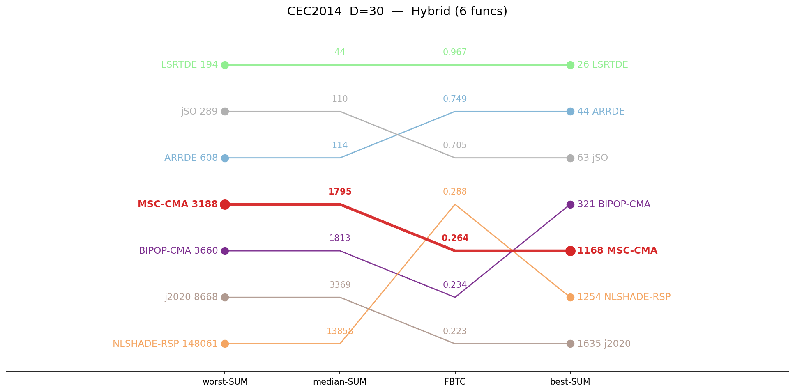
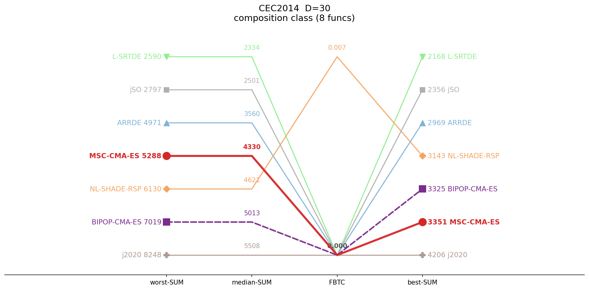
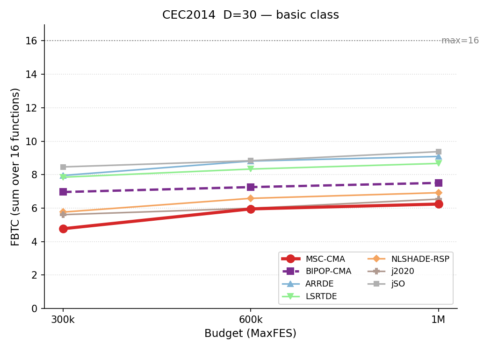
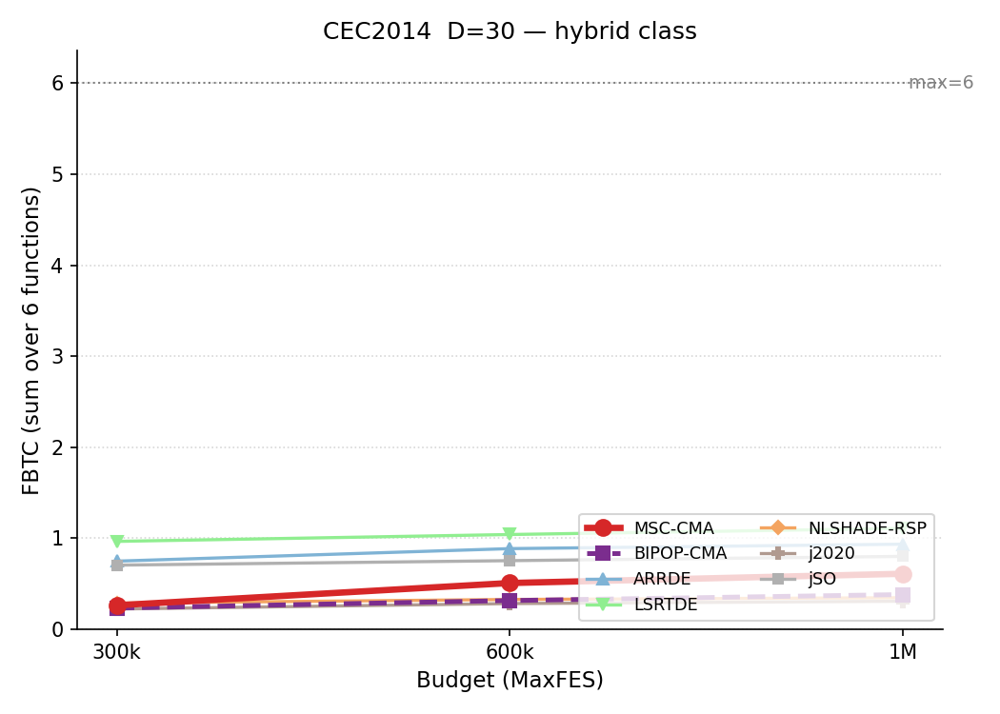
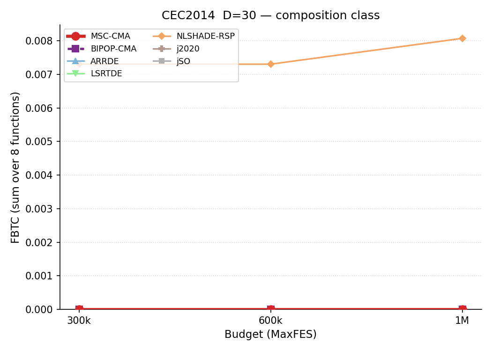
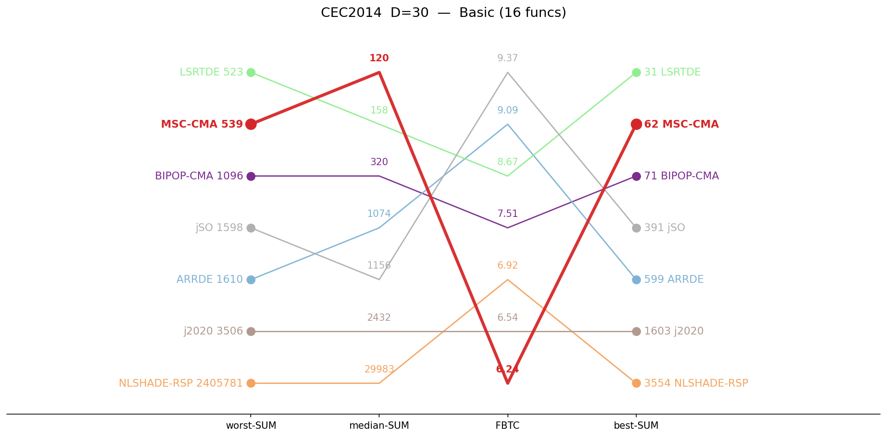
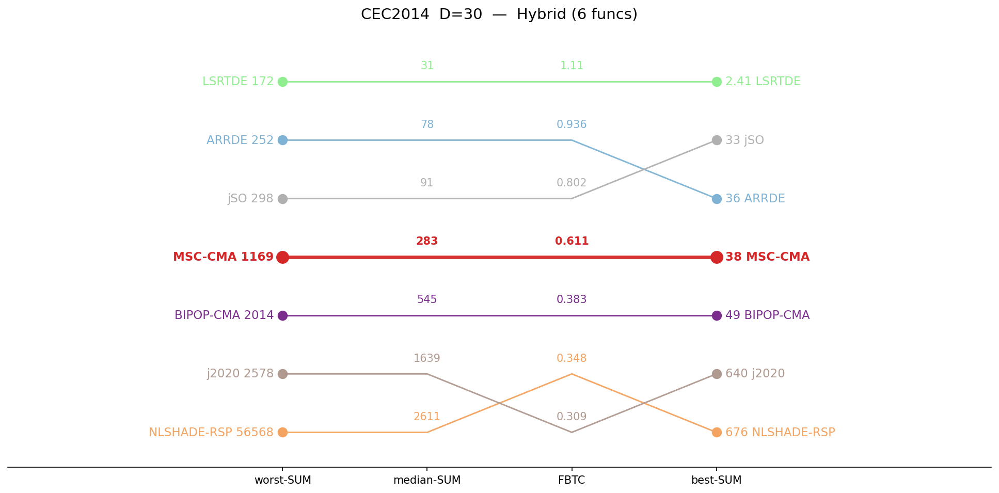
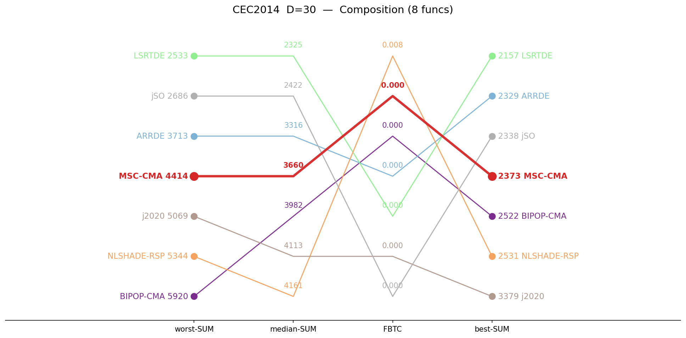

# CEC2014 / D=30 — by-category summary

Sums of per-function metrics, grouped by function class. Budget: 300,000 evaluations. **Bold** = best in row.

## Ranking across metrics (budget 300K)

Parallel-coordinate rank of all seven algorithms on four aggregate metrics (worst-SUM, median-SUM, FBTC, best-SUM), per function class. Each line is one algorithm; for every axis the best value is at the top. MSC-CMA in red.

<table>
<tr>
<td></td>
<td></td>
<td></td>
</tr>
<tr>
<td align="center">Basic</td>
<td align="center">Hybrid</td>
<td align="center">Composition</td>
</tr>
</table>

*Basic = unimodal + simple multimodal, per the CEC2014 definition.*

## Budget scaling

FBTC by budget, monotone envelope (running maximum over budgets). Higher is better. The budget axis is per class: a budget is shown only where all seven algorithms cover the whole class. MSC-CMA in red.

<table>
<tr>
<td></td>
<td></td>
<td></td>
</tr>
<tr>
<td align="center">Basic</td>
<td align="center">Hybrid</td>
<td align="center">Composition</td>
</tr>
</table>

## Ranking across metrics (budget 1M)

Same parallel-coordinate rank, recomputed at 1,000,000 evaluations. Only classes with full seven-algorithm coverage at 1M are shown. MSC-CMA in red.

<table>
<tr>
<td></td>
<td></td>
<td></td>
</tr>
<tr>
<td align="center">Basic</td>
<td align="center">Hybrid</td>
<td align="center">Composition</td>
</tr>
</table>

## Summary table

| Category | Metric | MSC-CMA | BIPOP-CMA |  | ARRDE | LSRTDE | NLSHADE | j2020 | jSO |
|:--|:--|--:|--:|:-:|--:|--:|--:|--:|--:|
| **Basic** (n=16) | mean | 513 | 1386 |    | 1892 | **457** | 370944 | 397092 | 1407 |
|  | median | 377 | 1283 |    | 1739 | **352** | 227493 | 302835 | 1407 |
|  | best | 74.2 | 343 |    | 936 | **34.2** | 59682 | 111591 | 857 |
|  | worst | **1414** | 3603 |    | 3769 | 1773 | 4447100 | 1949051 | 1884 |
|  | std | 345 | 693 |    | 630 | 381 | 609748 | 354740 | **205** |
|  | FBTC | 4.768 | 6.962 |    | 7.952 | 7.848 | 5.763 | 5.609 | **8.462** |
| **Hybrid** (n=6) | mean | 1866 | 1844 |    | 166 | **89.2** | 21111 | 3604 | 145 |
|  | median | 1795 | 1813 |    | 114 | **43.9** | 13858 | 3369 | 110 |
|  | best | 1168 | 321 |    | 43.7 | **26** | 1254 | 1635 | 62.9 |
|  | worst | 3188 | 3660 |    | 608 | **194** | 148061 | 8668 | 289 |
|  | std | 496 | 800 |    | 145 | **69.9** | 25977 | 1241 | 74.8 |
|  | FBTC | 0.264 | 0.234 |    | 0.749 | **0.967** | 0.288 | 0.223 | 0.705 |
| **Composition** (n=8) | mean | 4356 | 4883 |    | 3602 | **2359** | 4623 | 5716 | 2508 |
|  | median | 4330 | 5013 |    | 3560 | **2334** | 4621 | 5508 | 2501 |
|  | best | 3351 | 3325 |    | 2969 | **2168** | 3143 | 4206 | 2356 |
|  | worst | 5288 | 7019 |    | 4971 | **2590** | 6130 | 8248 | 2797 |
|  | std | 430 | 919 |    | 411 | 111 | 607 | 1119 | **99.7** |
|  | FBTC | 0.000 | 0.000 |    | 0.000 | 0.000 | **0.007** | 0.000 | 0.000 |
| **SUM** (n=30) | mean | 6735 | 8113 |    | 5660 | **2905** | 396677 | 406412 | 4060 |
|  | median | 6502 | 8109 |    | 5413 | **2730** | 245971 | 311712 | 4019 |
|  | best | 4593 | 3989 |    | 3949 | **2228** | 64080 | 117432 | 3275 |
|  | worst | 9890 | 14282 |    | 9347 | **4556** | 4601292 | 1965967 | 4969 |
|  | std | 1271 | 2411 |    | 1186 | 562 | 636332 | 357099 | **379** |
|  | FBTC | 5.032 | 7.195 |    | 8.701 | 8.815 | 6.058 | 5.832 | **9.168** |

*FBTC = Fixed-Budget Target Coverage (sum across 51 log-uniform targets in [10²…10⁻⁸] per function); fixed-budget analogue of the COCO/BBOB ECDF. Higher is better.*

## Environment
Python 3.13.5 (anaconda3 env `intelpython`) · NumPy 2.3.1 · SciPy 1.15.3 · pycma 4.4.2 · minionpy 1.5.0.
Hardware: Intel Xeon Platinum 8160 @ 2.10 GHz, 192 threads, 251 GiB RAM.

*Generated 2026-07-02 by analysis/cell_report.py from `*/maxevals_300000/f*.pkl` (table) and all common budgets (budget scaling).*
