# CEC2017 — cross-dimension summary

Aggregated sums by function category, across dimensions. **Bold** = best in row. For simplicity the suite is presented per dimension.

Official budgets — 10D: 100,000, 30D: 300,000.

## Ranking — D=10

Parallel-coordinate rank on four aggregate metrics (worst-SUM, median-SUM, FBTC, best-SUM). Best value at the top of each axis; MSC-CMA in red. Budget: 100,000 evaluations.

<table>
<tr>
<td>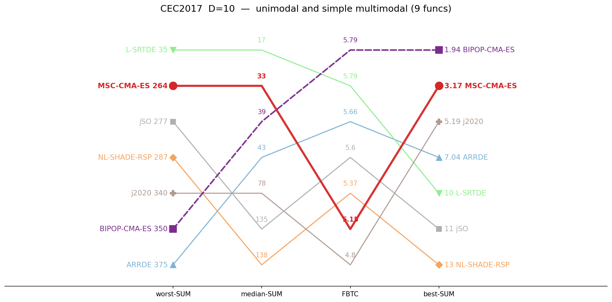</td>
<td></td>
<td>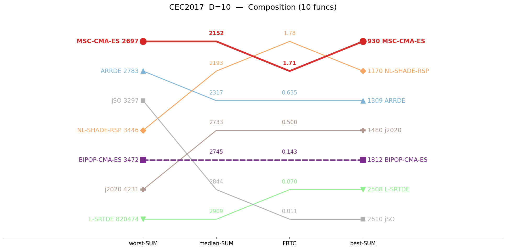</td>
</tr>
<tr>
<td align="center">unimodal and simple multimodal</td>
<td align="center">Hybrid</td>
<td align="center">Composition</td>
</tr>
</table>

## Budget scaling — D=10

FBTC by budget, monotone envelope; higher is better.

<table>
<tr>
<td>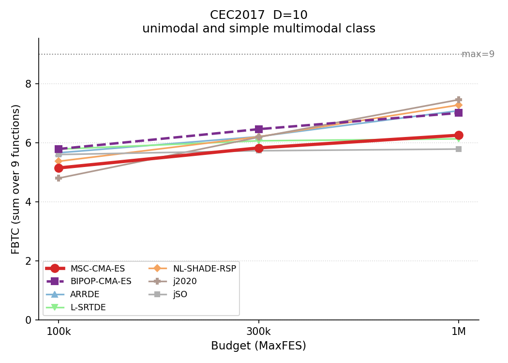</td>
<td>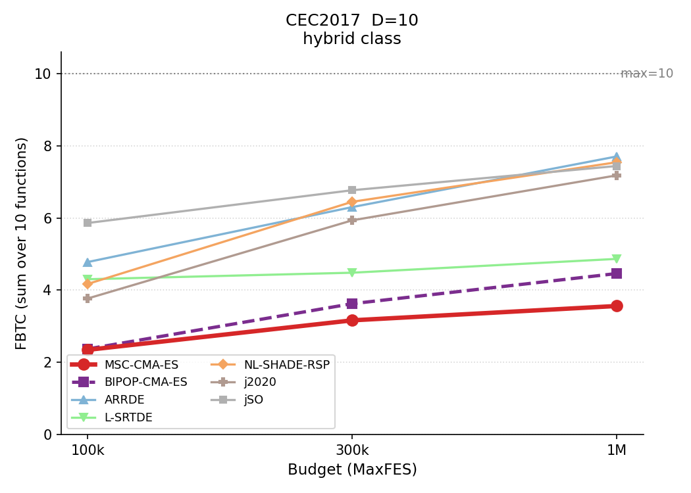</td>
<td>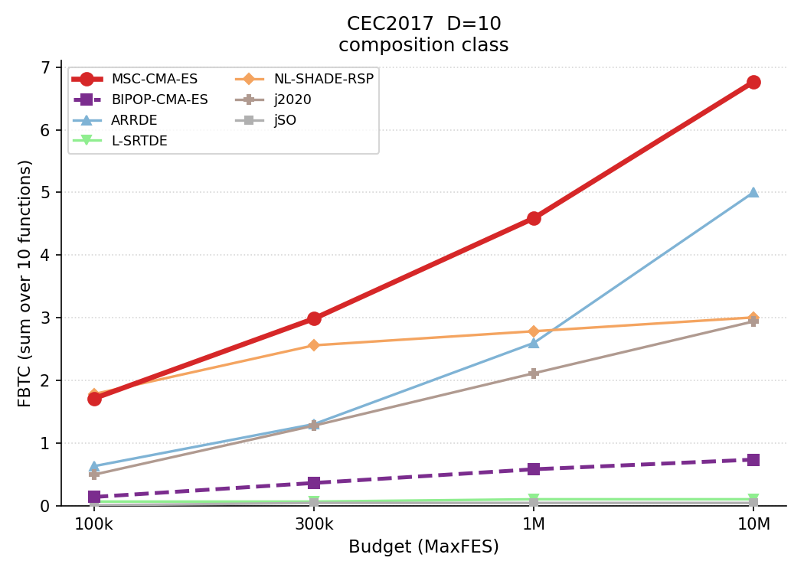</td>
</tr>
<tr>
<td align="center">unimodal and simple multimodal</td>
<td align="center">Hybrid</td>
<td align="center">Composition</td>
</tr>
</table>

## Ranking — D=10 (budget 1M)

Same rank, recomputed at 1,000,000 evaluations. Only classes with full 7-algorithm coverage at 1M are shown.

<table>
<tr>
<td>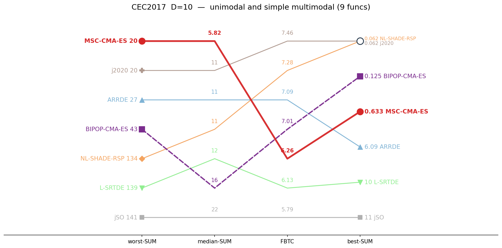</td>
<td>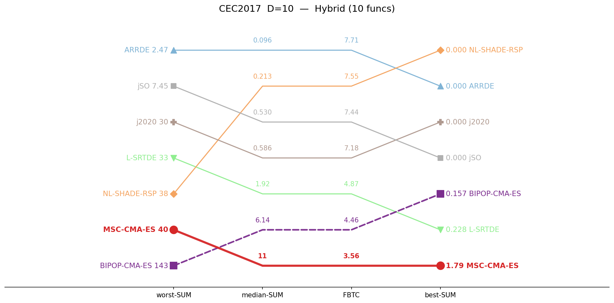</td>
<td>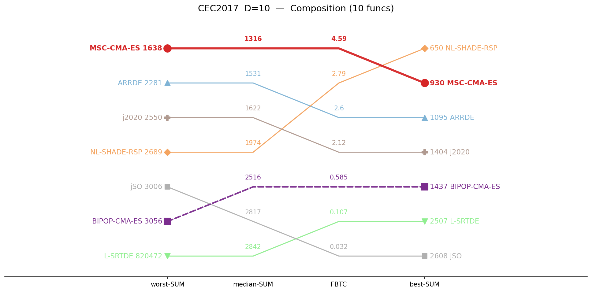</td>
</tr>
<tr>
<td align="center">unimodal and simple multimodal</td>
<td align="center">Hybrid</td>
<td align="center">Composition</td>
</tr>
</table>

## Ranking — D=10 (budget 10M)

Same rank, recomputed at 10,000,000 evaluations. Only classes with full 7-algorithm coverage at 10M are shown.

<table>
<tr>
<td></td>
<td></td>
<td>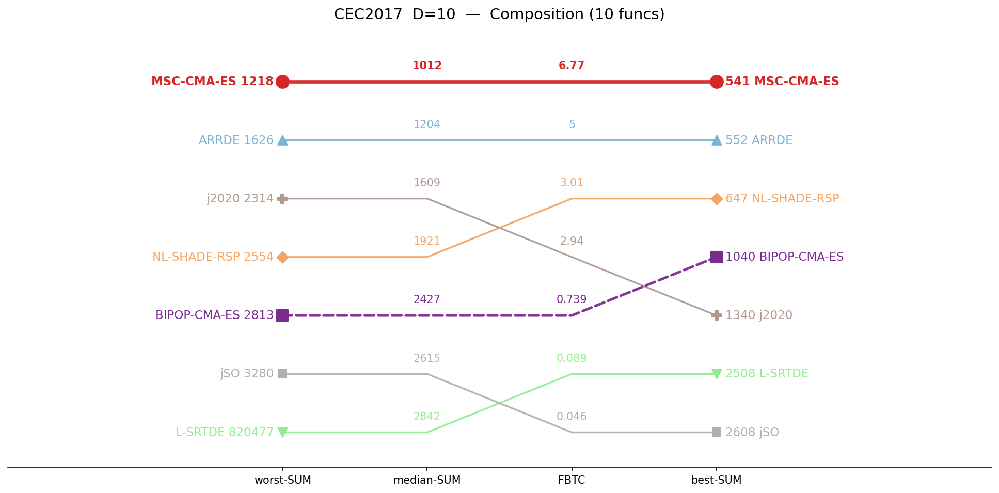</td>
</tr>
<tr>
<td></td>
<td></td>
<td align="center">Composition</td>
</tr>
</table>

## Ranking — D=30

Parallel-coordinate rank on four aggregate metrics (worst-SUM, median-SUM, FBTC, best-SUM). Best value at the top of each axis; MSC-CMA in red. Budget: 300,000 evaluations.

<table>
<tr>
<td>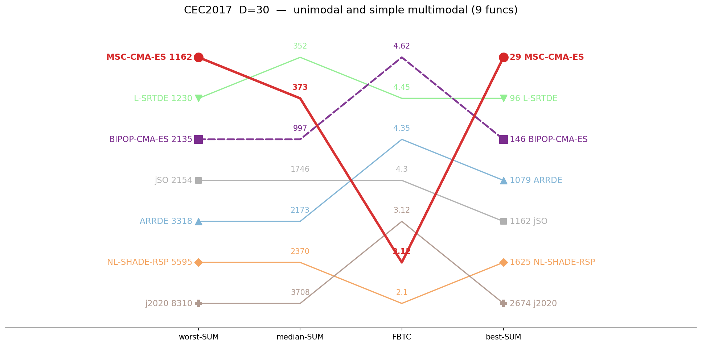</td>
<td>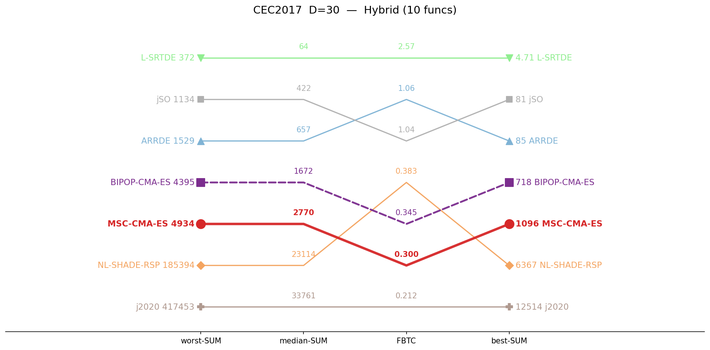</td>
<td>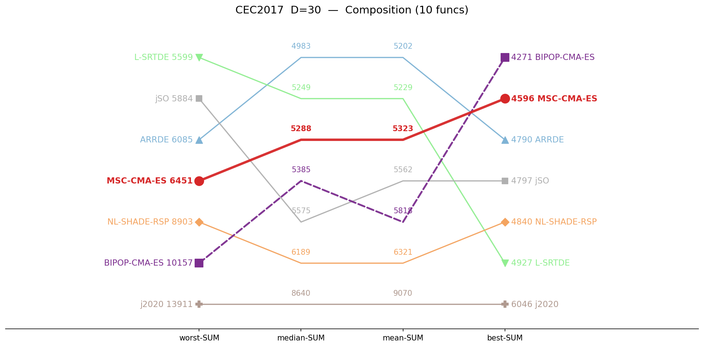</td>
</tr>
<tr>
<td align="center">unimodal and simple multimodal</td>
<td align="center">Hybrid</td>
<td align="center">Composition</td>
</tr>
</table>

## Budget scaling — D=30

FBTC by budget, monotone envelope; higher is better. Composition is shown as *median error* (lower is better): no algorithm reaches even the easiest target, so FBTC is zero for all.

<table>
<tr>
<td>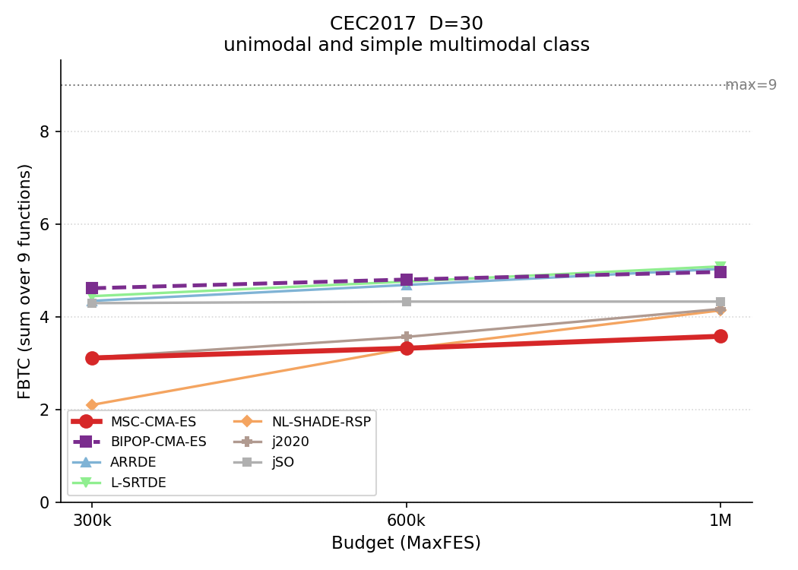</td>
<td>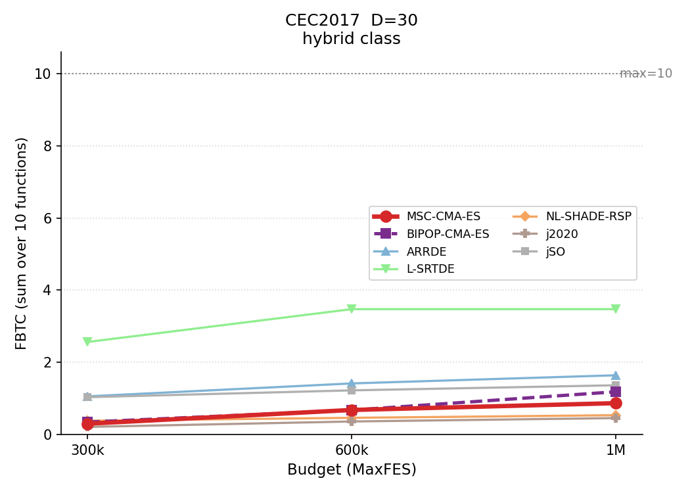</td>
<td>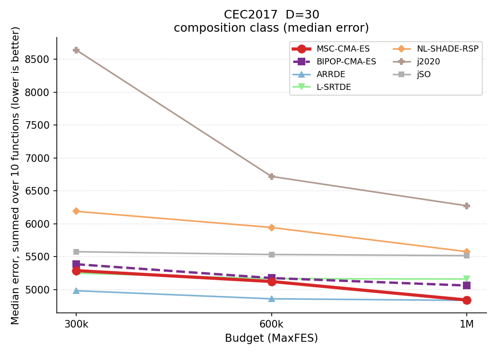</td>
</tr>
<tr>
<td align="center">unimodal and simple multimodal</td>
<td align="center">Hybrid</td>
<td align="center">Composition</td>
</tr>
</table>

## Ranking — D=30 (budget 1M)

Same rank, recomputed at 1,000,000 evaluations. Only classes with full 7-algorithm coverage at 1M are shown.

<table>
<tr>
<td>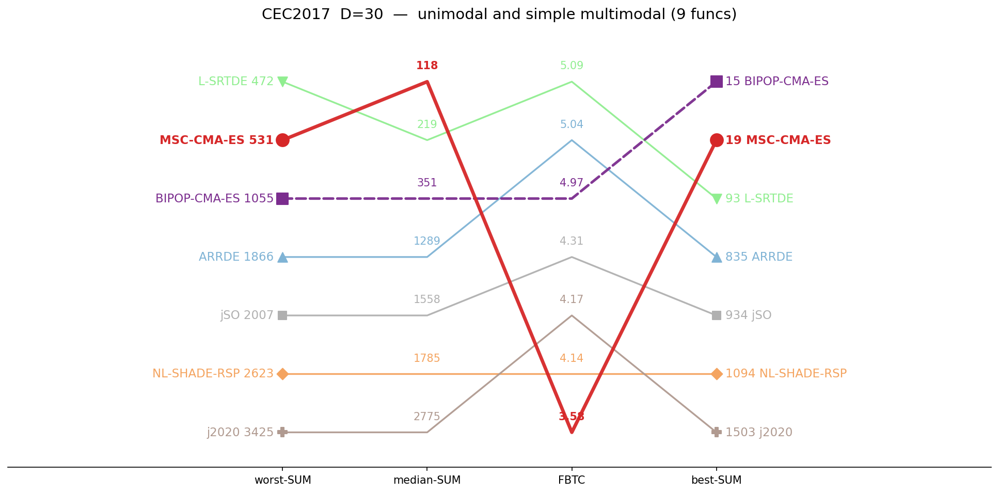</td>
<td>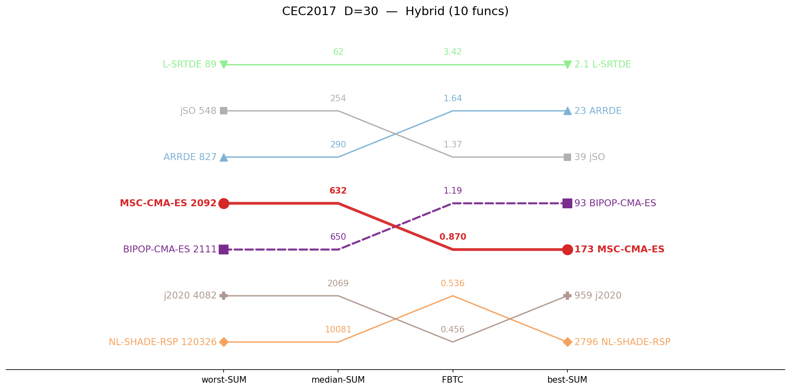</td>
<td>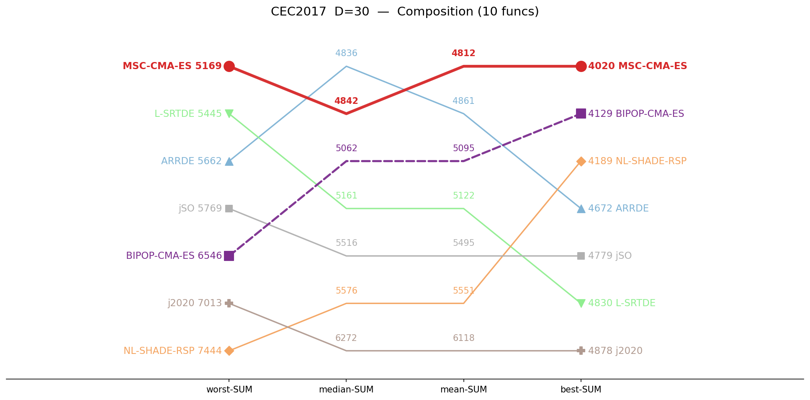</td>
</tr>
<tr>
<td align="center">unimodal and simple multimodal</td>
<td align="center">Hybrid</td>
<td align="center">Composition</td>
</tr>
</table>

## Median error (lower is better)

| Category | Dim | MSC-CMA-ES | BIPOP-CMA-ES |  | ARRDE | L-SRTDE | NL-SHADE-RSP | j2020 | jSO |
|:--|:--:|--:|--:|:-:|--:|--:|--:|--:|--:|
| unimodal and simple multimodal | 10 | 32.8 | 39.4 |    | 43.1 | **16.8** | 138 | 78.1 | 135 |
| unimodal and simple multimodal | 30 | 373 | 997 |    | 2173 | **352** | 2370 | 3708 | 1746 |
| Hybrid | 10 | 202 | 193 |    | 7.55 | 3.75 | 134 | 54.3 | **1.88** |
| Hybrid | 30 | 2770 | 1672 |    | 657 | **64.3** | 23114 | 33761 | 422 |
| Composition | 10 | **2152** | 2745 |    | 2317 | 2909 | 2193 | 2733 | 2844 |
| Composition | 30 | 5288 | 5385 |    | **4983** | 5249 | 6189 | 8640 | 5575 |

## Best error (lower is better)

| Category | Dim | MSC-CMA-ES | BIPOP-CMA-ES |  | ARRDE | L-SRTDE | NL-SHADE-RSP | j2020 | jSO |
|:--|:--:|--:|--:|:-:|--:|--:|--:|--:|--:|
| unimodal and simple multimodal | 10 | 3.17 | **1.94** |    | 7.04 | 10.5 | 13.3 | 5.19 | 10.9 |
| unimodal and simple multimodal | 30 | **28.9** | 146 |    | 1079 | 96.2 | 1625 | 2674 | 1162 |
| Hybrid | 10 | 4.38 | 1.92 |    | 0.0315 | **0.0195** | 4.74 | 0.233 | 0.0426 |
| Hybrid | 30 | 1096 | 718 |    | 84.7 | **4.71** | 6367 | 12514 | 81.2 |
| Composition | 10 | **930** | 1812 |    | 1309 | 2508 | 1170 | 1480 | 2610 |
| Composition | 30 | 4596 | **4271** |    | 4790 | 4927 | 4840 | 6046 | 4797 |

## Worst error (lower is better)

| Category | Dim | MSC-CMA-ES | BIPOP-CMA-ES |  | ARRDE | L-SRTDE | NL-SHADE-RSP | j2020 | jSO |
|:--|:--:|--:|--:|:-:|--:|--:|--:|--:|--:|
| unimodal and simple multimodal | 10 | 264 | 350 |    | 375 | **35.4** | 287 | 340 | 277 |
| unimodal and simple multimodal | 30 | **1162** | 2135 |    | 3318 | 1230 | 5595 | 8310 | 2154 |
| Hybrid | 10 | 423 | 698 |    | 236 | 156 | 614 | 463 | **10.8** |
| Hybrid | 30 | 4934 | 4395 |    | 1529 | **372** | 185394 | 417453 | 1134 |
| Composition | 10 | **2697** | 3472 |    | 2783 | 820474 | 3446 | 4231 | 3297 |
| Composition | 30 | 6451 | 10157 |    | 6085 | **5599** | 8903 | 13911 | 5884 |

## FBTC — Fixed-Budget Target Coverage (higher is better)

| Category | Dim | MSC-CMA-ES | BIPOP-CMA-ES |  | ARRDE | L-SRTDE | NL-SHADE-RSP | j2020 | jSO |
|:--|:--:|--:|--:|:-:|--:|--:|--:|--:|--:|
| unimodal and simple multimodal | 10 | 5.148 | **5.790** |    | 5.662 | 5.785 | 5.374 | 4.801 | 5.603 |
| unimodal and simple multimodal | 30 | 3.115 | **4.620** |    | 4.348 | 4.449 | 2.104 | 3.125 | 4.298 |
| Hybrid | 10 | 2.347 | 2.372 |    | 4.780 | 4.304 | 4.173 | 3.770 | **5.862** |
| Hybrid | 30 | 0.300 | 0.345 |    | 1.058 | **2.565** | 0.383 | 0.212 | 1.035 |
| Composition | 10 | 1.714 | 0.143 |    | 0.635 | 0.070 | **1.785** | 0.500 | 0.011 |
| Composition | 30 | **0.000** | **0.000** |    | **0.000** | **0.000** | **0.000** | **0.000** | **0.000** |

*FBTC = Fixed-Budget Target Coverage (sum across 51 log-uniform targets in [10²…10⁻⁸] per function); fixed-budget analogue of the COCO/BBOB ECDF. Higher is better.*

## Environment
Python 3.13.5 (anaconda3 env `intelpython`) · NumPy 2.3.1 · SciPy 1.15.3 · pycma 4.4.2 · minionpy 1.5.0.
Hardware: Intel Xeon Platinum 8160 @ 2.10 GHz, 192 threads, 251 GiB RAM.

*Generated 2026-07-21 by analysis/suite_report.py.*
