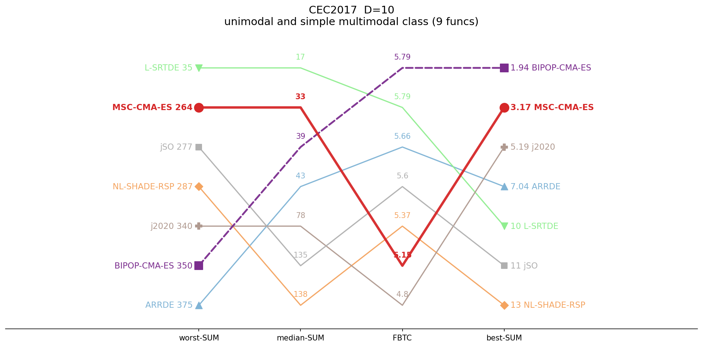
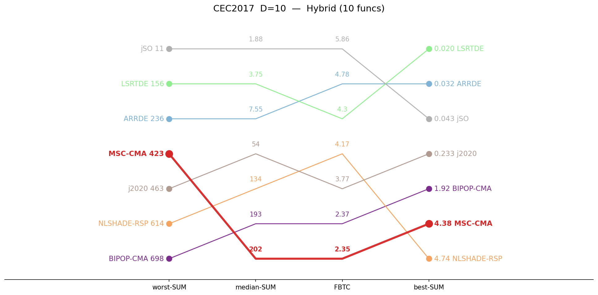
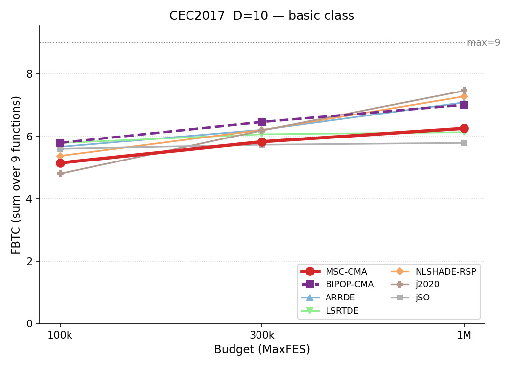
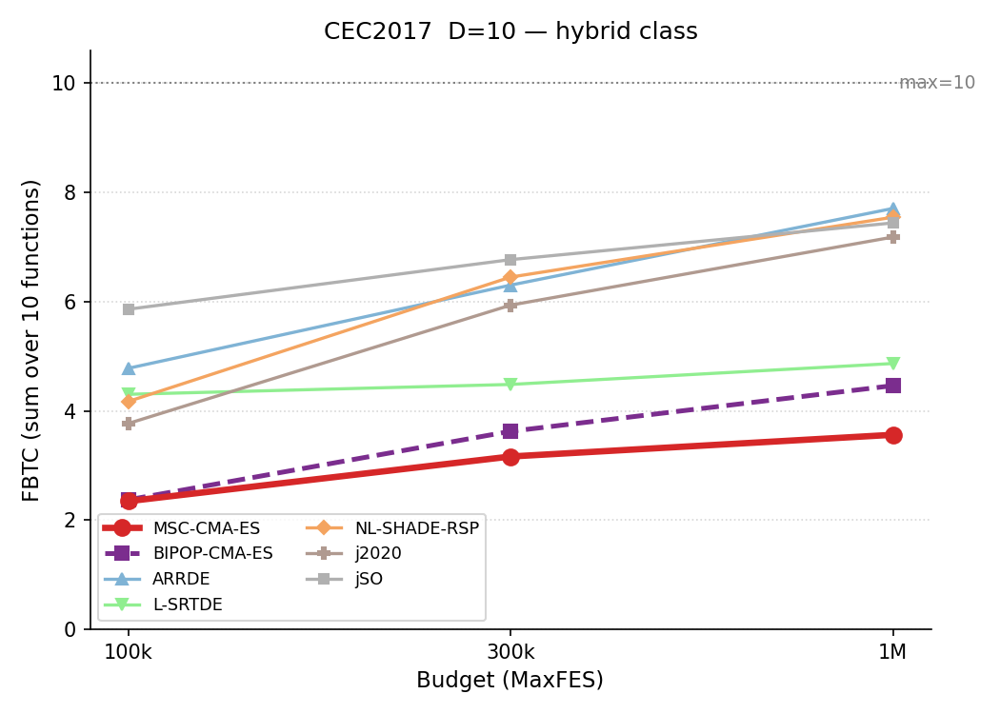
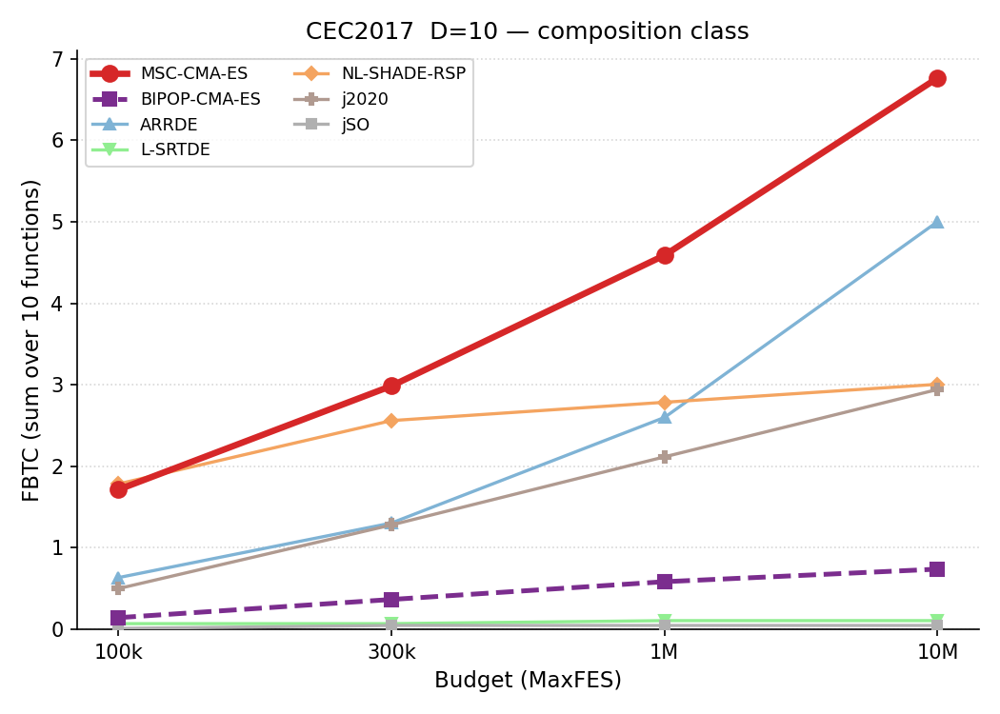
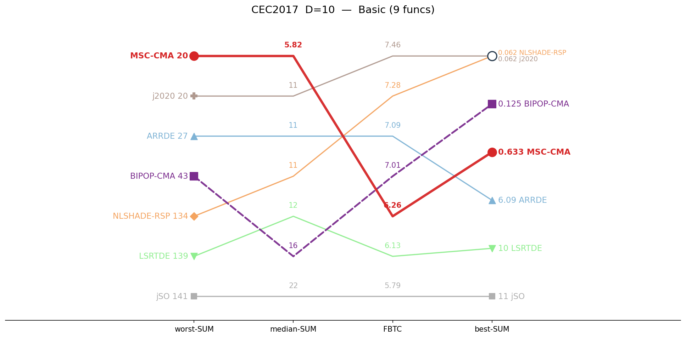
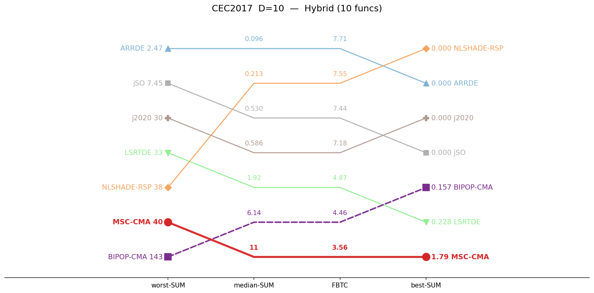
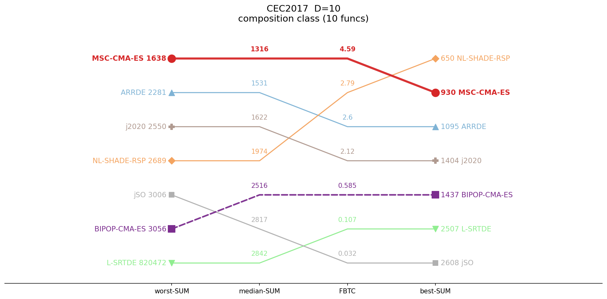
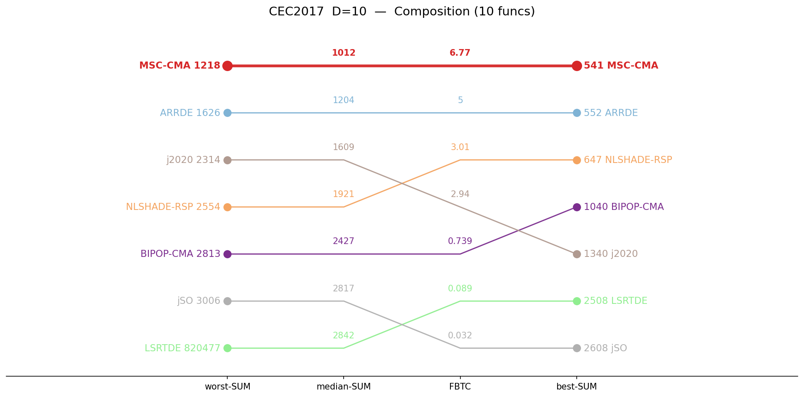

# CEC2017 / D=10 — by-category summary

Sums of per-function metrics, grouped by function class. Budget: 100,000 evaluations. **Bold** = best in row.

## Ranking across metrics (budget 100K)

Parallel-coordinate rank of all seven algorithms on four aggregate metrics (worst-SUM, median-SUM, FBTC, best-SUM), per function class. Each line is one algorithm; for every axis the best value is at the top. MSC-CMA in red.

<table>
<tr>
<td></td>
<td></td>
<td></td>
</tr>
<tr>
<td align="center">Basic</td>
<td align="center">Hybrid</td>
<td align="center">Composition</td>
</tr>
</table>

*Basic = unimodal + simple multimodal, per the CEC2017 definition.*

## Budget scaling

FBTC by budget, monotone envelope (running maximum over budgets). Higher is better. The budget axis is per class: a budget is shown only where all seven algorithms cover the whole class. MSC-CMA in red.

<table>
<tr>
<td></td>
<td></td>
<td></td>
</tr>
<tr>
<td align="center">Basic</td>
<td align="center">Hybrid</td>
<td align="center">Composition</td>
</tr>
</table>

## Ranking across metrics (budget 1M)

Same parallel-coordinate rank, recomputed at 1,000,000 evaluations. Only classes with full seven-algorithm coverage at 1M are shown. MSC-CMA in red.

<table>
<tr>
<td></td>
<td></td>
<td></td>
</tr>
<tr>
<td align="center">Basic</td>
<td align="center">Hybrid</td>
<td align="center">Composition</td>
</tr>
</table>

## Ranking across metrics (budget 10M)

Same parallel-coordinate rank, recomputed at 10,000,000 evaluations. Only classes with full seven-algorithm coverage at 10M are shown. MSC-CMA in red.

<table>
<tr>
<td></td><td></td>
<td></td>
</tr>
<tr>
<td></td><td></td>
<td align="center">Composition</td>
</tr>
</table>

## Summary table

| Category | Metric | MSC-CMA | BIPOP-CMA |  | ARRDE | LSRTDE | NLSHADE | j2020 | jSO |
|:--|:--|--:|--:|:-:|--:|--:|--:|--:|--:|
| **Basic** (n=9) | mean | 60.7 | 81.9 |    | 108 | **17.2** | 113 | 106 | 97.8 |
|  | median | 32.8 | 39.4 |    | 43.1 | **16.8** | 138 | 78.1 | 135 |
|  | best | 3.17 | **1.94** |    | 7.04 | 10.5 | 13.3 | 5.19 | 10.9 |
|  | worst | 264 | 350 |    | 375 | **35.4** | 287 | 340 | 277 |
|  | std | 67.5 | 86.8 |    | 106 | **6.81** | 86.1 | 87.6 | 78.3 |
|  | FBTC | 5.148 | **5.790** |    | 5.662 | 5.785 | 5.374 | 4.801 | 5.603 |
| **Hybrid** (n=10) | mean | 171 | 166 |    | 30.2 | 9.91 | 162 | 85.5 | **2.43** |
|  | median | 202 | 193 |    | 7.55 | 3.75 | 134 | 54.3 | **1.88** |
|  | best | 4.38 | 1.92 |    | 0.0315 | **0.0195** | 4.74 | 0.233 | 0.0426 |
|  | worst | 423 | 698 |    | 236 | 156 | 614 | 463 | **10.8** |
|  | std | 124 | 160 |    | 62.9 | 26.9 | 149 | 95.7 | **2.82** |
|  | FBTC | 2.347 | 2.372 |    | 4.780 | 4.304 | 4.173 | 3.770 | **5.862** |
| **Composition** (n=10) | mean | **1891** | 2754 |    | 2183 | 34956 | 2292 | 2637 | 2799 |
|  | median | **2152** | 2745 |    | 2317 | 2909 | 2193 | 2733 | 2844 |
|  | best | **930** | 1812 |    | 1309 | 2508 | 1170 | 1480 | 2610 |
|  | worst | **2697** | 3472 |    | 2783 | 820474 | 3446 | 4231 | 3297 |
|  | std | 569 | 449 |    | 459 | 160413 | 668 | 727 | **207** |
|  | FBTC | 1.714 | 0.143 |    | 0.635 | 0.070 | **1.785** | 0.500 | 0.011 |
| **SUM** (n=29) | mean | **2123** | 3002 |    | 2322 | 34983 | 2566 | 2828 | 2899 |
|  | median | 2387 | 2977 |    | **2368** | 2930 | 2465 | 2865 | 2981 |
|  | best | **937** | 1816 |    | 1316 | 2518 | 1188 | 1486 | 2621 |
|  | worst | **3384** | 4520 |    | 3394 | 820665 | 4348 | 5034 | 3585 |
|  | std | 760 | 696 |    | 628 | 160446 | 903 | 910 | **288** |
|  | FBTC | 9.209 | 8.306 |    | 11.077 | 10.159 | 11.331 | 9.071 | **11.476** |

*FBTC = Fixed-Budget Target Coverage (sum across 51 log-uniform targets in [10²…10⁻⁸] per function); fixed-budget analogue of the COCO/BBOB ECDF. Higher is better.*

## Environment
Python 3.13.5 (anaconda3 env `intelpython`) · NumPy 2.3.1 · SciPy 1.15.3 · pycma 4.4.2 · minionpy 1.5.0.
Hardware: Intel Xeon Platinum 8160 @ 2.10 GHz, 192 threads, 251 GiB RAM.

*Generated 2026-07-02 by analysis/cell_report.py from `*/maxevals_100000/f*.pkl` (table) and all common budgets (budget scaling).*
