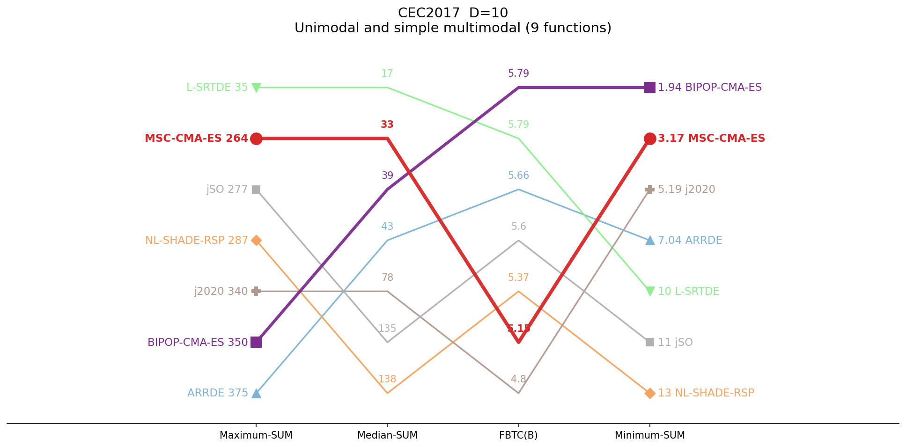
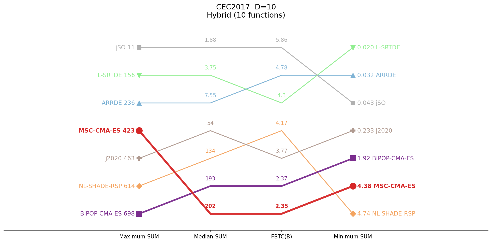
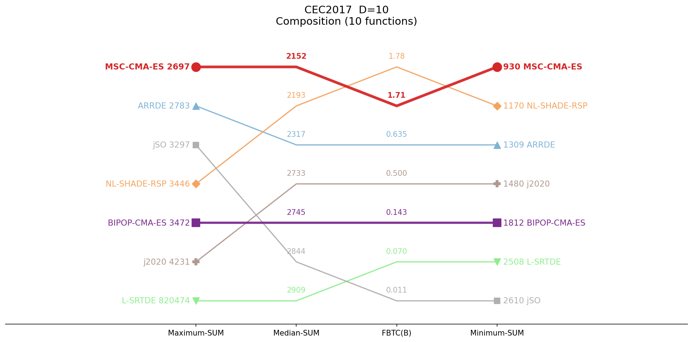
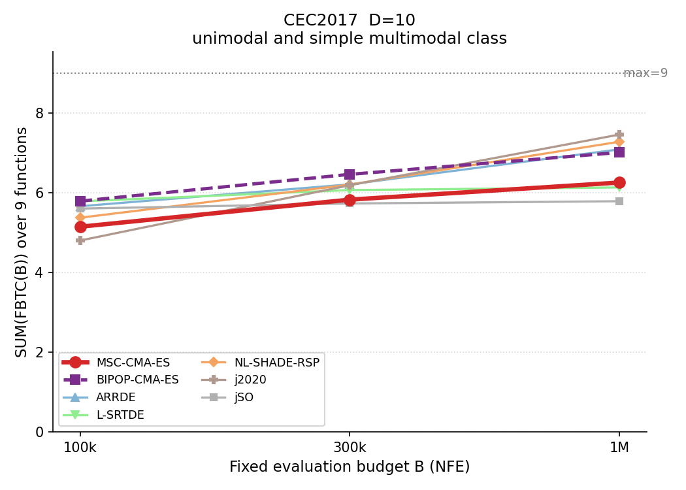
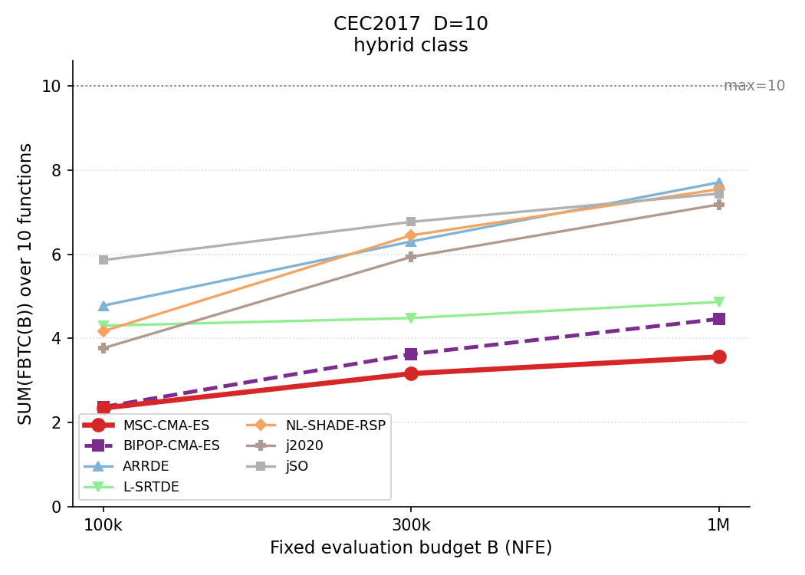
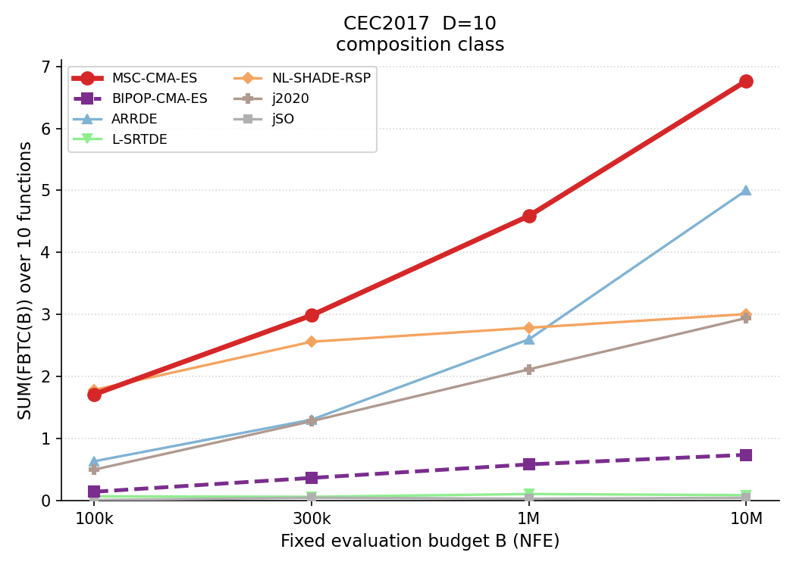
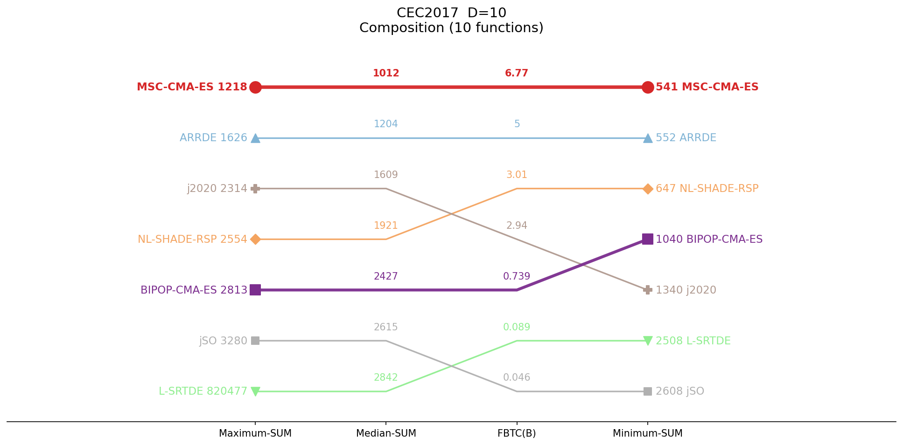

# CEC2017 / D=10 — by-category summary

## Ranking — D=10 (B = 10^5)

Parallel-coordinate rank of all 7 algorithms on four aggregate metrics (Maximum-SUM, Median-SUM, FBTC(B), Minimum-SUM), per function class. Each line is one algorithm. The axes are oriented so smaller error-based sums and larger FBTC(B) values appear toward the top. MSC-CMA-ES is shown in red. Budget: B = 10^5 evaluations.

<table>
<tr>
<td></td>
<td></td>
<td></td>
</tr>
<tr>
<td align="center">Unimodal and simple multimodal</td>
<td align="center">Hybrid</td>
<td align="center">Composition</td>
</tr>
</table>

## Budget scaling — D=10

Raw FBTC(B) at each evaluated fixed budget; no running maximum is applied. Each point is a separate fixed-budget experiment. Larger FBTC(B) values indicate greater fixed-budget target coverage. The budget axis is per class: a budget is shown only where all 7 algorithms cover the whole class. MSC-CMA-ES is shown in red. Official budget for this cell: B = 10^5 evaluations.

<table>
<tr>
<td></td>
<td></td>
<td></td>
</tr>
<tr>
<td align="center">Unimodal and simple multimodal</td>
<td align="center">Hybrid</td>
<td align="center">Composition</td>
</tr>
</table>

## Ranking — D=10 (B = 10^7)

Same parallel-coordinate rank, recomputed at B = 10^7 evaluations. Only classes with full 7-algorithm coverage at B = 10^7 are shown. MSC-CMA-ES is shown in red.

<table>
<tr>
<td></td>
<td></td>
<td></td>
</tr>
<tr>
<td></td>
<td></td>
<td align="center">Composition</td>
</tr>
</table>

## Summary table

Sums of per-function metrics, grouped by function class. Budget: 10^5 evaluations. Bold marks the minimum value for error-based metrics and standard deviation, and the maximum value for FBTC(B). These values are descriptive and are not significance tests.

| Category | Metric | MSC-CMA-ES | BIPOP-CMA-ES | ARRDE | L-SRTDE | NL-SHADE-RSP | j2020 | jSO |
|:--|:--|--:|--:|--:|--:|--:|--:|--:|
| **Unimodal and simple multimodal** (n=9) | Mean | 60.7 | 81.9 | 108 | **17.2** | 113 | 106 | 97.8 |
|  | Median | 32.8 | 39.4 | 43.1 | **16.8** | 138 | 78.1 | 135 |
|  | Minimum | 3.17 | **1.94** | 7.04 | 10.5 | 13.3 | 5.19 | 10.9 |
|  | Maximum | 264 | 350 | 375 | **35.4** | 287 | 340 | 277 |
|  | Std. | 67.5 | 86.8 | 106 | **6.81** | 86.1 | 87.6 | 78.3 |
|  | FBTC(B) | 5.148 | **5.790** | 5.662 | 5.785 | 5.374 | 4.801 | 5.603 |
| **Hybrid** (n=10) | Mean | 171 | 166 | 30.2 | 9.91 | 162 | 85.5 | **2.43** |
|  | Median | 202 | 193 | 7.55 | 3.75 | 134 | 54.3 | **1.88** |
|  | Minimum | 4.38 | 1.92 | 0.0315 | **0.0195** | 4.74 | 0.233 | 0.0426 |
|  | Maximum | 423 | 698 | 236 | 156 | 614 | 463 | **10.8** |
|  | Std. | 124 | 160 | 62.9 | 26.9 | 149 | 95.7 | **2.82** |
|  | FBTC(B) | 2.347 | 2.372 | 4.780 | 4.304 | 4.173 | 3.770 | **5.862** |
| **Composition** (n=10) | Mean | **1891** | 2754 | 2183 | 34956 | 2292 | 2637 | 2799 |
|  | Median | **2152** | 2745 | 2317 | 2909 | 2193 | 2733 | 2844 |
|  | Minimum | **930** | 1812 | 1309 | 2508 | 1170 | 1480 | 2610 |
|  | Maximum | **2697** | 3472 | 2783 | 820474 | 3446 | 4231 | 3297 |
|  | Std. | 569 | 449 | 459 | 160413 | 668 | 727 | **207** |
|  | FBTC(B) | 1.714 | 0.143 | 0.635 | 0.070 | **1.785** | 0.500 | 0.011 |
| **All** (n=29) | Mean | **2123** | 3002 | 2322 | 34983 | 2566 | 2828 | 2899 |
|  | Median | 2387 | 2977 | **2368** | 2930 | 2465 | 2865 | 2981 |
|  | Minimum | **937** | 1816 | 1316 | 2518 | 1188 | 1486 | 2621 |
|  | Maximum | **3384** | 4520 | 3394 | 820665 | 4348 | 5034 | 3585 |
|  | Std. | 760 | 696 | 628 | 160446 | 903 | 910 | **288** |
|  | FBTC(B) | 9.209 | 8.306 | 11.077 | 10.159 | 11.331 | 9.071 | **11.476** |

*FBTC(B) = Fixed-Budget Target Coverage at evaluation budget B: for each function, the mean attainment rate over 51 log-uniform targets in [10²…10⁻⁸] and 51 runs, computed from the terminal best-so-far errors at that budget. Class and All rows add the per-function FBTC(B) values. Each budget is evaluated separately; FBTC(B) is not an anytime measure. Larger FBTC(B) values indicate greater fixed-budget target coverage.*

## Environment
Python 3.13.5 (anaconda3 env `intelpython`) · NumPy 2.3.1 · SciPy 1.15.3 · pycma 4.4.2 · minionpy 1.5.0.
Hardware: Intel Xeon Platinum 8160 @ 2.10 GHz, 192 threads, 251 GiB RAM.

*Generated 2026-08-26 by analysis/cell_report.py from `*/maxevals_100000/f*.pkl` (table) and all common budgets (budget scaling).*
