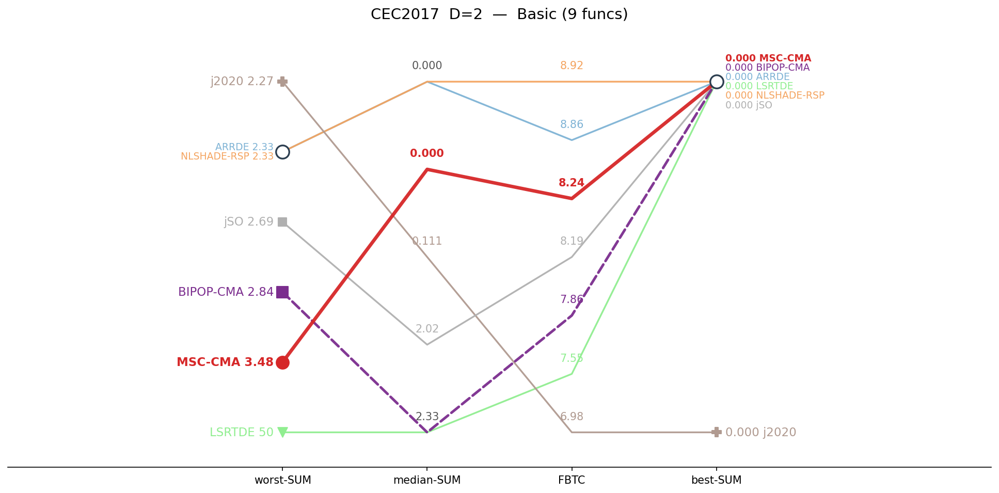
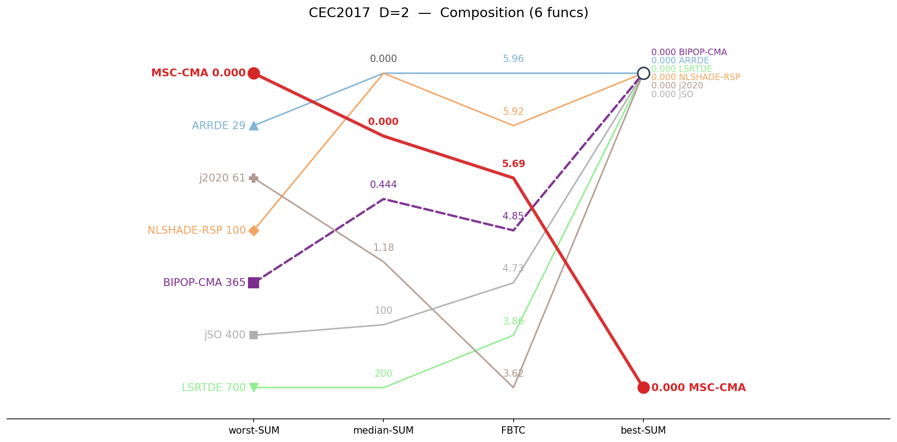
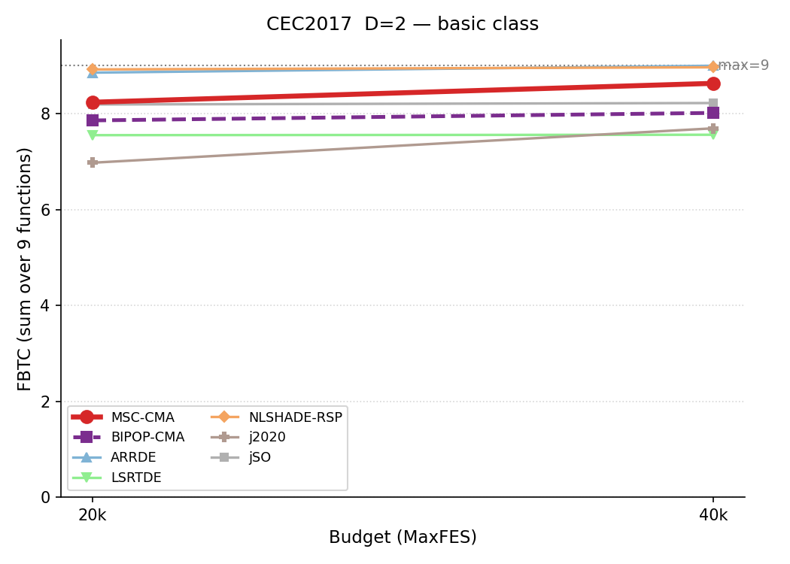
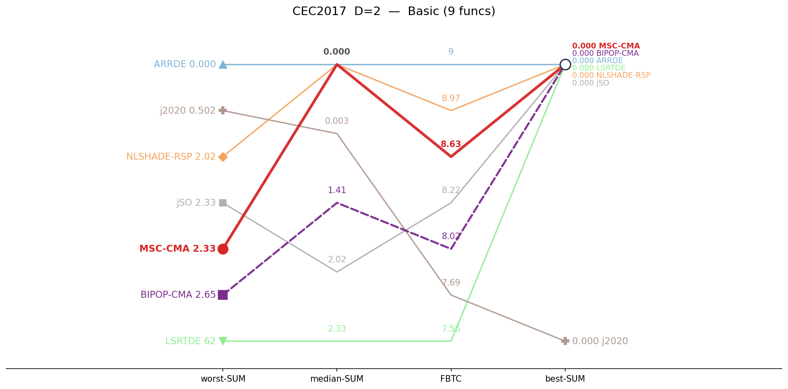

# CEC2017 / D=2 — by-category summary

Sums of per-function metrics, grouped by function class. Budget: 20,000 evaluations. **Bold** = best in row.

## Ranking across metrics (budget 20K)

Parallel-coordinate rank of all seven algorithms on four aggregate metrics (worst-SUM, median-SUM, FBTC, best-SUM), per function class. Each line is one algorithm; for every axis the best value is at the top. MSC-CMA in red.

<table>
<tr>
<td></td>
<td></td>
</tr>
<tr>
<td align="center">Basic</td>
<td align="center">Composition</td>
</tr>
</table>

*Basic = unimodal + simple multimodal, per the CEC2017 definition.*

## Budget scaling

FBTC by budget, monotone envelope (running maximum over budgets). Higher is better. The budget axis is per class: a budget is shown only where all seven algorithms cover the whole class. MSC-CMA in red.

<table>
<tr>
<td></td>
</tr>
<tr>
<td align="center">Basic</td>
</tr>
</table>

## Ranking across metrics (budget 40K)

Same parallel-coordinate rank, recomputed at 40,000 evaluations. Only classes with full seven-algorithm coverage at 40K are shown. MSC-CMA in red.

<table>
<tr>
<td></td>
</tr>
<tr>
<td align="center">Basic</td>
</tr>
</table>

## Summary table

| Category | Metric | MSC-CMA | BIPOP-CMA |  | ARRDE | LSRTDE | NLSHADE | j2020 | jSO |
|:--|:--|--:|--:|:-:|--:|--:|--:|--:|--:|
| **Basic** (n=9) | mean | 0.679 | 1.71 |    | 0.162 | 5.22 | **0.111** | 0.449 | 1.36 |
|  | median | 1.4e-5 | 2.33 |    | **0** | 2.33 | **0** | 0.111 | 2.02 |
|  | best | **0** | **0** |    | **0** | **0** | **0** | 3.6e-5 | **0** |
|  | worst | 3.48 | 2.84 |    | 2.33 | 49.9 | 2.33 | **2.27** | 2.69 |
|  | std | 1.01 | 0.908 |    | 0.535 | 9.18 | **0.477** | 0.669 | 1.15 |
|  | FBTC | 8.238 | 7.859 |    | 8.856 | 7.552 | **8.923** | 6.976 | 8.192 |
| **Hybrid** (n=0) | mean | **0** | **0** |    | **0** | **0** | **0** | **0** | **0** |
|  | median | **0** | **0** |    | **0** | **0** | **0** | **0** | **0** |
|  | best | **0** | **0** |    | **0** | **0** | **0** | **0** | **0** |
|  | worst | **0** | **0** |    | **0** | **0** | **0** | **0** | **0** |
|  | std | **0** | **0** |    | **0** | **0** | **0** | **0** | **0** |
|  | FBTC | **0.000** | **0.000** |    | **0.000** | **0.000** | **0.000** | **0.000** | **0.000** |
| **Composition** (n=6) | mean | **1.7e-5** | 89.9 |    | 0.734 | 236 | 7.84 | 5.2 | 134 |
|  | median | 4.6e-6 | 0.444 |    | **0** | 200 | **0** | 1.18 | 100 |
|  | best | 1.9e-7 | **0** |    | **0** | **0** | **0** | **0** | **0** |
|  | worst | **2.0e-4** | 365 |    | 28.9 | 700 | 100 | 61.1 | 400 |
|  | std | **3.7e-5** | 115 |    | 4.2 | 180 | 27.2 | 12 | 150 |
|  | FBTC | 5.689 | 4.850 |    | **5.964** | 3.863 | 5.922 | 3.625 | 4.731 |
| **SUM** (n=15) | mean | **0.679** | 91.6 |    | 0.896 | 241 | 7.95 | 5.64 | 135 |
|  | median | 1.9e-5 | 2.77 |    | **0** | 202 | **0** | 1.29 | 102 |
|  | best | 1.9e-7 | **0** |    | **0** | **0** | **0** | 3.6e-5 | **0** |
|  | worst | **3.48** | 368 |    | 31.2 | 750 | 102 | 63.4 | 403 |
|  | std | **1.01** | 115 |    | 4.73 | 189 | 27.6 | 12.6 | 151 |
|  | FBTC | 13.928 | 12.709 |    | 14.820 | 11.415 | **14.845** | 10.601 | 12.923 |

*FBTC = Fixed-Budget Target Coverage (sum across 51 log-uniform targets in [10²…10⁻⁸] per function); fixed-budget analogue of the COCO/BBOB ECDF. Higher is better.*

## Environment
Python 3.13.5 (anaconda3 env `intelpython`) · NumPy 2.3.1 · SciPy 1.15.3 · pycma 4.4.2 · minionpy 1.5.0.
Hardware: Intel Xeon Platinum 8160 @ 2.10 GHz, 192 threads, 251 GiB RAM.

*Generated 2026-07-09 by analysis/cell_report.py from `*/maxevals_20000/f*.pkl` (table) and all common budgets (budget scaling).*
