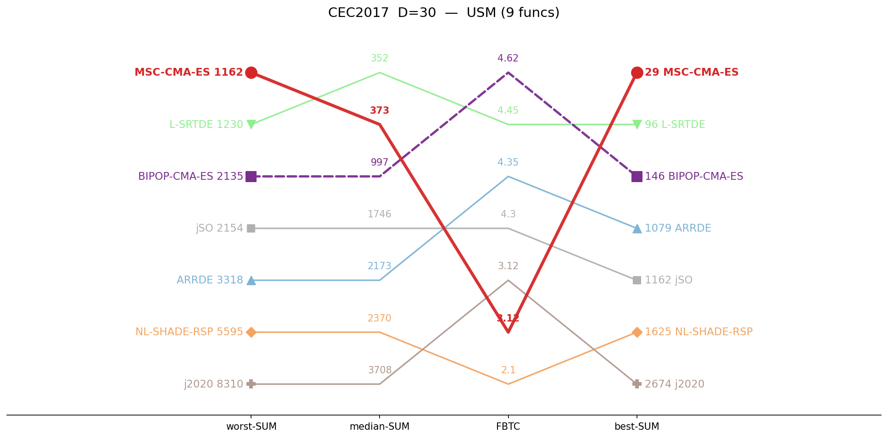
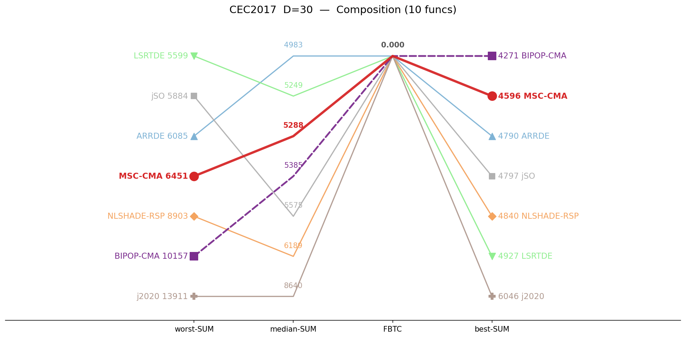
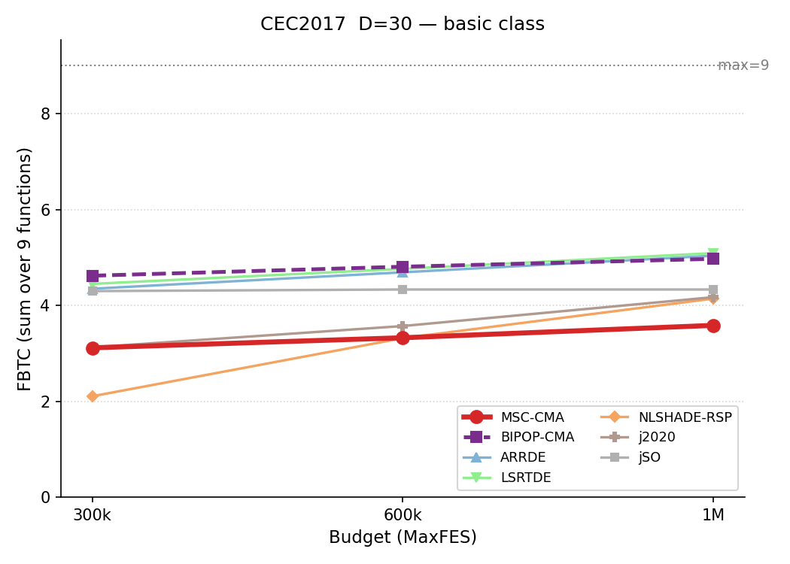
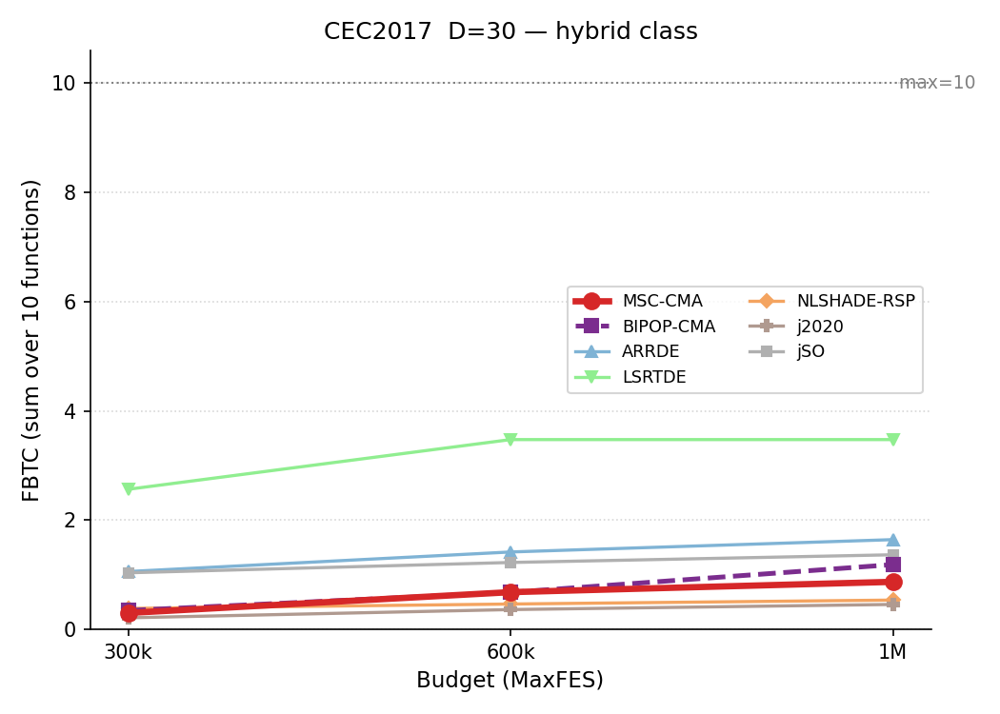
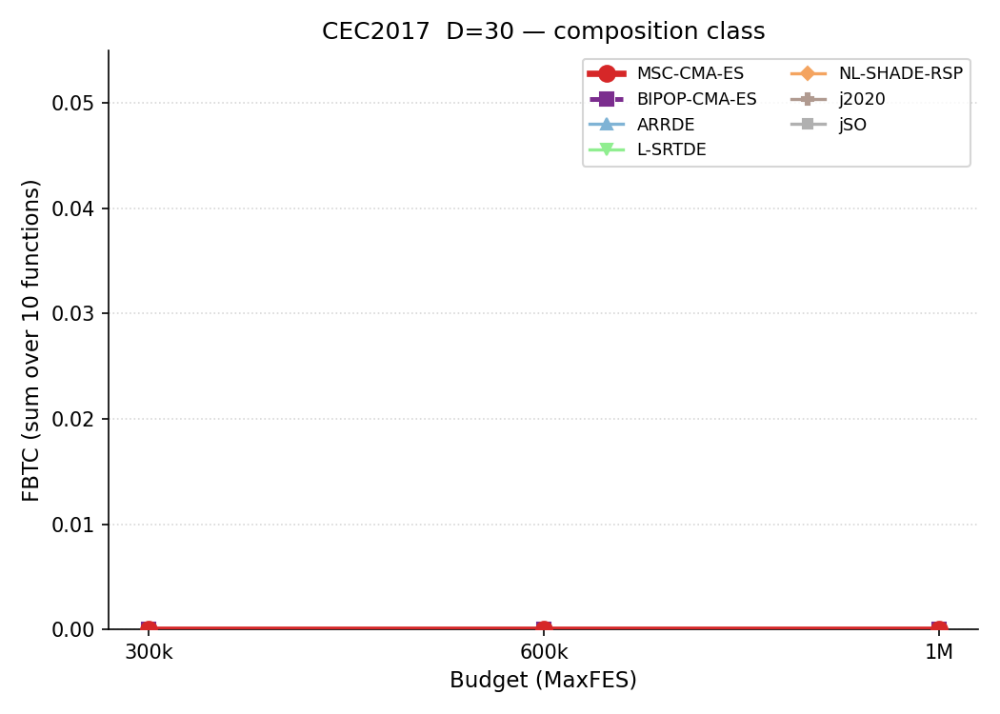
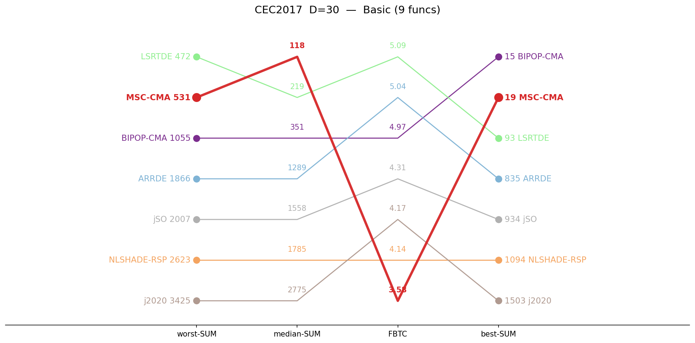
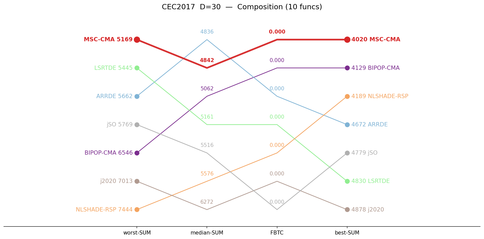

# CEC2017 / D=30 — by-category summary

Sums of per-function metrics, grouped by function class. Budget: 300,000 evaluations. **Bold** = best in row.

## Ranking across metrics (budget 300K)

Parallel-coordinate rank of all seven algorithms on four aggregate metrics (worst-SUM, median-SUM, FBTC, best-SUM), per function class. Each line is one algorithm; for every axis the best value is at the top. MSC-CMA in red.

<table>
<tr>
<td></td>
<td></td>
<td></td>
</tr>
<tr>
<td align="center">Basic</td>
<td align="center">Hybrid</td>
<td align="center">Composition</td>
</tr>
</table>

*Basic = unimodal + simple multimodal, per the CEC2017 definition.*

## Budget scaling

FBTC by budget, monotone envelope (running maximum over budgets). Higher is better. The budget axis is per class: a budget is shown only where all seven algorithms cover the whole class. MSC-CMA in red.

<table>
<tr>
<td></td>
<td></td>
<td></td>
</tr>
<tr>
<td align="center">Basic</td>
<td align="center">Hybrid</td>
<td align="center">Composition</td>
</tr>
</table>

## Ranking across metrics (budget 1M)

Same parallel-coordinate rank, recomputed at 1,000,000 evaluations. Only classes with full seven-algorithm coverage at 1M are shown. MSC-CMA in red.

<table>
<tr>
<td></td>
<td></td>
<td></td>
</tr>
<tr>
<td align="center">Basic</td>
<td align="center">Hybrid</td>
<td align="center">Composition</td>
</tr>
</table>

## Summary table

| Category | Metric | MSC-CMA | BIPOP-CMA |  | ARRDE | LSRTDE | NLSHADE | j2020 | jSO |
|:--|:--|--:|--:|:-:|--:|--:|--:|--:|--:|
| **Basic** (n=9) | mean | 435 | 1046 |    | 2145 | **421** | 2491 | 3894 | 1713 |
|  | median | 373 | 997 |    | 2173 | **352** | 2370 | 3708 | 1746 |
|  | best | **28.9** | 146 |    | 1079 | 96.2 | 1625 | 2674 | 1162 |
|  | worst | **1162** | 2135 |    | 3318 | 1230 | 5595 | 8310 | 2154 |
|  | std | 285 | 447 |    | 548 | **256** | 801 | 1038 | 272 |
|  | FBTC | 3.115 | **4.620** |    | 4.348 | 4.449 | 2.104 | 3.125 | 4.298 |
| **Hybrid** (n=10) | mean | 2779 | 1855 |    | 696 | **75.9** | 32985 | 48737 | 445 |
|  | median | 2770 | 1672 |    | 657 | **64.3** | 23114 | 33761 | 422 |
|  | best | 1096 | 718 |    | 84.7 | **4.71** | 6367 | 12514 | 81.2 |
|  | worst | 4934 | 4395 |    | 1529 | **372** | 185394 | 417453 | 1134 |
|  | std | 909 | 871 |    | 326 | **75.6** | 31129 | 57907 | 245 |
|  | FBTC | 0.300 | 0.345 |    | 1.058 | **2.565** | 0.383 | 0.212 | 1.035 |
| **Composition** (n=10) | mean | 5323 | 5818 |    | **5202** | 5229 | 6321 | 9070 | 5562 |
|  | median | 5288 | 5385 |    | **4983** | 5249 | 6189 | 8640 | 5575 |
|  | best | 4596 | **4271** |    | 4790 | 4927 | 4840 | 6046 | 4797 |
|  | worst | 6451 | 10157 |    | 6085 | **5599** | 8903 | 13911 | 5884 |
|  | std | 379 | 1271 |    | 447 | **161** | 819 | 1845 | 188 |
|  | FBTC | **0.000** | **0.000** |    | **0.000** | **0.000** | **0.000** | **0.000** | **0.000** |
| **SUM** (n=29) | mean | 8538 | 8719 |    | 8043 | **5726** | 41797 | 61700 | 7719 |
|  | median | 8431 | 8054 |    | 7813 | **5666** | 31673 | 46109 | 7743 |
|  | best | 5721 | 5135 |    | 5954 | **5028** | 12832 | 21234 | 6040 |
|  | worst | 12548 | 16687 |    | 10932 | **7201** | 199892 | 439674 | 9172 |
|  | std | 1573 | 2589 |    | 1320 | **492** | 32750 | 60790 | 704 |
|  | FBTC | 3.416 | 4.965 |    | 5.406 | **7.014** | 2.487 | 3.337 | 5.334 |

*FBTC = Fixed-Budget Target Coverage (sum across 51 log-uniform targets in [10²…10⁻⁸] per function); fixed-budget analogue of the COCO/BBOB ECDF. Higher is better.*

## Environment
Python 3.13.5 (anaconda3 env `intelpython`) · NumPy 2.3.1 · SciPy 1.15.3 · pycma 4.4.2 · minionpy 1.5.0.
Hardware: Intel Xeon Platinum 8160 @ 2.10 GHz, 192 threads, 251 GiB RAM.

*Generated 2026-07-02 by analysis/cell_report.py from `*/maxevals_300000/f*.pkl` (table) and all common budgets (budget scaling).*
