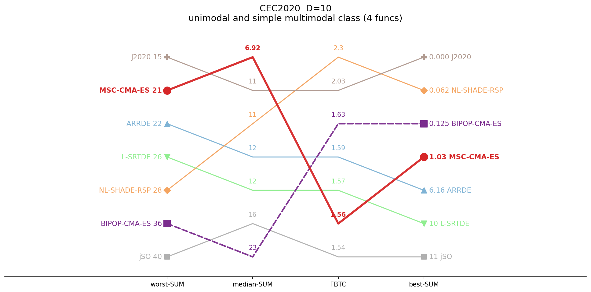
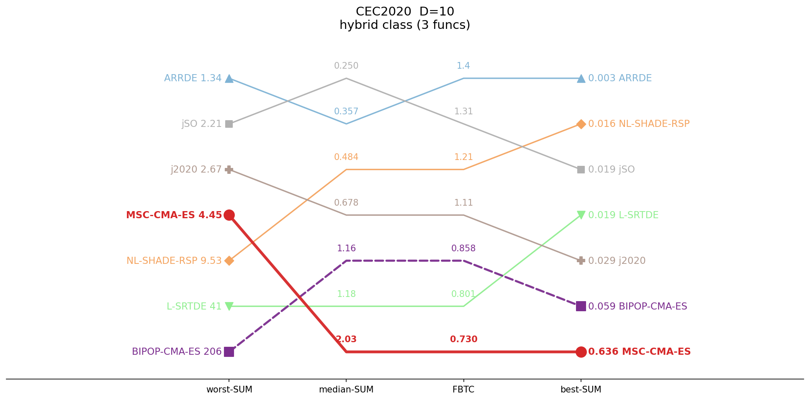
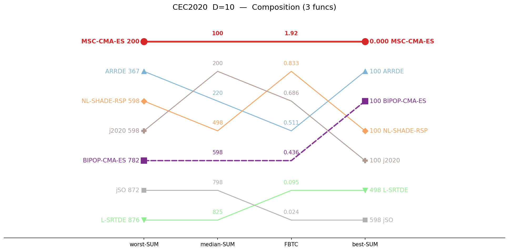
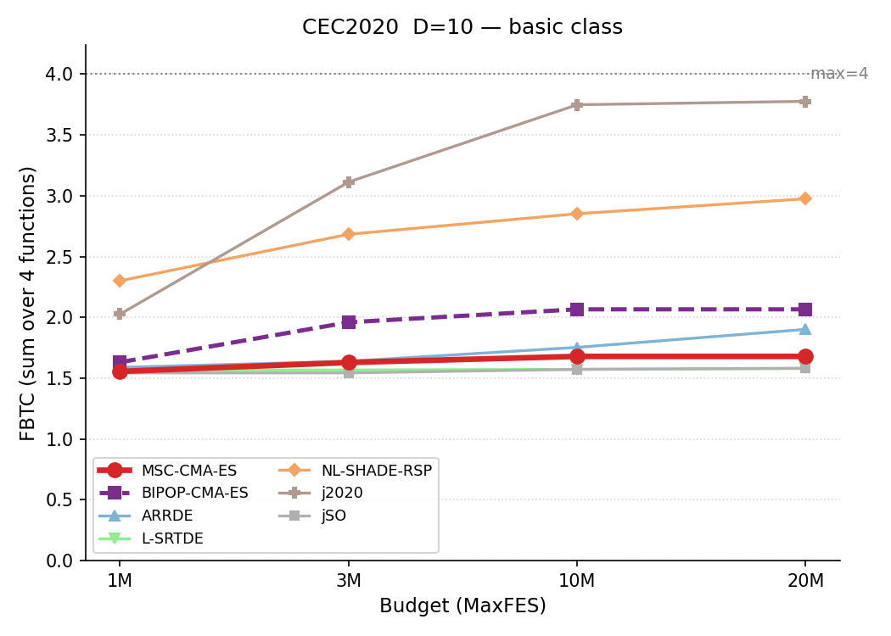
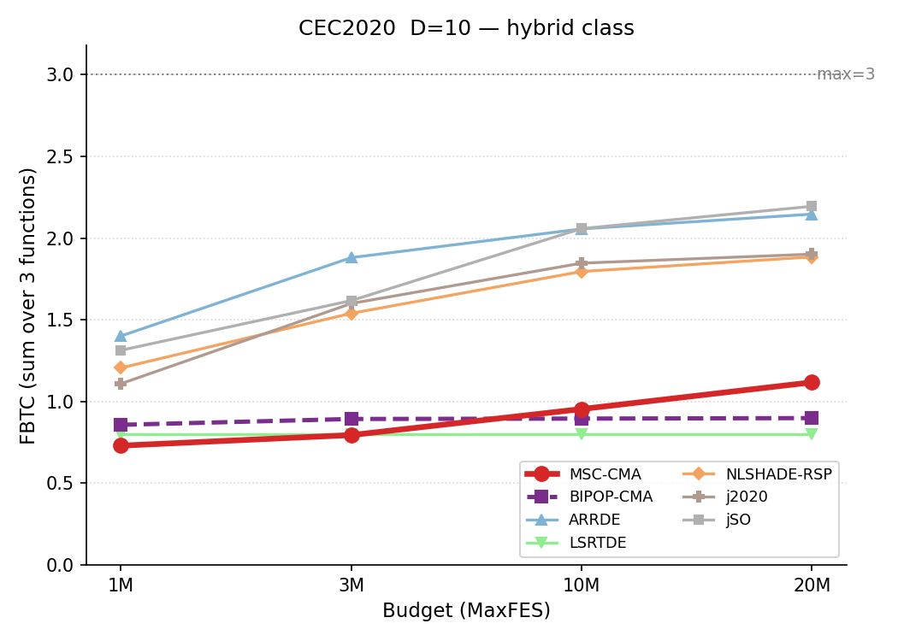
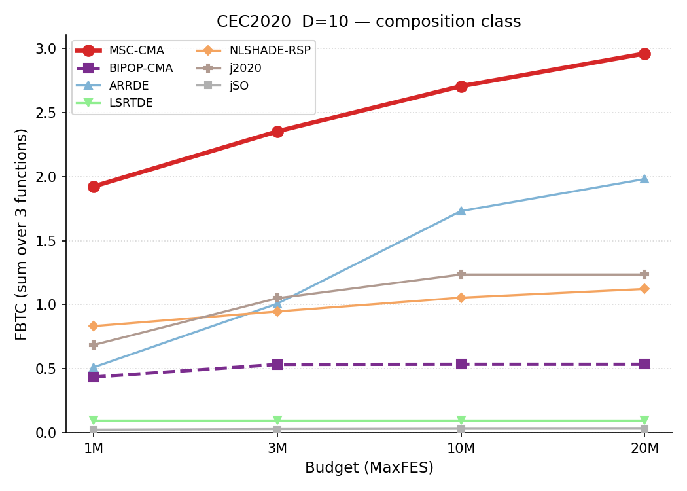

# CEC2020 / D=10 — by-category summary

Sums of per-function metrics, grouped by function class. Budget: 1,000,000 evaluations. **Bold** = best in row.

## Ranking across metrics (budget 1M)

Parallel-coordinate rank of all seven algorithms on four aggregate metrics (worst-SUM, median-SUM, FBTC, best-SUM), per function class. Each line is one algorithm; for every axis the best value is at the top. MSC-CMA in red.

<table>
<tr>
<td></td>
<td></td>
<td></td>
</tr>
<tr>
<td align="center">USM</td>
<td align="center">Hybrid</td>
<td align="center">Composition</td>
</tr>
</table>

*USM = unimodal and simple multimodal.*

## Budget scaling

FBTC by budget, monotone envelope (running maximum over budgets). Higher is better. The budget axis is per class: a budget is shown only where all seven algorithms cover the whole class. MSC-CMA in red.

<table>
<tr>
<td></td>
<td></td>
<td></td>
</tr>
<tr>
<td align="center">USM</td>
<td align="center">Hybrid</td>
<td align="center">Composition</td>
</tr>
</table>

## Summary table

| Category | Metric | MSC-CMA-ES | BIPOP-CMA-ES |  | ARRDE | L-SRTDE | NL-SHADE-RSP | j2020 | jSO |
|:--|:--|--:|--:|:-:|--:|--:|--:|--:|--:|
| **USM** (n=4) | mean | 8.67 | 17.1 |    | 13.3 | 14 | 11.8 | **8.22** | 17.6 |
|  | median | **6.92** | 22.7 |    | 11.6 | 11.9 | 10.8 | 10.7 | 15.7 |
|  | best | 1.03 | 0.125 |    | 6.16 | 10.5 | 0.0625 | **0** | 10.8 |
|  | worst | 20.6 | 36.4 |    | 22.5 | 25.5 | 28.4 | **15** | 39.9 |
|  | std | 5.2 | 11.6 |    | 3.97 | **3.83** | 7.82 | 4.96 | 5.76 |
|  | FBTC | 1.556 | 1.631 |    | 1.589 | 1.567 | **2.301** | 2.027 | 1.543 |
| **Hybrid** (n=3) | mean | 2.12 | 6.06 |    | **0.367** | 3.48 | 1.16 | 0.765 | 0.41 |
|  | median | 2.03 | 1.16 |    | 0.357 | 1.18 | 0.484 | 0.678 | **0.25** |
|  | best | 0.636 | 0.0593 |    | **0.00333** | 0.0195 | 0.016 | 0.0292 | 0.0194 |
|  | worst | 4.45 | 206 |    | **1.34** | 41.3 | 9.53 | 2.67 | 2.21 |
|  | std | 0.836 | 29.6 |    | **0.409** | 6.98 | 1.83 | 0.588 | 0.471 |
|  | FBTC | 0.730 | 0.858 |    | **1.401** | 0.801 | 1.206 | 1.110 | 1.314 |
| **Composition** (n=3) | mean | **106** | 512 |    | 205 | 814 | 462 | 244 | 719 |
|  | median | **100** | 598 |    | 220 | 825 | 498 | 200 | 798 |
|  | best | **0** | 100 |    | 100 | 498 | 100 | 100 | 598 |
|  | worst | **200** | 782 |    | 367 | 876 | 598 | 598 | 872 |
|  | std | **71** | 205 |    | 79.8 | 102 | 150 | 148 | 121 |
|  | FBTC | **1.923** | 0.436 |    | 0.511 | 0.095 | 0.833 | 0.686 | 0.024 |
| **SUM** (n=10) | mean | **117** | 535 |    | 219 | 832 | 474 | 253 | 737 |
|  | median | **109** | 622 |    | 232 | 838 | 509 | 211 | 814 |
|  | best | **1.66** | 100 |    | 106 | 508 | 100 | 100 | 609 |
|  | worst | **225** | 1023 |    | 391 | 943 | 636 | 616 | 914 |
|  | std | **77** | 246 |    | 84.2 | 113 | 160 | 154 | 128 |
|  | FBTC | 4.210 | 2.924 |    | 3.502 | 2.464 | **4.339** | 3.822 | 2.881 |

*FBTC = Fixed-Budget Target Coverage (sum across 51 log-uniform targets in [10²…10⁻⁸] per function); fixed-budget analogue of the COCO/BBOB ECDF. Higher is better.*

## Environment
Python 3.13.5 (anaconda3 env `intelpython`) · NumPy 2.3.1 · SciPy 1.15.3 · pycma 4.4.2 · minionpy 1.5.0.
Hardware: Intel Xeon Platinum 8160 @ 2.10 GHz, 192 threads, 251 GiB RAM.

*Generated 2026-07-14 by analysis/cell_report.py from `*/maxevals_1000000/f*.pkl` (table) and all common budgets (budget scaling).*
