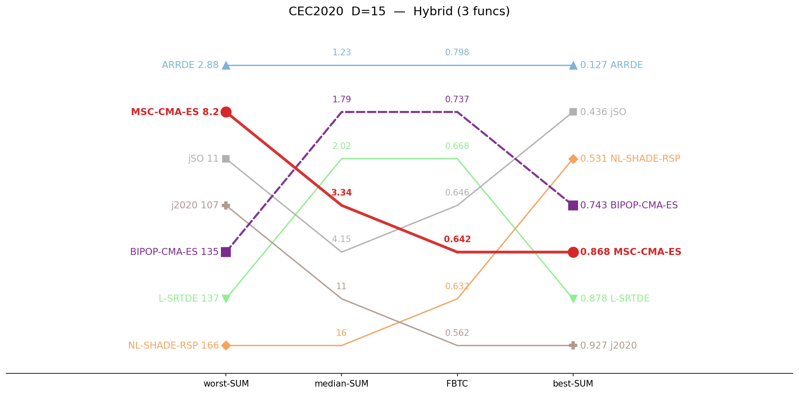
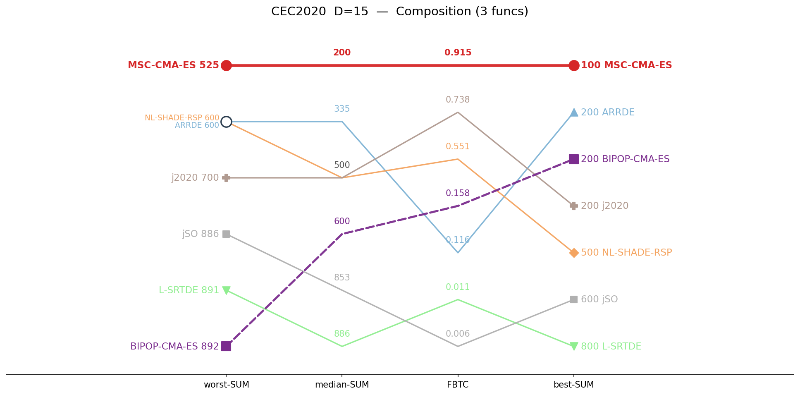
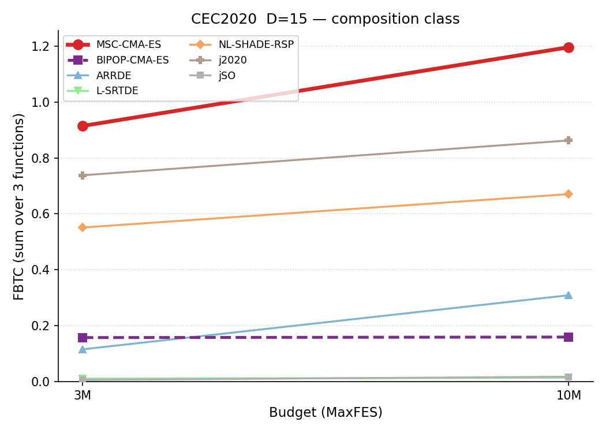

# CEC2020 / D=15 — by-category summary

Sums of per-function metrics, grouped by function class. Budget: 3,000,000 evaluations. **Bold** = best in row.

## Ranking across metrics (budget 3M)

Parallel-coordinate rank of all seven algorithms on four aggregate metrics (worst-SUM, median-SUM, FBTC, best-SUM), per function class. Each line is one algorithm; for every axis the best value is at the top. MSC-CMA in red.

<table>
<tr>
<td></td>
<td></td>
<td></td>
</tr>
<tr>
<td align="center">USM</td>
<td align="center">Hybrid</td>
<td align="center">Composition</td>
</tr>
</table>

*USM = unimodal and simple multimodal, per the CEC2020 definition.*

## Budget scaling

FBTC by budget, monotone envelope (running maximum over budgets). Higher is better. The budget axis is per class: a budget is shown only where all seven algorithms cover the whole class. MSC-CMA in red.

<table>
<tr>
<td></td>
</tr>
<tr>
<td align="center">Composition</td>
</tr>
</table>

## Summary table

| Category | Metric | MSC-CMA-ES | BIPOP-CMA-ES |  | ARRDE | L-SRTDE | NL-SHADE-RSP | j2020 | jSO |
|:--|:--|--:|--:|:-:|--:|--:|--:|--:|--:|
| **USM** (n=4) | mean | 11.1 | 24.8 |    | 18.8 | 50.8 | 19.2 | **8.82** | 62 |
|  | median | **11.7** | 23.1 |    | 18.3 | 19.7 | 15.7 | 15.8 | 26.8 |
|  | best | 1.22 | 0.125 |    | 15.9 | 16.3 | 15.6 | **0** | 15.8 |
|  | worst | 28.2 | 61.2 |    | 33.3 | 154 | 141 | **18.2** | 149 |
|  | std | 6.36 | 16.4 |    | **3.84** | 52.8 | 17.6 | 8.2 | 56.5 |
|  | FBTC | 1.530 | **2.432** |    | 1.552 | 1.440 | 2.271 | 2.219 | 1.446 |
| **Hybrid** (n=3) | mean | 3.62 | 4.3 |    | **1.3** | 5.42 | 23.4 | 17 | 4.4 |
|  | median | 3.34 | 1.79 |    | **1.23** | 2.02 | 15.7 | 10.5 | 4.15 |
|  | best | 0.868 | 0.743 |    | **0.127** | 0.878 | 0.531 | 0.927 | 0.436 |
|  | worst | 8.2 | 135 |    | **2.88** | 137 | 166 | 107 | 11.3 |
|  | std | 1.53 | 18.9 |    | **0.538** | 19.7 | 30.8 | 19.1 | 2.24 |
|  | FBTC | 0.642 | 0.737 |    | **0.798** | 0.668 | 0.632 | 0.562 | 0.646 |
| **Composition** (n=3) | mean | **266** | 609 |    | 388 | 882 | 521 | 531 | 840 |
|  | median | **200** | 600 |    | 335 | 886 | 500 | 500 | 853 |
|  | best | **100** | 200 |    | 200 | 800 | 500 | 200 | 600 |
|  | worst | **525** | 892 |    | 600 | 891 | 600 | 700 | 886 |
|  | std | 146 | 157 |    | 124 | **18.1** | 30 | 118 | 51.4 |
|  | FBTC | **0.915** | 0.158 |    | 0.116 | 0.011 | 0.551 | 0.738 | 0.006 |
| **SUM** (n=10) | mean | **281** | 638 |    | 408 | 938 | 563 | 557 | 907 |
|  | median | **215** | 625 |    | 354 | 908 | 531 | 526 | 884 |
|  | best | **102** | 201 |    | 216 | 817 | 516 | 201 | 616 |
|  | worst | **562** | 1088 |    | 636 | 1182 | 907 | 825 | 1046 |
|  | std | 154 | 192 |    | 129 | 90.6 | **78.4** | 146 | 110 |
|  | FBTC | 3.087 | 3.327 |    | 2.466 | 2.119 | 3.455 | **3.519** | 2.097 |

*FBTC = Fixed-Budget Target Coverage (sum across 51 log-uniform targets in [10²…10⁻⁸] per function); fixed-budget analogue of the COCO/BBOB ECDF. Higher is better.*

## Environment
Python 3.13.5 (anaconda3 env `intelpython`) · NumPy 2.3.1 · SciPy 1.15.3 · pycma 4.4.2 · minionpy 1.5.0.
Hardware: Intel Xeon Platinum 8160 @ 2.10 GHz, 192 threads, 251 GiB RAM.

*Generated 2026-07-14 by analysis/cell_report.py from `*/maxevals_3000000/f*.pkl` (table) and all common budgets (budget scaling).*
