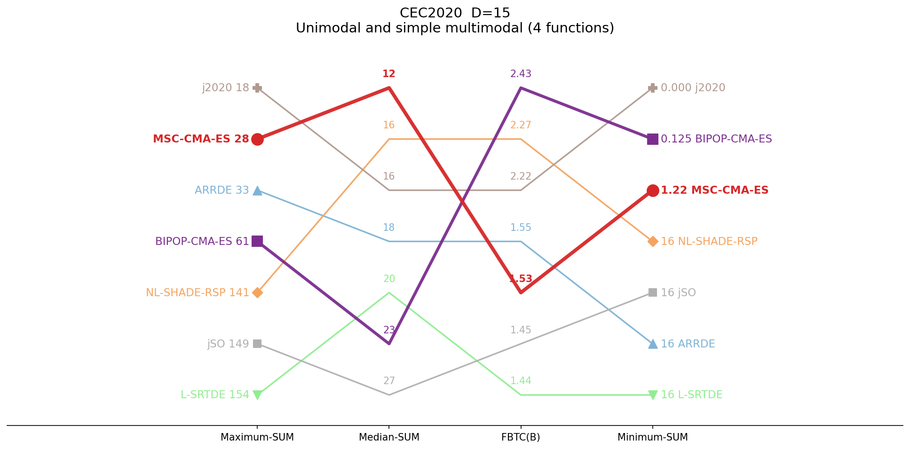
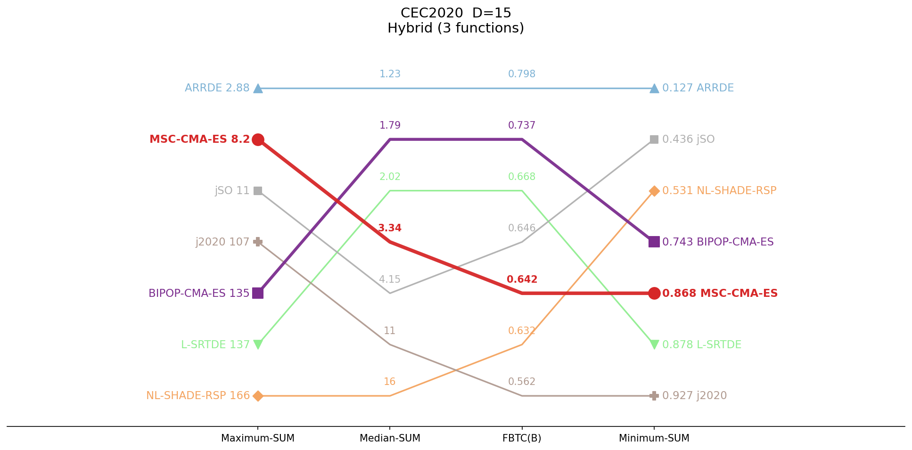
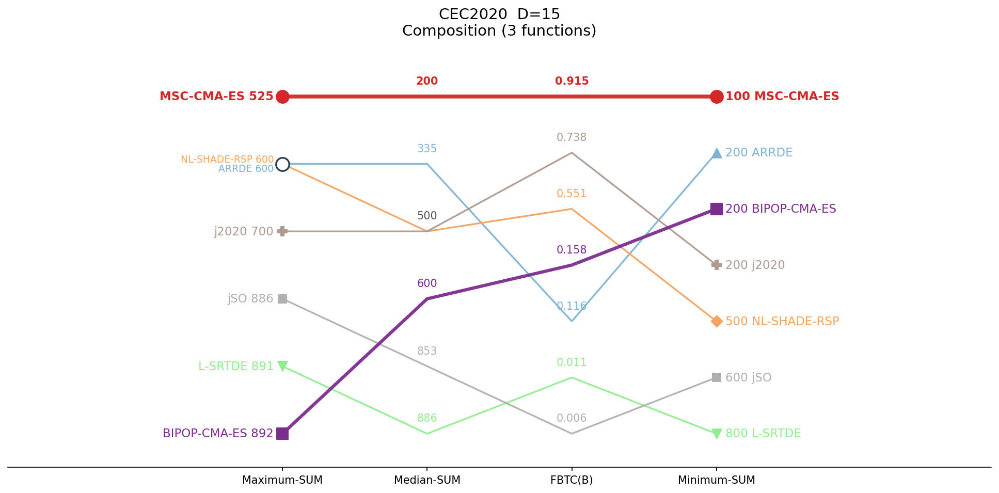
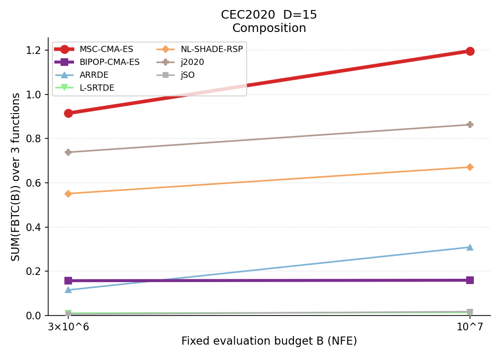
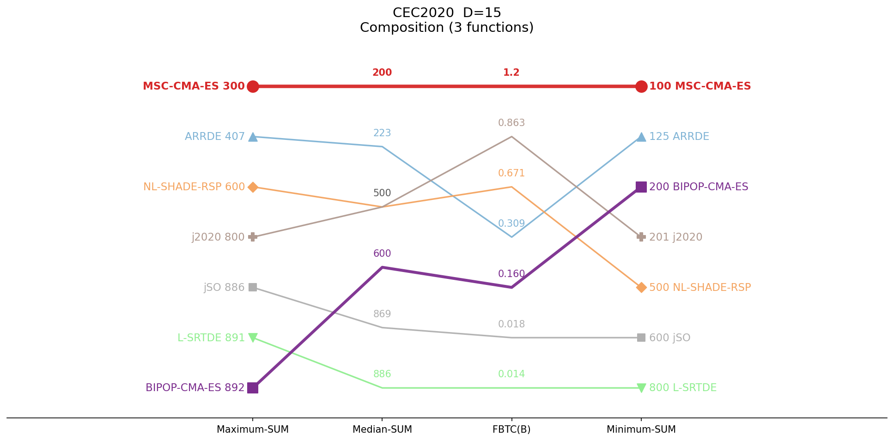

# CEC2020 / D=15 — by-category summary

## Ranking — D=15 (B = 3×10^6)

Parallel-coordinate rank of all 7 algorithms on four aggregate metrics (Maximum-SUM, Median-SUM, FBTC(B), Minimum-SUM), per function class. Each line is one algorithm. The axes are oriented so smaller error-based sums and larger FBTC(B) values appear toward the top. MSC-CMA-ES is shown in red. Budget: B = 3×10^6 evaluations.

<table>
<tr>
<td></td>
<td></td>
<td></td>
</tr>
<tr>
<td align="center">Unimodal and simple multimodal</td>
<td align="center">Hybrid</td>
<td align="center">Composition</td>
</tr>
</table>

## Budget scaling — D=15

Raw FBTC(B) at each evaluated fixed budget; no running maximum is applied. Each point is a separate fixed-budget experiment. Larger FBTC(B) values indicate greater fixed-budget target coverage. The budget axis is per class: a budget is shown only where all 7 algorithms cover the whole class. MSC-CMA-ES is shown in red. Official budget for this cell: B = 3×10^6 evaluations.

<table>
<tr>
<td></td>
<td></td>
<td></td>
</tr>
<tr>
<td></td>
<td></td>
<td align="center">Composition</td>
</tr>
</table>

## Ranking — D=15 (B = 10^7)

Same parallel-coordinate rank, recomputed at B = 10^7 evaluations. Only classes with full 7-algorithm coverage at B = 10^7 are shown. MSC-CMA-ES is shown in red.

<table>
<tr>
<td></td>
<td></td>
<td></td>
</tr>
<tr>
<td></td>
<td></td>
<td align="center">Composition</td>
</tr>
</table>

## Summary table

Sums of per-function metrics, grouped by function class. Budget: 3×10^6 evaluations. Bold marks the minimum value for error-based metrics and standard deviation, and the maximum value for FBTC(B). These values are descriptive and are not significance tests.

| Category | Metric | MSC-CMA-ES | BIPOP-CMA-ES | ARRDE | L-SRTDE | NL-SHADE-RSP | j2020 | jSO |
|:--|:--|--:|--:|--:|--:|--:|--:|--:|
| **Unimodal and simple multimodal** (n=4) | Mean | 11.1 | 24.8 | 18.8 | 50.8 | 19.2 | **8.82** | 62 |
|  | Median | **11.7** | 23.1 | 18.3 | 19.7 | 15.7 | 15.8 | 26.8 |
|  | Minimum | 1.22 | 0.125 | 15.9 | 16.3 | 15.6 | **0** | 15.8 |
|  | Maximum | 28.2 | 61.2 | 33.3 | 154 | 141 | **18.2** | 149 |
|  | Std. | 6.36 | 16.4 | **3.84** | 52.8 | 17.6 | 8.2 | 56.5 |
|  | FBTC(B) | 1.530 | **2.432** | 1.552 | 1.440 | 2.271 | 2.219 | 1.446 |
| **Hybrid** (n=3) | Mean | 3.62 | 4.3 | **1.3** | 5.42 | 23.4 | 17 | 4.4 |
|  | Median | 3.34 | 1.79 | **1.23** | 2.02 | 15.7 | 10.5 | 4.15 |
|  | Minimum | 0.868 | 0.743 | **0.127** | 0.878 | 0.531 | 0.927 | 0.436 |
|  | Maximum | 8.2 | 135 | **2.88** | 137 | 166 | 107 | 11.3 |
|  | Std. | 1.53 | 18.9 | **0.538** | 19.7 | 30.8 | 19.1 | 2.24 |
|  | FBTC(B) | 0.642 | 0.737 | **0.798** | 0.668 | 0.632 | 0.562 | 0.646 |
| **Composition** (n=3) | Mean | **266** | 609 | 388 | 882 | 521 | 531 | 840 |
|  | Median | **200** | 600 | 335 | 886 | 500 | 500 | 853 |
|  | Minimum | **100** | 200 | 200 | 800 | 500 | 200 | 600 |
|  | Maximum | **525** | 892 | 600 | 891 | 600 | 700 | 886 |
|  | Std. | 146 | 157 | 124 | **18.1** | 30 | 118 | 51.4 |
|  | FBTC(B) | **0.915** | 0.158 | 0.116 | 0.011 | 0.551 | 0.738 | 0.006 |
| **All** (n=10) | Mean | **281** | 638 | 408 | 938 | 563 | 557 | 907 |
|  | Median | **215** | 625 | 354 | 908 | 531 | 526 | 884 |
|  | Minimum | **102** | 201 | 216 | 817 | 516 | 201 | 616 |
|  | Maximum | **562** | 1088 | 636 | 1182 | 907 | 825 | 1046 |
|  | Std. | 154 | 192 | 129 | 90.6 | **78.4** | 146 | 110 |
|  | FBTC(B) | 3.087 | 3.327 | 2.466 | 2.119 | 3.455 | **3.519** | 2.097 |

*FBTC(B) = Fixed-Budget Target Coverage at evaluation budget B: for each function, the mean attainment rate over 51 log-uniform targets in [10²…10⁻⁸] and 51 runs, computed from the terminal best-so-far errors at that budget. Class and All rows add the per-function FBTC(B) values. Each budget is evaluated separately; FBTC(B) is not an anytime measure. Larger FBTC(B) values indicate greater fixed-budget target coverage.*

## Environment
Python 3.13.5 (anaconda3 env `intelpython`) · NumPy 2.3.1 · SciPy 1.15.3 · pycma 4.4.2 · minionpy 1.5.0.
Hardware: Intel Xeon Platinum 8160 @ 2.10 GHz, 192 threads, 251 GiB RAM.

*Generated 2026-08-26 by analysis/cell_report.py from `*/maxevals_3000000/f*.pkl` (table) and all common budgets (budget scaling).*
