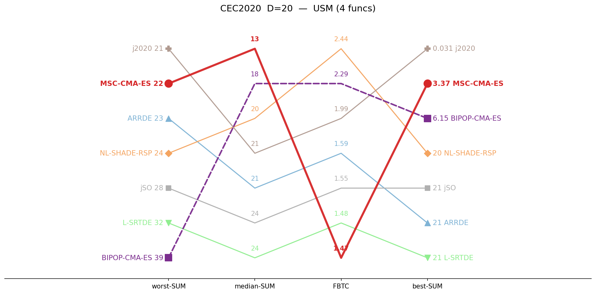
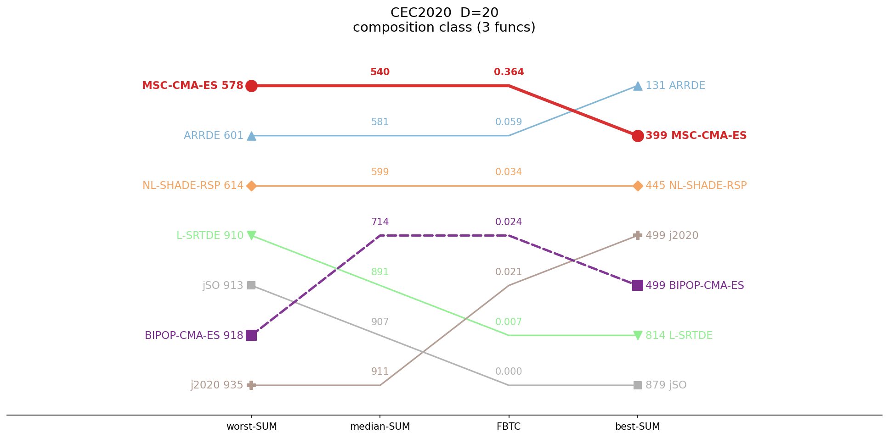
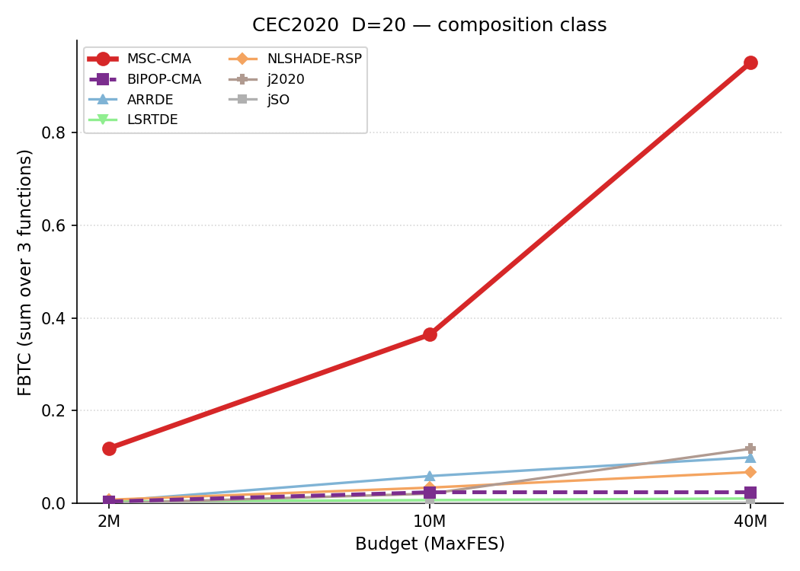

# CEC2020 / D=20 — by-category summary

Sums of per-function metrics, grouped by function class. Budget: 10,000,000 evaluations. **Bold** = best in row.

## Ranking across metrics

Parallel-coordinate rank of all seven algorithms on four aggregate metrics (worst-SUM, median-SUM, FBTC, best-SUM), per function class. Each line is one algorithm; for every axis the best value is at the top. MSC-CMA in red.

<table>
<tr>
<td></td>
<td></td>
<td></td>
</tr>
<tr>
<td align="center">Basic</td>
<td align="center">Hybrid</td>
<td align="center">Composition</td>
</tr>
</table>

*Basic = unimodal + simple multimodal, per the CEC2020 definition.*

## Budget scaling

FBTC by budget, monotone envelope (running maximum over budgets). Higher is better. The budget axis is per class: a budget is shown only where all seven algorithms cover the whole class. MSC-CMA in red.

<table>
<tr>
<td></td>
</tr>
<tr>
<td align="center">Composition</td>
</tr>
</table>

## Summary table

| Category | Metric | MSC-CMA | BIPOP-CMA |  | ARRDE | LSRTDE | NLSHADE | j2020 | jSO |
|:--|:--|--:|--:|:-:|--:|--:|--:|--:|--:|
| **Basic** (n=4) | mean | **13.8** | 17.9 |    | 21.3 | 24 | 20.7 | 16.5 | 23.3 |
|  | median | **13.1** | 17.8 |    | 21 | 24.1 | 20.4 | 20.6 | 23.6 |
|  | best | 3.37 | 6.15 |    | 20.7 | 21.3 | 20.4 | **0.031** | 20.7 |
|  | worst | 22 | 39.5 |    | 23 | 32.2 | 23.9 | **20.8** | 27.9 |
|  | std | 3.51 | 5.79 |    | **0.782** | 2.31 | 0.881 | 8.03 | 1.87 |
|  | FBTC | 1.474 | 2.289 |    | 1.590 | 1.478 | **2.436** | 1.992 | 1.546 |
| **Hybrid** (n=3) | mean | 9.82 | 23.3 |    | **1.82** | 4.86 | 152 | 95.2 | 8.3 |
|  | median | 11.6 | 8.4 |    | **1.48** | 2 | 135 | 69.5 | 7.43 |
|  | best | 2.77 | 2.32 |    | 0.567 | 1.06 | **0.426** | 20.6 | 1.67 |
|  | worst | 17.6 | 508 |    | **5.82** | 25 | 742 | 250 | 28.8 |
|  | std | 4.77 | 78.7 |    | **0.944** | 5.45 | 167 | 66.6 | 5.28 |
|  | FBTC | 0.504 | 0.541 |    | **0.714** | 0.646 | 0.479 | 0.527 | 0.659 |
| **Composition** (n=3) | mean | **533** | 724 |    | 567 | 874 | 593 | 853 | 905 |
|  | median | **540** | 714 |    | 581 | 891 | 599 | 911 | 907 |
|  | best | 399 | 499 |    | **131** | 814 | 445 | 499 | 879 |
|  | worst | **578** | 918 |    | 601 | 910 | 614 | 935 | 913 |
|  | std | 42.2 | 146 |    | 83.8 | 36.3 | 35.4 | 133 | **6.17** |
|  | FBTC | **0.364** | 0.024 |    | 0.059 | 0.007 | 0.034 | 0.021 | 0.000 |
| **SUM** (n=10) | mean | **557** | 765 |    | 590 | 902 | 766 | 965 | 936 |
|  | median | **564** | 740 |    | 604 | 917 | 755 | 1001 | 938 |
|  | best | 405 | 508 |    | **152** | 836 | 466 | 520 | 901 |
|  | worst | **618** | 1466 |    | 630 | 968 | 1380 | 1206 | 969 |
|  | std | 50.5 | 230 |    | 85.5 | 44.1 | 204 | 208 | **13.3** |
|  | FBTC | 2.343 | 2.854 |    | 2.363 | 2.131 | **2.948** | 2.539 | 2.205 |

*FBTC = Fixed-Budget Target Coverage (sum across 51 log-uniform targets in [10²…10⁻⁸] per function); fixed-budget analogue of the COCO/BBOB ECDF. Higher is better.*

## Environment
Python 3.13.5 (anaconda3 env `intelpython`) · NumPy 2.3.1 · SciPy 1.15.3 · pycma 4.4.2 · minionpy 1.5.0.
Hardware: Intel Xeon Platinum 8160 @ 2.10 GHz, 192 threads, 251 GiB RAM.

*Generated 2026-06-28 by analysis/cell_report.py from `*/maxevals_10000000/f*.pkl` (table) and all common budgets (budget scaling).*
