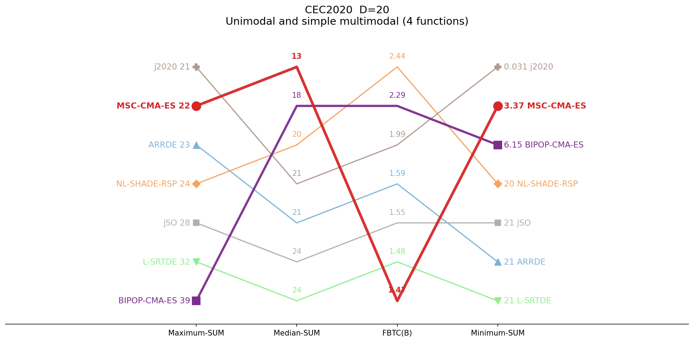
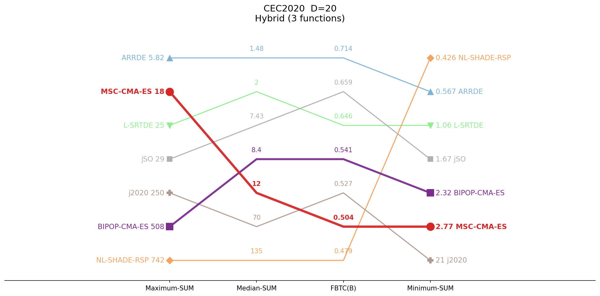
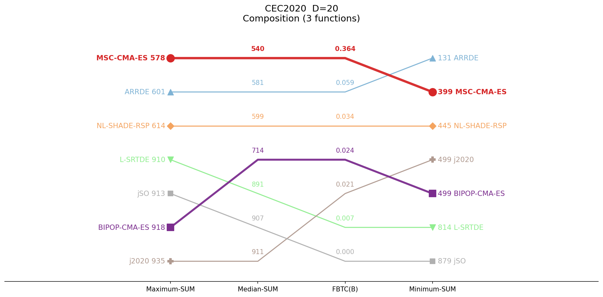
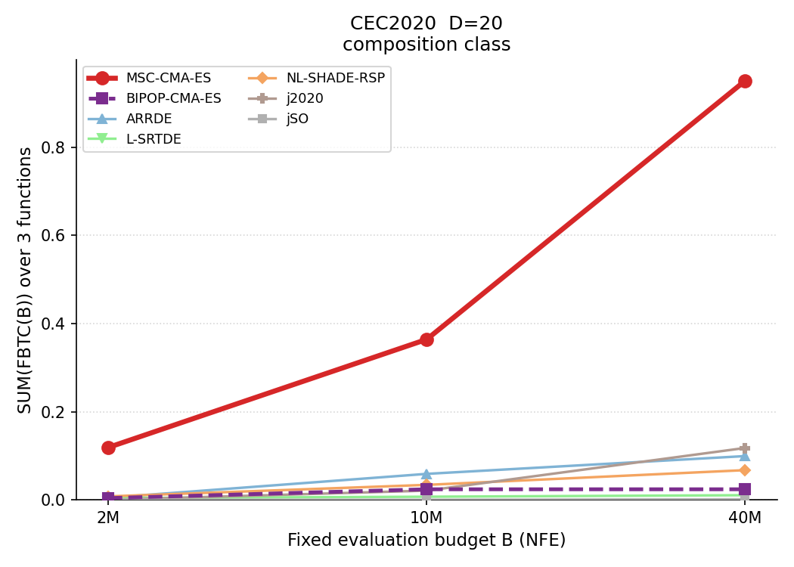
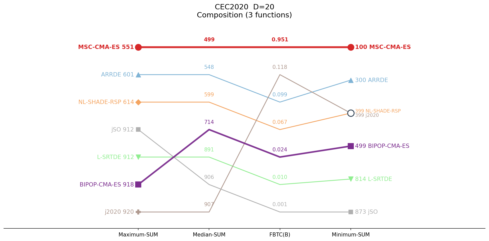

# CEC2020 / D=20 — by-category summary

## Ranking — D=20 (B = 10^7)

Parallel-coordinate rank of all 7 algorithms on four aggregate metrics (Maximum-SUM, Median-SUM, FBTC(B), Minimum-SUM), per function class. Each line is one algorithm. The axes are oriented so smaller error-based sums and larger FBTC(B) values appear toward the top. MSC-CMA-ES is shown in red. Budget: B = 10^7 evaluations.

<table>
<tr>
<td></td>
<td></td>
<td></td>
</tr>
<tr>
<td align="center">Unimodal and simple multimodal</td>
<td align="center">Hybrid</td>
<td align="center">Composition</td>
</tr>
</table>

## Budget scaling — D=20

Raw FBTC(B) at each evaluated fixed budget; no running maximum is applied. Each point is a separate fixed-budget experiment. Larger FBTC(B) values indicate greater fixed-budget target coverage. The budget axis is per class: a budget is shown only where all 7 algorithms cover the whole class. MSC-CMA-ES is shown in red. Official budget for this cell: B = 10^7 evaluations.

<table>
<tr>
<td></td>
<td></td>
<td></td>
</tr>
<tr>
<td></td>
<td></td>
<td align="center">Composition</td>
</tr>
</table>

## Ranking — D=20 (B = 4×10^7)

Same parallel-coordinate rank, recomputed at B = 4×10^7 evaluations. Only classes with full 7-algorithm coverage at B = 4×10^7 are shown. MSC-CMA-ES is shown in red.

<table>
<tr>
<td></td>
<td></td>
<td></td>
</tr>
<tr>
<td></td>
<td></td>
<td align="center">Composition</td>
</tr>
</table>

## Summary table

Sums of per-function metrics, grouped by function class. Budget: 10^7 evaluations. Bold marks the minimum value for error-based metrics and standard deviation, and the maximum value for FBTC(B). These values are descriptive and are not significance tests.

| Category | Metric | MSC-CMA-ES | BIPOP-CMA-ES | ARRDE | L-SRTDE | NL-SHADE-RSP | j2020 | jSO |
|:--|:--|--:|--:|--:|--:|--:|--:|--:|
| **Unimodal and simple multimodal** (n=4) | Mean | **13.8** | 17.9 | 21.3 | 24 | 20.7 | 16.5 | 23.3 |
|  | Median | **13.1** | 17.8 | 21 | 24.1 | 20.4 | 20.6 | 23.6 |
|  | Minimum | 3.37 | 6.15 | 20.7 | 21.3 | 20.4 | **0.031** | 20.7 |
|  | Maximum | 22 | 39.5 | 23 | 32.2 | 23.9 | **20.8** | 27.9 |
|  | Std. | 3.51 | 5.79 | **0.782** | 2.31 | 0.881 | 8.03 | 1.87 |
|  | FBTC(B) | 1.474 | 2.289 | 1.590 | 1.478 | **2.436** | 1.992 | 1.546 |
| **Hybrid** (n=3) | Mean | 9.82 | 23.3 | **1.82** | 4.86 | 152 | 95.2 | 8.3 |
|  | Median | 11.6 | 8.4 | **1.48** | 2 | 135 | 69.5 | 7.43 |
|  | Minimum | 2.77 | 2.32 | 0.567 | 1.06 | **0.426** | 20.6 | 1.67 |
|  | Maximum | 17.6 | 508 | **5.82** | 25 | 742 | 250 | 28.8 |
|  | Std. | 4.77 | 78.7 | **0.944** | 5.45 | 167 | 66.6 | 5.28 |
|  | FBTC(B) | 0.504 | 0.541 | **0.714** | 0.646 | 0.479 | 0.527 | 0.659 |
| **Composition** (n=3) | Mean | **533** | 724 | 567 | 874 | 593 | 853 | 905 |
|  | Median | **540** | 714 | 581 | 891 | 599 | 911 | 907 |
|  | Minimum | 399 | 499 | **131** | 814 | 445 | 499 | 879 |
|  | Maximum | **578** | 918 | 601 | 910 | 614 | 935 | 913 |
|  | Std. | 42.2 | 146 | 83.8 | 36.3 | 35.4 | 133 | **6.17** |
|  | FBTC(B) | **0.364** | 0.024 | 0.059 | 0.007 | 0.034 | 0.021 | 0.000 |
| **All** (n=10) | Mean | **557** | 765 | 590 | 902 | 766 | 965 | 936 |
|  | Median | **564** | 740 | 604 | 917 | 755 | 1001 | 938 |
|  | Minimum | 405 | 508 | **152** | 836 | 466 | 520 | 901 |
|  | Maximum | **618** | 1466 | 630 | 968 | 1380 | 1206 | 969 |
|  | Std. | 50.5 | 230 | 85.5 | 44.1 | 204 | 208 | **13.3** |
|  | FBTC(B) | 2.343 | 2.854 | 2.363 | 2.131 | **2.948** | 2.539 | 2.205 |

*FBTC(B) = Fixed-Budget Target Coverage at evaluation budget B: for each function, the mean attainment rate over 51 log-uniform targets in [10²…10⁻⁸] and 51 runs, computed from the terminal best-so-far errors at that budget. Class and All rows add the per-function FBTC(B) values. Each budget is evaluated separately; FBTC(B) is not an anytime measure. Larger FBTC(B) values indicate greater fixed-budget target coverage.*

## Environment
Python 3.13.5 (anaconda3 env `intelpython`) · NumPy 2.3.1 · SciPy 1.15.3 · pycma 4.4.2 · minionpy 1.5.0.
Hardware: Intel Xeon Platinum 8160 @ 2.10 GHz, 192 threads, 251 GiB RAM.

*Generated 2026-08-26 by analysis/cell_report.py from `*/maxevals_10000000/f*.pkl` (table) and all common budgets (budget scaling).*
