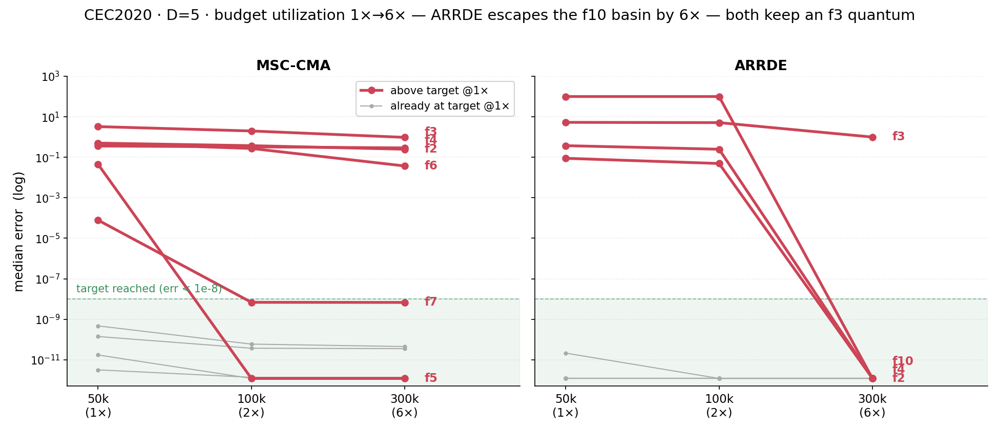
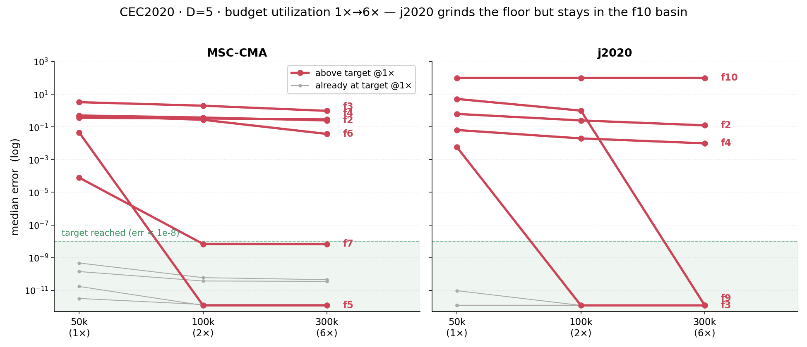

# CEC2020 / D=5 — by-category summary

Sums of per-function metrics, grouped by function class. Categories: **Basic** = F1–F4 (1 unimodal + 3 basic multimodal), **Hybrid** = F5–F7, **Composition** = F8–F10. Total: 10 functions. Budget: 50,000 evaluations. **Bold** = best in row.

| Category | Metric | MSC-CMA | BIPOP-CMA |   | ARRDE | LSRTDE | NLSHADE | j2020 | jSO |
|:--|:--|--:|--:|:-:|--:|--:|--:|--:|--:|
| **Basic** (n=4) | mean | 25.1 | 18.7 |   | 14.3 | 14.9 | **3** | 9.25 | 5.64 |
|  | median | 4.13 | 8.66 |   | 5.77 | 5.87 | **1.77** | 5.84 | 5.5 |
|  | best | 0.125 | 1.12 |   | 0.613 | **0** | **0** | **0** | 0.613 |
|  | worst | 165 | 132 |   | 125 | 452 | **12.1** | 37 | 12.9 |
|  | std | 43.1 | 28.4 |   | 29.3 | 63.5 | 3.38 | 8.15 | **1.66** |
|  | FBTC | 1.693 | 1.695 |   | 1.846 | 1.905 | **2.726** | 1.897 | 1.880 |
| **Hybrid** (n=3) | mean | 1.03 | 0.754 |   | 0.0122 | 5.62 | **0** | 0.0131 | 0.0489 |
|  | median | 0.542 | 0.624 |   | **0** | **0** | **0** | **0** | **0** |
|  | best | 5.5e-7 | **0** |   | **0** | **0** | **0** | **0** | **0** |
|  | worst | 7.38 | 3.11 |   | 0.624 | 139 | **0** | 0.624 | 0.624 |
|  | std | 1.41 | 0.965 |   | 0.0874 | 26.4 | **0** | 0.0874 | 0.169 |
|  | FBTC | 1.428 | 2.102 |   | 2.985 | 2.330 | **3.000** | 2.957 | 2.940 |
| **Composition** (n=3) | mean | **48.3** | 372 |   | 145 | 462 | 224 | 180 | 446 |
|  | median | **0** | 447 |   | 100 | 447 | 300 | 100 | 447 |
|  | best | **0** | 100 |   | **0** | 400 | **0** | **0** | 400 |
|  | worst | **116** | 691 |   | 418 | 648 | 401 | 414 | 447 |
|  | std | 53.7 | 165 |   | 126 | 58 | 135 | 143 | **6.63** |
|  | FBTC | **2.408** | 0.919 |   | 1.898 | 0.831 | 2.102 | 1.296 | 1.019 |
| **SUM** (n=10) | mean | **74.4** | 391 |   | 159 | 482 | 227 | 189 | 452 |
|  | median | **4.68** | 457 |   | 106 | 453 | 302 | 106 | 453 |
|  | best | 0.125 | 101 |   | 0.613 | 400 | **0** | **0** | 401 |
|  | worst | **288** | 826 |   | 544 | 1239 | 413 | 452 | 461 |
|  | std | 98.2 | 195 |   | 155 | 148 | 139 | 152 | **8.46** |
|  | FBTC | 5.529 | 4.717 |   | 6.729 | 5.066 | **7.828** | 6.150 | 5.839 |

*FBTC = Fixed-Budget Target Coverage (sum across 51 log-uniform targets in [10²…10⁻⁸] per function); fixed-budget analogue of the COCO/BBOB ECDF. Higher is better.*

## Budget scaling (1x-6x)

The CEC2020 D=5 standard budget is 50,000 evaluations (1x). The figures below track per-function median error as the budget grows to 2x (100k) and 6x (300k), MSC-CMA against the two strongest DE baselines on this cell. Green band = target reached (err < 1e-8); gray lines = functions already at target at 1x.

MSC-CMA solves the composition basins (F9, F10) already at the standard budget, where every DE baseline is still trapped (F10 stuck at 100-347). Its remaining residuals are small multimodal floors: F3 and F6 grind down with budget, while F2 and F4 plateau at the 0.25 basin quantum. ARRDE converts extra budget into basin escapes instead: between 2x and 6x it clears F2, F4 and the F10 basin at once, leaving a single Rastrigin quantum on F3 (0.995, vs 0.962 for MSC-CMA).

j2020 shows the opposite failure mode: it polishes local residuals quickly (F9 reaches 0 at 2x, F3 at 6x) but never leaves the F10 composition basin - six times the budget buys precision, not escape. Together the panels locate MSC-CMA's advantage at the standard budget: basin-topology detection pays off at 1x-2x, while beyond roughly 6x restart-based DEs catch up on this low-dimensional cell.

*Figures: median over 51 runs per function, from the maxevals_50000/100000/300000 cells; generated by analysis/make_budget_traj.py.*

*Generated 2026-06-04 by analysis/make_cell_readme.py from `experiments/cec2020/d5/*/maxevals_50000/f*.pkl`.*

## Environment
Python 3.13.5 (anaconda3 env `intelpython`) · NumPy 2.3.1 · SciPy 1.15.3 · pycma 4.4.2 · minionpy 1.5.0.
Hardware: Intel Xeon Platinum 8160 @ 2.10 GHz, 192 threads, 251 GiB RAM.
