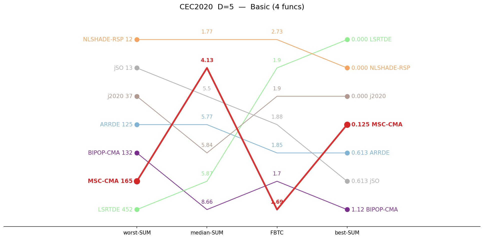
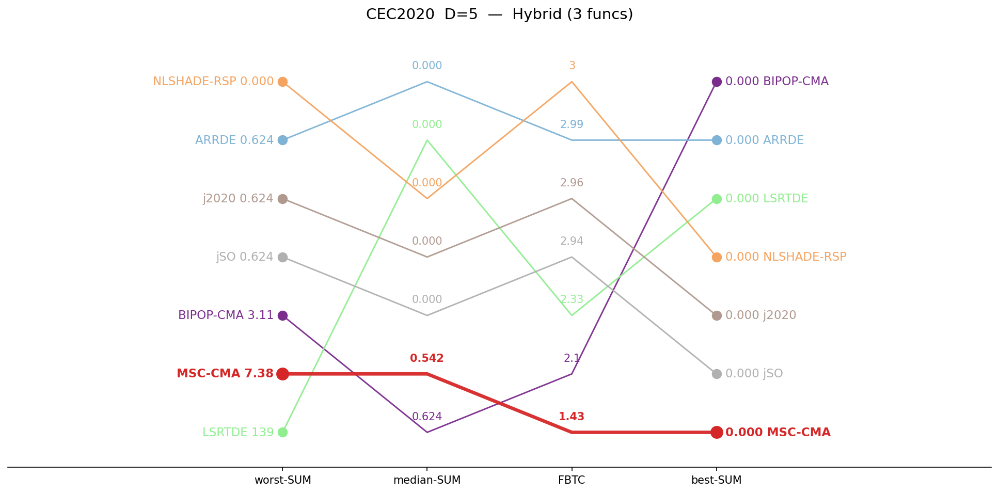
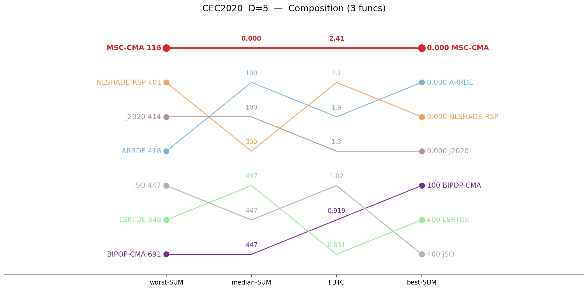
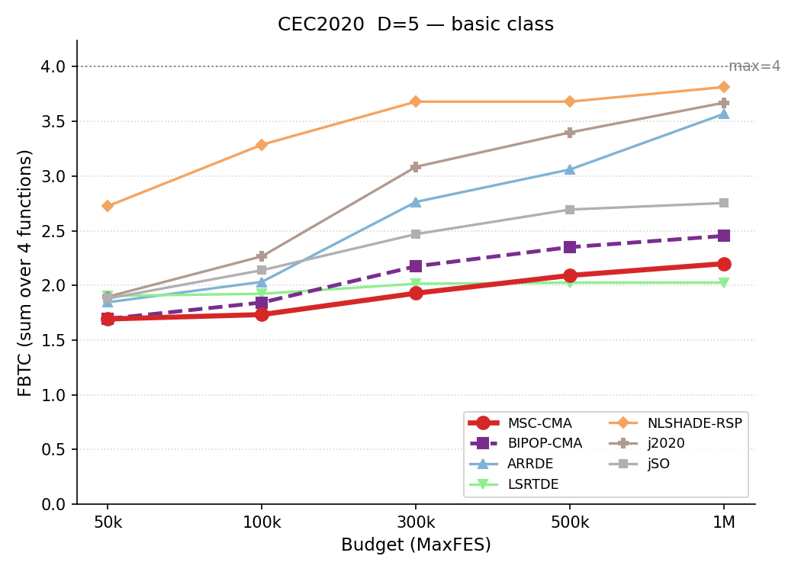
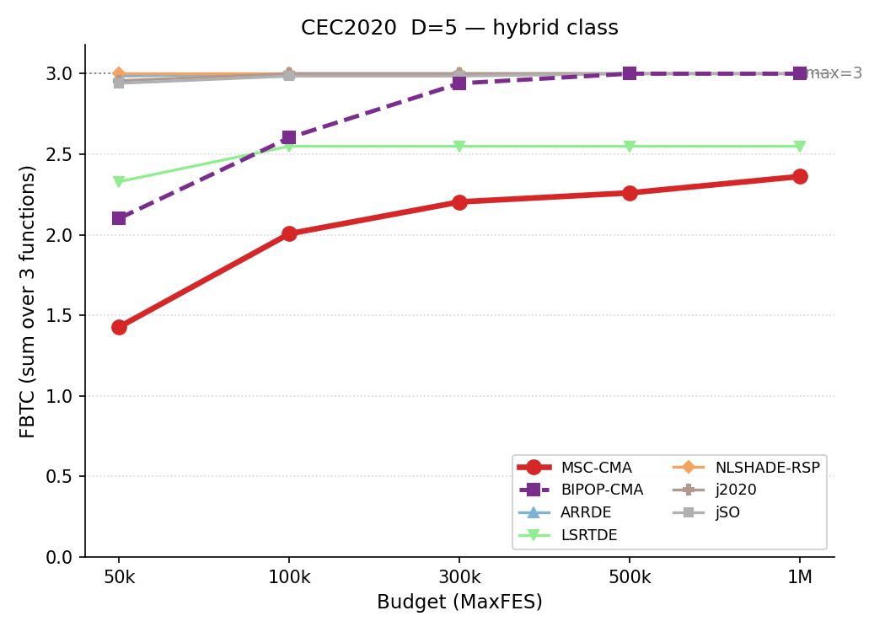
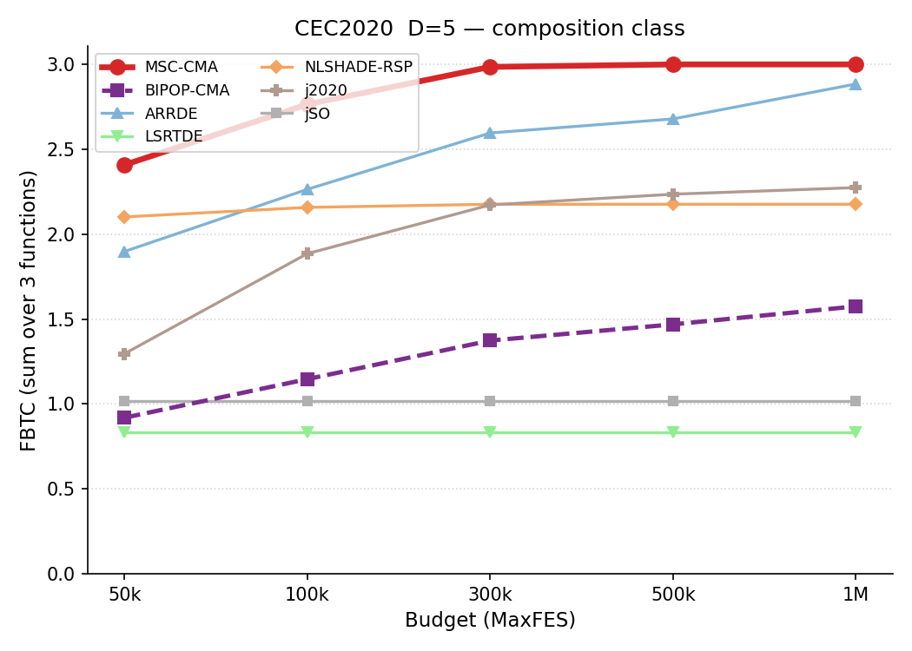

# CEC2020 / D=5 — by-category summary

Sums of per-function metrics, grouped by function class. Budget: 50,000 evaluations. **Bold** = best in row.

## Ranking across metrics

Parallel-coordinate rank of all seven algorithms on four aggregate metrics (worst-SUM, median-SUM, FBTC, best-SUM), per function class. Each line is one algorithm; for every axis the best value is at the top. MSC-CMA in red.

<table>
<tr>
<td></td>
<td></td>
<td></td>
</tr>
<tr>
<td align="center">Basic</td>
<td align="center">Hybrid</td>
<td align="center">Composition</td>
</tr>
</table>

*Basic = unimodal + simple multimodal, per the CEC2020 definition.*

## Budget scaling

FBTC by budget, monotone envelope (running maximum over budgets). Higher is better. The budget axis is per class: a budget is shown only where all seven algorithms cover the whole class. MSC-CMA in red.

<table>
<tr>
<td></td>
<td></td>
<td></td>
</tr>
<tr>
<td align="center">Basic</td>
<td align="center">Hybrid</td>
<td align="center">Composition</td>
</tr>
</table>

## Summary table

| Category | Metric | MSC-CMA | BIPOP-CMA |  | ARRDE | LSRTDE | NLSHADE | j2020 | jSO |
|:--|:--|--:|--:|:-:|--:|--:|--:|--:|--:|
| **Basic** (n=4) | mean | 25.1 | 18.7 |    | 14.3 | 14.9 | **3** | 9.25 | 5.64 |
|  | median | 4.13 | 8.66 |    | 5.77 | 5.87 | **1.77** | 5.84 | 5.5 |
|  | best | 0.125 | 1.12 |    | 0.613 | **0** | **0** | **0** | 0.613 |
|  | worst | 165 | 132 |    | 125 | 452 | **12.1** | 37 | 12.9 |
|  | std | 43.1 | 28.4 |    | 29.3 | 63.5 | 3.38 | 8.15 | **1.66** |
|  | FBTC | 1.693 | 1.695 |    | 1.846 | 1.905 | **2.726** | 1.897 | 1.880 |
| **Hybrid** (n=3) | mean | 1.03 | 0.754 |    | 0.0122 | 5.62 | **0** | 0.0131 | 0.0489 |
|  | median | 0.542 | 0.624 |    | **0** | **0** | **0** | **0** | **0** |
|  | best | 5.5e-7 | **0** |    | **0** | **0** | **0** | **0** | **0** |
|  | worst | 7.38 | 3.11 |    | 0.624 | 139 | **0** | 0.624 | 0.624 |
|  | std | 1.41 | 0.965 |    | 0.0874 | 26.4 | **0** | 0.0874 | 0.169 |
|  | FBTC | 1.428 | 2.102 |    | 2.985 | 2.330 | **3.000** | 2.957 | 2.940 |
| **Composition** (n=3) | mean | **48.3** | 372 |    | 145 | 462 | 224 | 180 | 446 |
|  | median | **0** | 447 |    | 100 | 447 | 300 | 100 | 447 |
|  | best | **0** | 100 |    | **0** | 400 | **0** | **0** | 400 |
|  | worst | **116** | 691 |    | 418 | 648 | 401 | 414 | 447 |
|  | std | 53.7 | 165 |    | 126 | 58 | 135 | 143 | **6.63** |
|  | FBTC | **2.408** | 0.919 |    | 1.898 | 0.831 | 2.102 | 1.296 | 1.019 |
| **SUM** (n=10) | mean | **74.4** | 391 |    | 159 | 482 | 227 | 189 | 452 |
|  | median | **4.68** | 457 |    | 106 | 453 | 302 | 106 | 453 |
|  | best | 0.125 | 101 |    | 0.613 | 400 | **0** | **0** | 401 |
|  | worst | **288** | 826 |    | 544 | 1239 | 413 | 452 | 461 |
|  | std | 98.2 | 195 |    | 155 | 148 | 139 | 152 | **8.46** |
|  | FBTC | 5.529 | 4.717 |    | 6.729 | 5.066 | **7.828** | 6.150 | 5.839 |

*FBTC = Fixed-Budget Target Coverage (sum across 51 log-uniform targets in [10²…10⁻⁸] per function); fixed-budget analogue of the COCO/BBOB ECDF. Higher is better.*

## Environment
Python 3.13.5 (anaconda3 env `intelpython`) · NumPy 2.3.1 · SciPy 1.15.3 · pycma 4.4.2 · minionpy 1.5.0.
Hardware: Intel Xeon Platinum 8160 @ 2.10 GHz, 192 threads, 251 GiB RAM.

*Generated 2026-06-28 by analysis/cell_report.py from `*/maxevals_50000/f*.pkl` (table) and all common budgets (budget scaling).*
