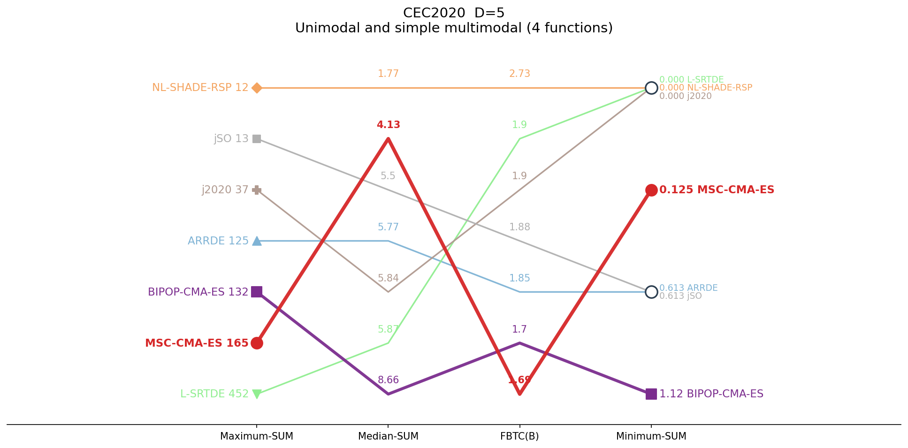
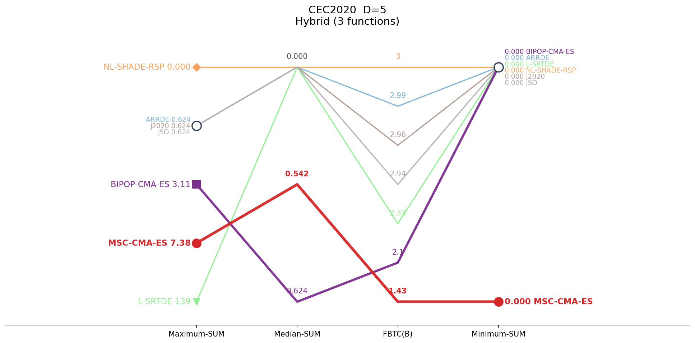
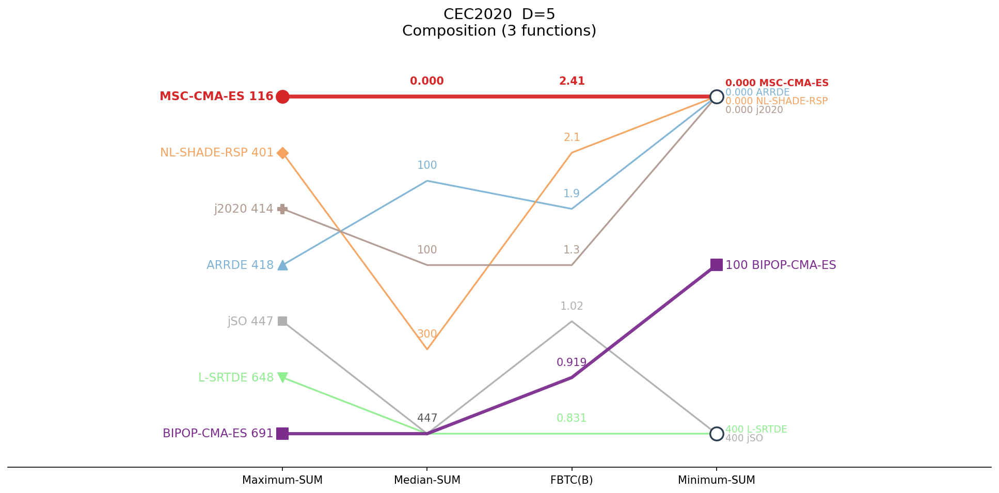
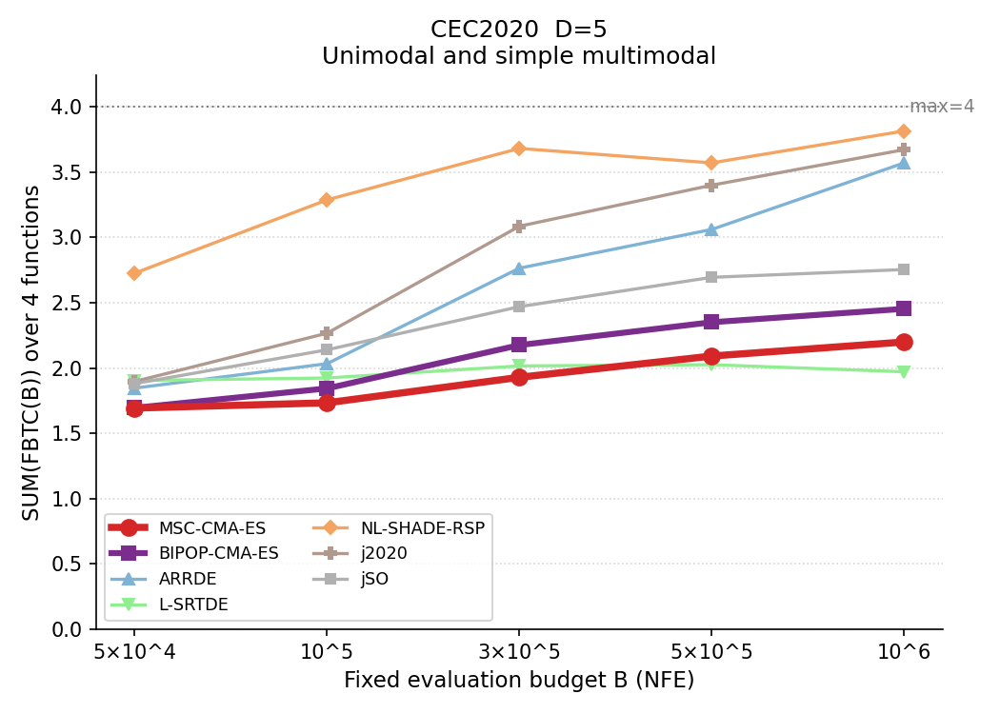
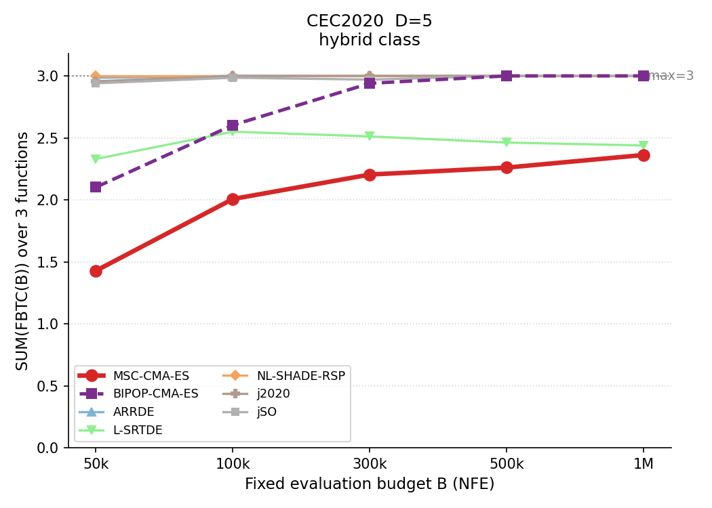
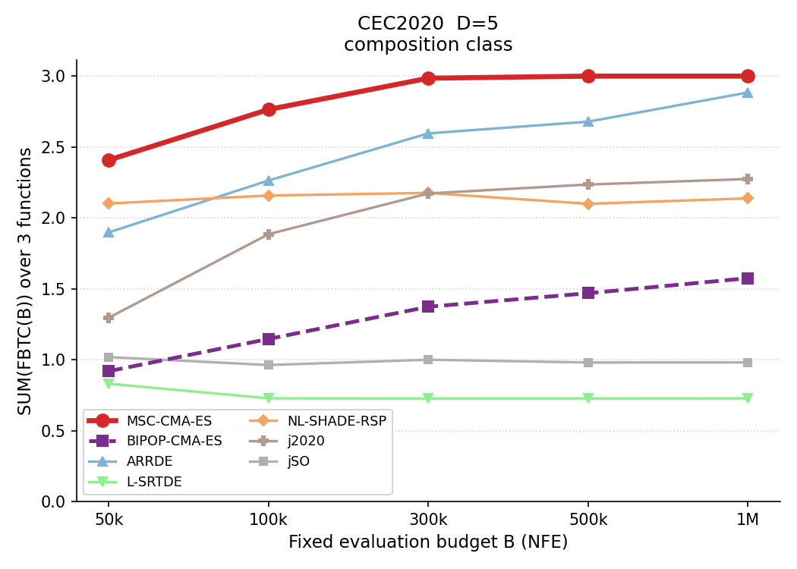
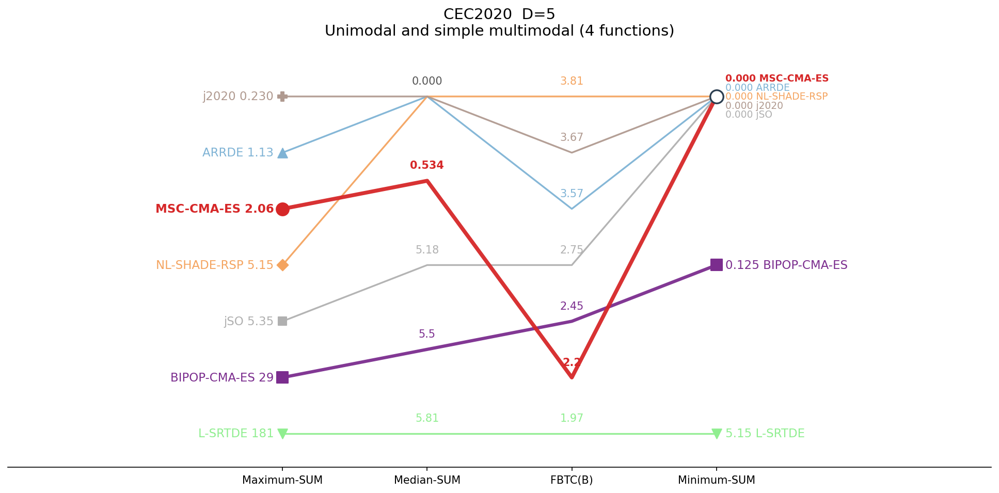
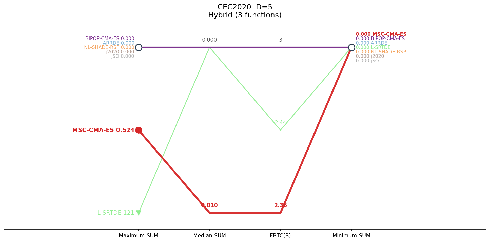
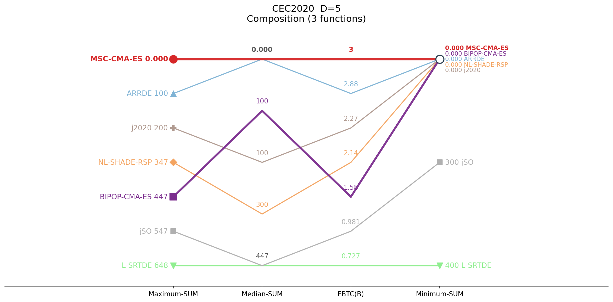

# CEC2020 / D=5 — by-category summary

## Ranking across metrics (budget 5×10^4)

Parallel-coordinate rank of all 7 algorithms on four aggregate metrics (Maximum-SUM, Median-SUM, FBTC(B), Minimum-SUM), per function class. Each line is one algorithm. The axes are oriented so smaller error-based sums and larger FBTC(B) values appear toward the top. MSC-CMA-ES is shown in red.

<table>
<tr>
<td></td>
<td></td>
<td></td>
</tr>
<tr>
<td align="center">Unimodal and simple multimodal</td>
<td align="center">Hybrid</td>
<td align="center">Composition</td>
</tr>
</table>

## Budget scaling

Raw FBTC(B) at each evaluated fixed budget; no running maximum is applied. Each point is a separate fixed-budget experiment. Larger FBTC(B) values indicate greater fixed-budget target coverage. The budget axis is per class: a budget is shown only where all 7 algorithms cover the whole class. MSC-CMA-ES is shown in red.

<table>
<tr>
<td></td>
<td></td>
<td></td>
</tr>
<tr>
<td align="center">Unimodal and simple multimodal</td>
<td align="center">Hybrid</td>
<td align="center">Composition</td>
</tr>
</table>

## Ranking across metrics (budget 10^6)

Same parallel-coordinate rank, recomputed at 10^6 evaluations. Only classes with full 7-algorithm coverage at 10^6 are shown. MSC-CMA-ES is shown in red.

<table>
<tr>
<td></td>
<td></td>
<td></td>
</tr>
<tr>
<td align="center">Unimodal and simple multimodal</td>
<td align="center">Hybrid</td>
<td align="center">Composition</td>
</tr>
</table>

## Summary table

Sums of per-function metrics, grouped by function class. Budget: 5×10^4 evaluations. Bold marks the minimum value for error-based metrics and standard deviation, and the maximum value for FBTC(B). These values are descriptive and are not significance tests.

| Category | Metric | MSC-CMA-ES | BIPOP-CMA-ES | ARRDE | L-SRTDE | NL-SHADE-RSP | j2020 | jSO |
|:--|:--|--:|--:|--:|--:|--:|--:|--:|
| **Unimodal and simple multimodal** (n=4) | Mean | 25.1 | 18.7 | 14.3 | 14.9 | **3** | 9.25 | 5.64 |
|  | Median | 4.13 | 8.66 | 5.77 | 5.87 | **1.77** | 5.84 | 5.5 |
|  | Minimum | 0.125 | 1.12 | 0.613 | **0** | **0** | **0** | 0.613 |
|  | Maximum | 165 | 132 | 125 | 452 | **12.1** | 37 | 12.9 |
|  | Std. | 43.1 | 28.4 | 29.3 | 63.5 | 3.38 | 8.15 | **1.66** |
|  | FBTC(B) | 1.693 | 1.695 | 1.846 | 1.905 | **2.726** | 1.897 | 1.880 |
| **Hybrid** (n=3) | Mean | 1.03 | 0.754 | 0.0122 | 5.62 | **0** | 0.0131 | 0.0489 |
|  | Median | 0.542 | 0.624 | **0** | **0** | **0** | **0** | **0** |
|  | Minimum | 5.5e-7 | **0** | **0** | **0** | **0** | **0** | **0** |
|  | Maximum | 7.38 | 3.11 | 0.624 | 139 | **0** | 0.624 | 0.624 |
|  | Std. | 1.41 | 0.965 | 0.0874 | 26.4 | **0** | 0.0874 | 0.169 |
|  | FBTC(B) | 1.428 | 2.102 | 2.985 | 2.330 | **3.000** | 2.957 | 2.940 |
| **Composition** (n=3) | Mean | **48.3** | 372 | 145 | 462 | 224 | 180 | 446 |
|  | Median | **0** | 447 | 100 | 447 | 300 | 100 | 447 |
|  | Minimum | **0** | 100 | **0** | 400 | **0** | **0** | 400 |
|  | Maximum | **116** | 691 | 418 | 648 | 401 | 414 | 447 |
|  | Std. | 53.7 | 165 | 126 | 58 | 135 | 143 | **6.63** |
|  | FBTC(B) | **2.408** | 0.919 | 1.898 | 0.831 | 2.102 | 1.296 | 1.019 |
| **All** (n=10) | Mean | **74.4** | 391 | 159 | 482 | 227 | 189 | 452 |
|  | Median | **4.68** | 457 | 106 | 453 | 302 | 106 | 453 |
|  | Minimum | 0.125 | 101 | 0.613 | 400 | **0** | **0** | 401 |
|  | Maximum | **288** | 826 | 544 | 1239 | 413 | 452 | 461 |
|  | Std. | 98.2 | 195 | 155 | 148 | 139 | 152 | **8.46** |
|  | FBTC(B) | 5.529 | 4.717 | 6.729 | 5.066 | **7.828** | 6.150 | 5.839 |

*FBTC(B) = Fixed-Budget Target Coverage at evaluation budget B: for each function, the mean attainment rate over 51 log-uniform targets in [10²…10⁻⁸] and 51 runs, computed from the terminal best-so-far errors at that budget. Class and All rows add the per-function FBTC(B) values. Each budget is evaluated separately; FBTC(B) is not an anytime measure. Larger FBTC(B) values indicate greater fixed-budget target coverage.*

## Environment
Python 3.13.5 (anaconda3 env `intelpython`) · NumPy 2.3.1 · SciPy 1.15.3 · pycma 4.4.2 · minionpy 1.5.0.
Hardware: Intel Xeon Platinum 8160 @ 2.10 GHz, 192 threads, 251 GiB RAM.

*Generated 2026-08-26 by analysis/cell_report.py from `*/maxevals_50000/f*.pkl` (table) and all common budgets (budget scaling).*
