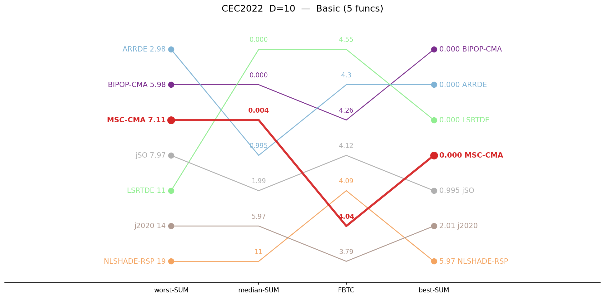
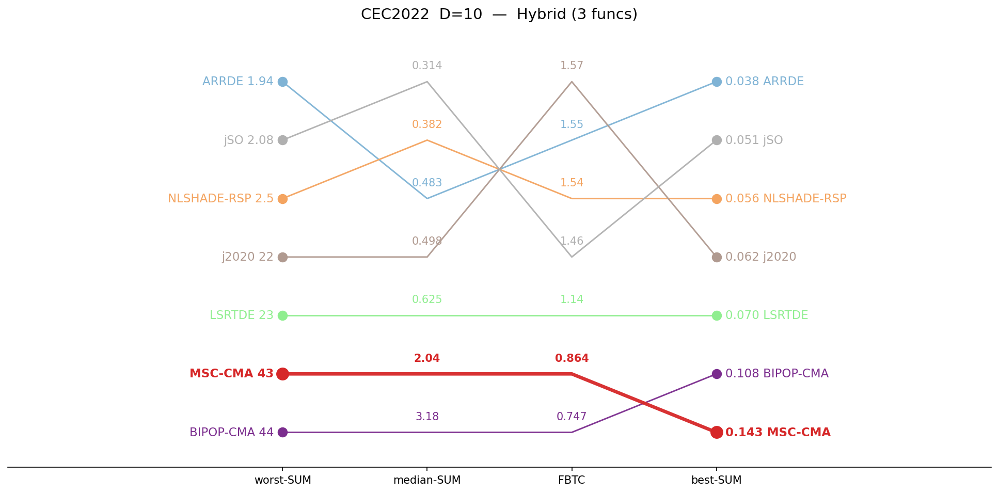
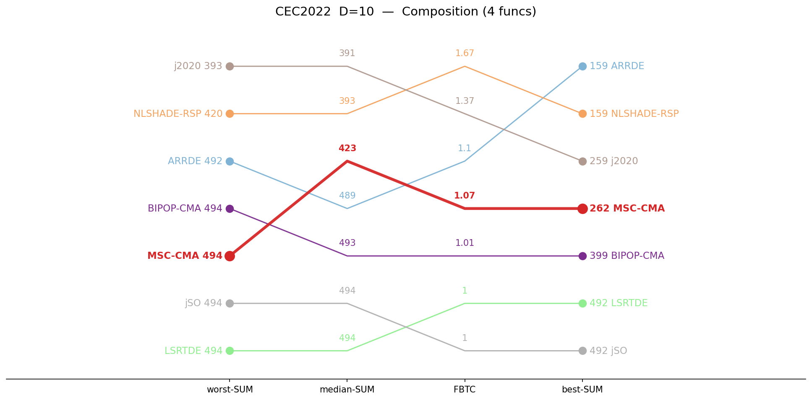
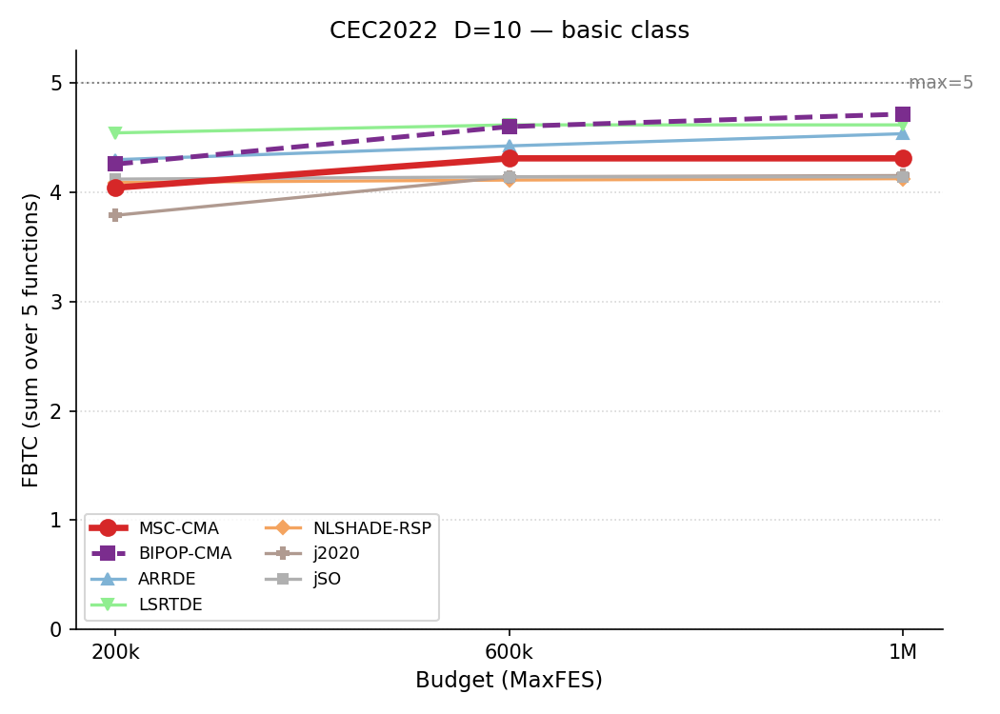
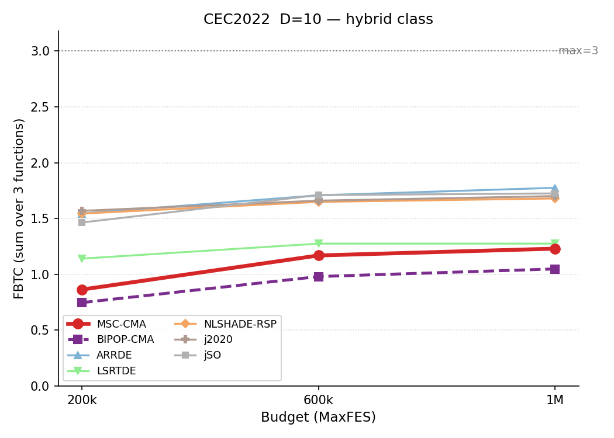
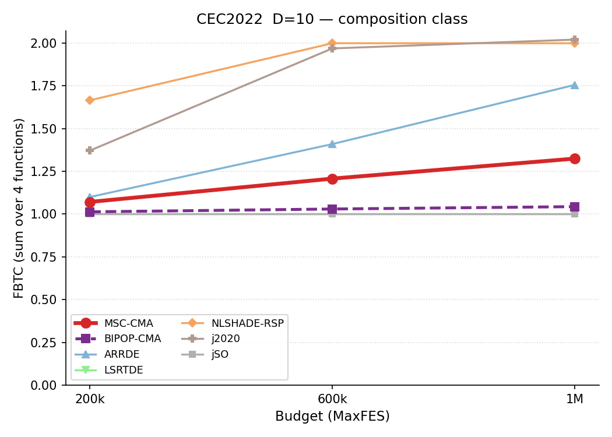
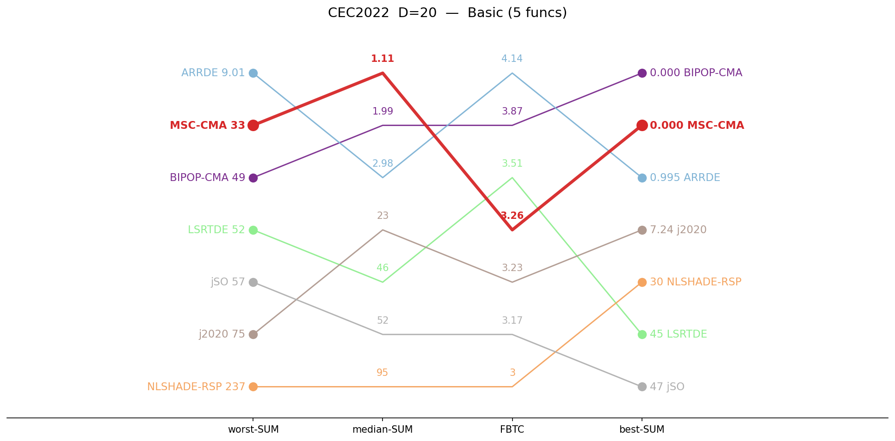
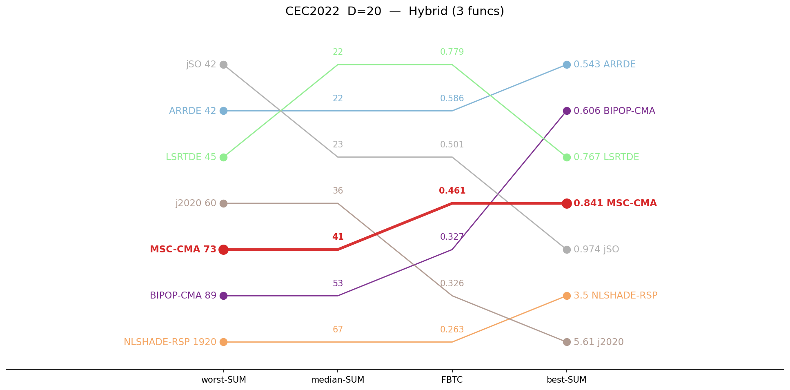

# CEC2022 — cross-dimension summary

Aggregated sums by function category, across dimensions. **Bold** = best in row. For simplicity the suite is presented per dimension.

Official budgets — 10D: 200,000, 20D: 1,000,000.

## Ranking — D=10

Parallel-coordinate rank on four aggregate metrics (worst-SUM, median-SUM, coverage, best-SUM). Best value at the top of each axis; MSC-CMA in red.

<table>
<tr>
<td></td>
<td></td>
<td></td>
</tr>
<tr>
<td align="center">Basic</td>
<td align="center">Hybrid</td>
<td align="center">Composition</td>
</tr>
</table>

## Budget scaling — D=10

FBTC by budget, monotone envelope; higher is better.

<table>
<tr>
<td></td>
<td></td>
<td></td>
</tr>
<tr>
<td align="center">Basic</td>
<td align="center">Hybrid</td>
<td align="center">Composition</td>
</tr>
</table>

## Ranking — D=20

Parallel-coordinate rank on four aggregate metrics (worst-SUM, median-SUM, coverage, best-SUM). Best value at the top of each axis; MSC-CMA in red.

<table>
<tr>
<td></td>
<td></td>
<td></td>
</tr>
<tr>
<td align="center">Basic</td>
<td align="center">Hybrid</td>
<td align="center">Composition</td>
</tr>
</table>

## Median error (lower is better)

| Category | Dim | MSC-CMA | BIPOP-CMA |  | ARRDE | LSRTDE | NLSHADE | j2020 | jSO |
|:--|:--:|--:|--:|:-:|--:|--:|--:|--:|--:|
| Basic | 10 | 0.00372 | 3.8e-5 |    | 0.995 | **0** | 11 | 5.97 | 1.99 |
| Basic | 20 | **1.11** | 1.99 |    | 2.98 | 45.9 | 94.6 | 22.9 | 51.9 |
| Hybrid | 10 | 2.04 | 3.18 |    | 0.483 | 0.625 | 0.382 | 0.498 | **0.314** |
| Hybrid | 20 | 41.4 | 52.9 |    | 22.3 | **21.8** | 67.3 | 36 | 23 |
| Composition | 10 | 423 | 493 |    | 489 | 494 | 393 | **391** | 494 |
| Composition | 20 | **435** | 451 |    | 513 | 814 | 719 | 716 | 813 |

## Best error (lower is better)

| Category | Dim | MSC-CMA | BIPOP-CMA |  | ARRDE | LSRTDE | NLSHADE | j2020 | jSO |
|:--|:--:|--:|--:|:-:|--:|--:|--:|--:|--:|
| Basic | 10 | 7.7e-5 | **0** |    | **0** | **0** | 5.97 | 2.01 | 0.995 |
| Basic | 20 | 3.4e-4 | **0** |    | 0.995 | 44.9 | 29.8 | 7.24 | 46.9 |
| Hybrid | 10 | 0.143 | 0.108 |    | **0.0382** | 0.07 | 0.0559 | 0.0624 | 0.0511 |
| Hybrid | 20 | 0.841 | 0.606 |    | **0.543** | 0.767 | 3.5 | 5.61 | 0.974 |
| Composition | 10 | 262 | 399 |    | **159** | 492 | 159 | 259 | 492 |
| Composition | 20 | 422 | 427 |    | **417** | 512 | 712 | 698 | 812 |

## Worst error (lower is better)

| Category | Dim | MSC-CMA | BIPOP-CMA |  | ARRDE | LSRTDE | NLSHADE | j2020 | jSO |
|:--|:--:|--:|--:|:-:|--:|--:|--:|--:|--:|
| Basic | 10 | 7.11 | 5.98 |    | **2.98** | 10.9 | 18.9 | 14.1 | 7.97 |
| Basic | 20 | 33.1 | 48.9 |    | **9.01** | 52.1 | 237 | 74.5 | 57 |
| Hybrid | 10 | 42.8 | 44.2 |    | **1.94** | 23.3 | 2.5 | 22 | 2.08 |
| Hybrid | 20 | 72.8 | 89.2 |    | 42.3 | 45.5 | 1920 | 60 | **41.8** |
| Composition | 10 | 494 | 494 |    | 492 | 494 | 420 | **393** | 494 |
| Composition | 20 | **452** | 827 |    | 813 | 928 | 734 | 726 | 916 |

## FBTC — Fixed-Budget Target Coverage (higher is better)

| Category | Dim | MSC-CMA | BIPOP-CMA |  | ARRDE | LSRTDE | NLSHADE | j2020 | jSO |
|:--|:--:|--:|--:|:-:|--:|--:|--:|--:|--:|
| Basic | 10 | 4.043 | 4.259 |    | 4.300 | **4.546** | 4.092 | 3.790 | 4.122 |
| Basic | 20 | 3.264 | 3.865 |    | **4.141** | 3.506 | 3.000 | 3.228 | 3.167 |
| Hybrid | 10 | 0.864 | 0.747 |    | 1.546 | 1.141 | 1.545 | **1.569** | 1.465 |
| Hybrid | 20 | 0.461 | 0.327 |    | 0.586 | **0.779** | 0.263 | 0.326 | 0.501 |
| Composition | 10 | 1.071 | 1.013 |    | 1.100 | 1.000 | **1.665** | 1.371 | 1.000 |
| Composition | 20 | **1.082** | 0.830 |    | 0.932 | 0.020 | 0.939 | 0.427 | 0.000 |

*FBTC = Fixed-Budget Target Coverage (per-function sum across 51 log-uniform targets in [10²…10⁻⁸]); fixed-budget analogue of the COCO/BBOB ECDF. Higher is better.*

## Environment
Python 3.13.5 (anaconda3 env `intelpython`) · NumPy 2.3.1 · SciPy 1.15.3 · pycma 4.4.2 · minionpy 1.5.0.
Hardware: Intel Xeon Platinum 8160 @ 2.10 GHz, 192 threads, 251 GiB RAM.

*Generated 2026-06-28 by analysis/suite_report.py.*
