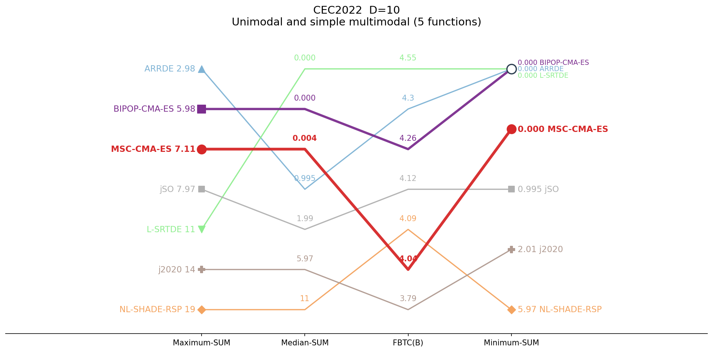
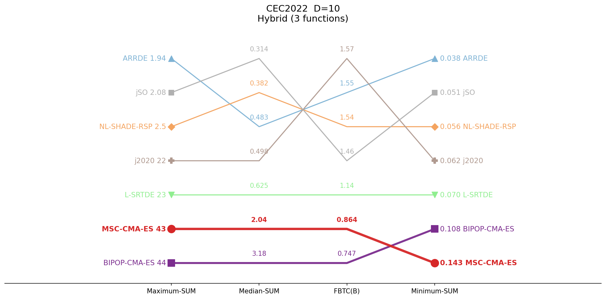
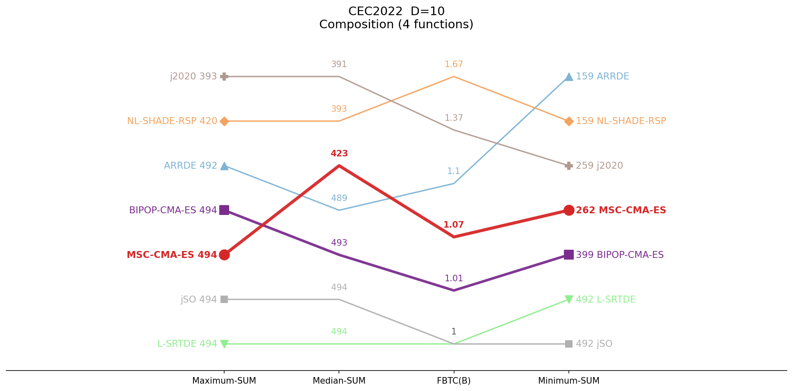
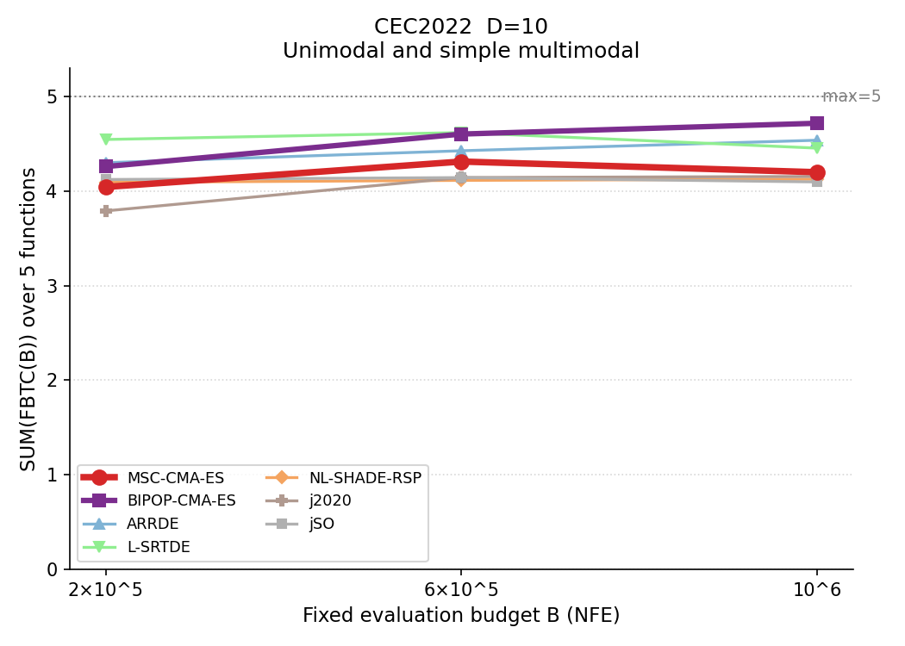
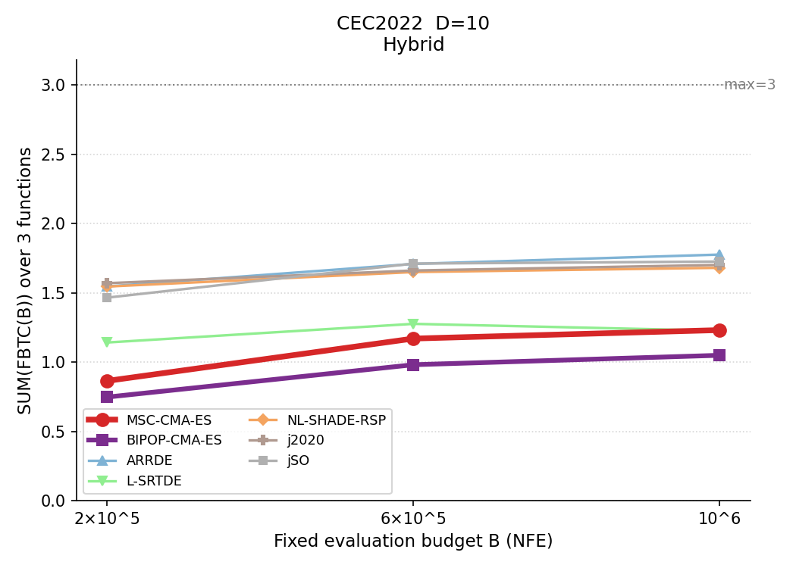
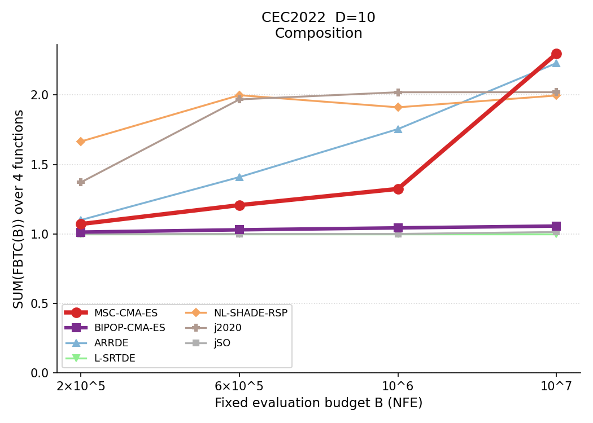
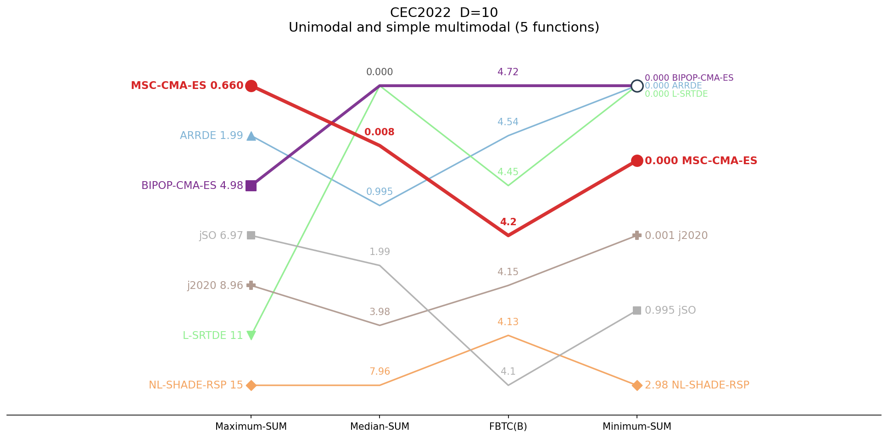
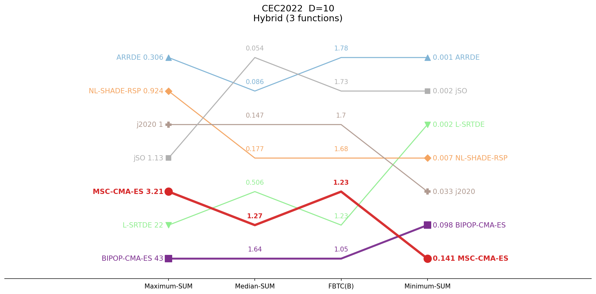
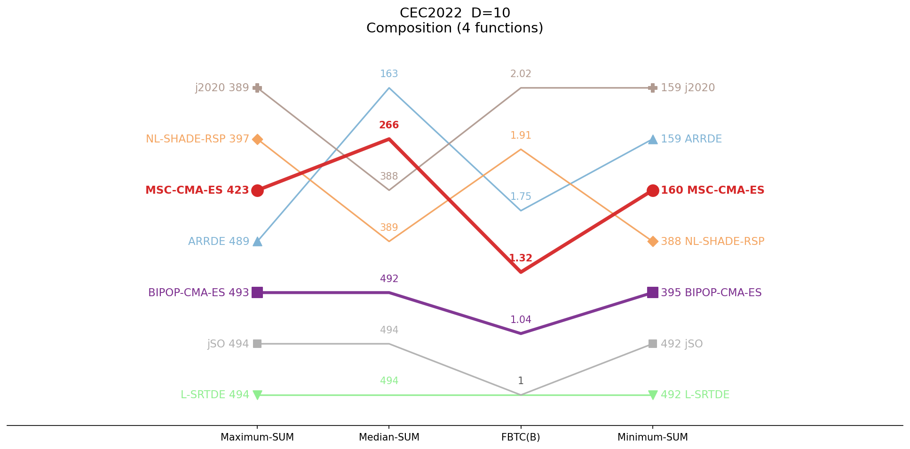
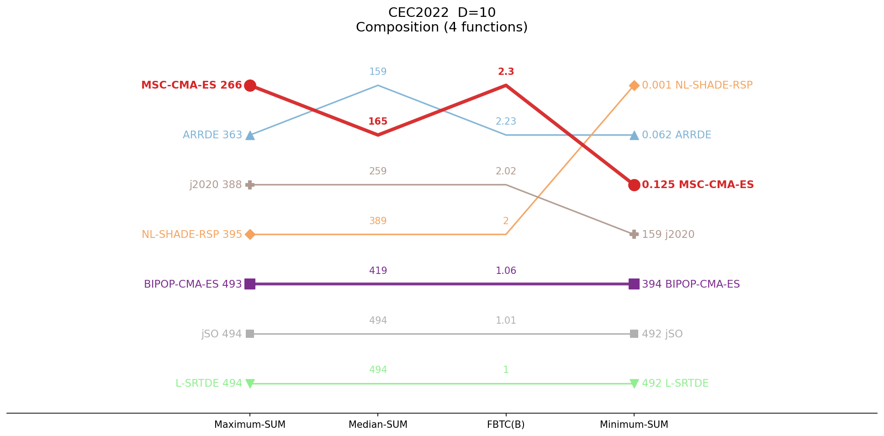

# CEC2022 / D=10 — by-category summary

## Ranking — D=10 (B = 2×10^5)

Parallel-coordinate rank of all 7 algorithms on four aggregate metrics (Maximum-SUM, Median-SUM, FBTC(B), Minimum-SUM), per function class. Each line is one algorithm. The axes are oriented so smaller error-based sums and larger FBTC(B) values appear toward the top. MSC-CMA-ES is shown in red. Budget: B = 2×10^5 evaluations.

<table>
<tr>
<td></td>
<td></td>
<td></td>
</tr>
<tr>
<td align="center">Unimodal and simple multimodal</td>
<td align="center">Hybrid</td>
<td align="center">Composition</td>
</tr>
</table>

## Budget scaling — D=10

Raw FBTC(B) at each evaluated fixed budget; no running maximum is applied. Each point is a separate fixed-budget experiment. Larger FBTC(B) values indicate greater fixed-budget target coverage. The budget axis is per class: a budget is shown only where all 7 algorithms cover the whole class. MSC-CMA-ES is shown in red. Official budget for this cell: B = 2×10^5 evaluations.

<table>
<tr>
<td></td>
<td></td>
<td></td>
</tr>
<tr>
<td align="center">Unimodal and simple multimodal</td>
<td align="center">Hybrid</td>
<td align="center">Composition</td>
</tr>
</table>

## Ranking — D=10 (B = 10^6)

Same parallel-coordinate rank, recomputed at B = 10^6 evaluations. Only classes with full 7-algorithm coverage at B = 10^6 are shown. MSC-CMA-ES is shown in red.

<table>
<tr>
<td></td>
<td></td>
<td></td>
</tr>
<tr>
<td align="center">Unimodal and simple multimodal</td>
<td align="center">Hybrid</td>
<td align="center">Composition</td>
</tr>
</table>

## Ranking — D=10 (B = 10^7)

Same parallel-coordinate rank, recomputed at B = 10^7 evaluations. Only classes with full 7-algorithm coverage at B = 10^7 are shown. MSC-CMA-ES is shown in red.

<table>
<tr>
<td></td>
<td></td>
<td></td>
</tr>
<tr>
<td></td>
<td></td>
<td align="center">Composition</td>
</tr>
</table>

## Summary table

Sums of per-function metrics, grouped by function class. Budget: 2×10^5 evaluations. Bold marks the minimum value for error-based metrics and standard deviation, and the maximum value for FBTC(B). These values are descriptive and are not significance tests.

| Category | Metric | MSC-CMA-ES | BIPOP-CMA-ES | ARRDE | L-SRTDE | NL-SHADE-RSP | j2020 | jSO |
|:--|:--|--:|--:|--:|--:|--:|--:|--:|
| **Unimodal and simple multimodal** (n=5) | Mean | **0.435** | 2.41 | 1.31 | 1.6 | 11.7 | 6.2 | 2.54 |
|  | Median | 0.00372 | 3.8e-5 | 0.995 | **0** | 11 | 5.97 | 1.99 |
|  | Minimum | 7.7e-5 | **0** | **0** | **0** | 5.97 | 2.01 | 0.995 |
|  | Maximum | 7.11 | 5.98 | **2.98** | 10.9 | 18.9 | 14.1 | 7.97 |
|  | Std. | 1.27 | 2.73 | **0.808** | 2.85 | 3.49 | 2.44 | 1.65 |
|  | FBTC(B) | 4.043 | 4.259 | 4.300 | **4.546** | 4.092 | 3.790 | 4.122 |
| **Hybrid** (n=3) | Mean | 7.58 | 17.3 | 0.523 | 6.13 | 0.534 | 1.28 | **0.412** |
|  | Median | 2.04 | 3.18 | 0.483 | 0.625 | 0.382 | 0.498 | **0.314** |
|  | Minimum | 0.143 | 0.108 | **0.0382** | 0.07 | 0.0559 | 0.0624 | 0.0511 |
|  | Maximum | 42.8 | 44.2 | **1.94** | 23.3 | 2.5 | 22 | 2.08 |
|  | Std. | 13.8 | 19.5 | 0.503 | 9.42 | 0.547 | 3.24 | **0.438** |
|  | FBTC(B) | 0.864 | 0.747 | 1.546 | 1.141 | 1.545 | **1.569** | 1.465 |
| **Composition** (n=4) | Mean | 421 | 480 | 438 | 494 | **385** | 387 | 494 |
|  | Median | 423 | 493 | 489 | 494 | 393 | **391** | 494 |
|  | Minimum | 262 | 399 | **159** | 492 | 159 | 259 | 492 |
|  | Maximum | 494 | 494 | 492 | 494 | 420 | **393** | 494 |
|  | Std. | 89 | 29.4 | 102 | **0.378** | 49.8 | 19.4 | 0.632 |
|  | FBTC(B) | 1.071 | 1.013 | 1.100 | 1.000 | **1.665** | 1.371 | 1.000 |
| **All** (n=12) | Mean | 429 | 500 | 440 | 502 | 397 | **395** | 497 |
|  | Median | 425 | 496 | 490 | 495 | 404 | **397** | 497 |
|  | Minimum | 262 | 399 | **159** | 492 | 165 | 261 | 493 |
|  | Maximum | 544 | 544 | 497 | 529 | 441 | **429** | 504 |
|  | Std. | 104 | 51.6 | 104 | 12.6 | 53.9 | 25.1 | **2.72** |
|  | FBTC(B) | 5.979 | 6.020 | 6.945 | 6.687 | **7.302** | 6.731 | 6.587 |

*FBTC(B) = Fixed-Budget Target Coverage at evaluation budget B: for each function, the mean attainment rate over 51 log-uniform targets in [10²…10⁻⁸] and 51 runs, computed from the terminal best-so-far errors at that budget. Class and All rows add the per-function FBTC(B) values. Each budget is evaluated separately; FBTC(B) is not an anytime measure. Larger FBTC(B) values indicate greater fixed-budget target coverage.*

## Environment
Python 3.13.5 (anaconda3 env `intelpython`) · NumPy 2.3.1 · SciPy 1.15.3 · pycma 4.4.2 · minionpy 1.5.0.
Hardware: Intel Xeon Platinum 8160 @ 2.10 GHz, 192 threads, 251 GiB RAM.

*Generated 2026-08-26 by analysis/cell_report.py from `*/maxevals_200000/f*.pkl` (table) and all common budgets (budget scaling).*
