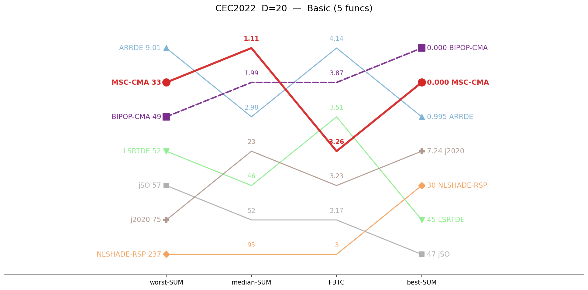
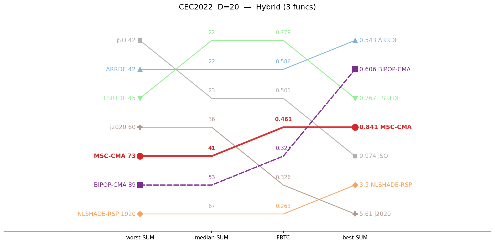
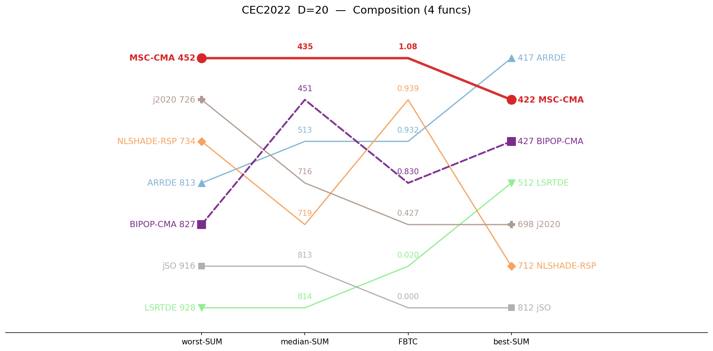

# CEC2022 / D=20 — by-category summary

Sums of per-function metrics, grouped by function class. Budget: 1,000,000 evaluations. **Bold** = best in row.

## Ranking across metrics (budget 1M)

Parallel-coordinate rank of all seven algorithms on four aggregate metrics (worst-SUM, median-SUM, FBTC, best-SUM), per function class. Each line is one algorithm; for every axis the best value is at the top. MSC-CMA in red.

<table>
<tr>
<td></td>
<td></td>
<td></td>
</tr>
<tr>
<td align="center">Basic</td>
<td align="center">Hybrid</td>
<td align="center">Composition</td>
</tr>
</table>

*Basic = unimodal + simple multimodal, per the CEC2022 definition.*

## Summary table

| Category | Metric | MSC-CMA | BIPOP-CMA |  | ARRDE | LSRTDE | NLSHADE | j2020 | jSO |
|:--|:--|--:|--:|:-:|--:|--:|--:|--:|--:|
| **Basic** (n=5) | mean | **2.42** | 17 |    | 3.12 | 45.9 | 89.4 | 28.3 | 52.7 |
|  | median | **1.11** | 1.99 |    | 2.98 | 45.9 | 94.6 | 22.9 | 51.9 |
|  | best | 3.4e-4 | **0** |    | 0.995 | 44.9 | 29.8 | 7.24 | 46.9 |
|  | worst | 33.1 | 48.9 |    | **9.01** | 52.1 | 237 | 74.5 | 57 |
|  | std | 5.44 | 22.3 |    | **1.39** | 1.45 | 48.6 | 17.7 | 3.26 |
|  | FBTC | 3.264 | 3.865 |    | **4.141** | 3.506 | 3.000 | 3.228 | 3.167 |
| **Hybrid** (n=3) | mean | 29.4 | 51.7 |    | 22.9 | **19** | 146 | 38.3 | 21.4 |
|  | median | 41.4 | 52.9 |    | 22.3 | **21.8** | 67.3 | 36 | 23 |
|  | best | 0.841 | 0.606 |    | **0.543** | 0.767 | 3.5 | 5.61 | 0.974 |
|  | worst | 72.8 | 89.2 |    | 42.3 | 45.5 | 1920 | 60 | **41.8** |
|  | std | 22.2 | 21.6 |    | 13.9 | 16.5 | 294 | 13.8 | **12.6** |
|  | FBTC | 0.461 | 0.327 |    | 0.586 | **0.779** | 0.263 | 0.326 | 0.501 |
| **Composition** (n=4) | mean | **435** | 532 |    | 524 | 845 | 719 | 716 | 817 |
|  | median | **435** | 451 |    | 513 | 814 | 719 | 716 | 813 |
|  | best | 422 | 427 |    | **417** | 512 | 712 | 698 | 812 |
|  | worst | **452** | 827 |    | 813 | 928 | 734 | 726 | 916 |
|  | std | 6.9 | 159 |    | 94.8 | 71 | **4.54** | 5.45 | 20.4 |
|  | FBTC | **1.082** | 0.830 |    | 0.932 | 0.020 | 0.939 | 0.427 | 0.000 |
| **SUM** (n=12) | mean | **466** | 601 |    | 550 | 910 | 954 | 783 | 891 |
|  | median | **478** | 506 |    | 538 | 881 | 881 | 774 | 888 |
|  | best | 423 | 427 |    | **419** | 558 | 745 | 711 | 860 |
|  | worst | **558** | 965 |    | 865 | 1025 | 2891 | 861 | 1014 |
|  | std | **34.5** | 203 |    | 110 | 89 | 347 | 37 | 36.3 |
|  | FBTC | 4.808 | 5.022 |    | **5.659** | 4.305 | 4.202 | 3.982 | 3.668 |

*FBTC = Fixed-Budget Target Coverage (sum across 51 log-uniform targets in [10²…10⁻⁸] per function); fixed-budget analogue of the COCO/BBOB ECDF. Higher is better.*

## Environment
Python 3.13.5 (anaconda3 env `intelpython`) · NumPy 2.3.1 · SciPy 1.15.3 · pycma 4.4.2 · minionpy 1.5.0.
Hardware: Intel Xeon Platinum 8160 @ 2.10 GHz, 192 threads, 251 GiB RAM.

*Generated 2026-07-09 by analysis/cell_report.py from `*/maxevals_1000000/f*.pkl` (table) and all common budgets (budget scaling).*
